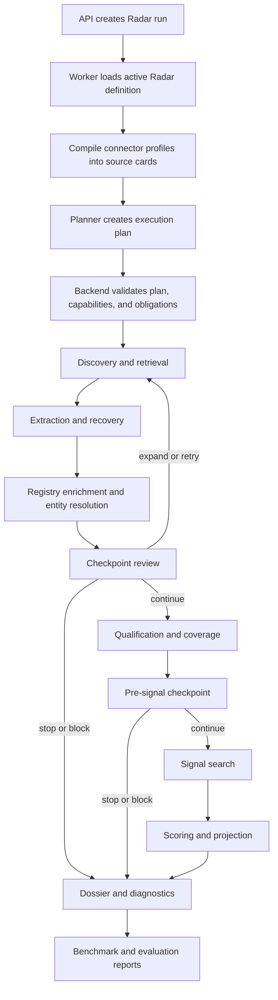
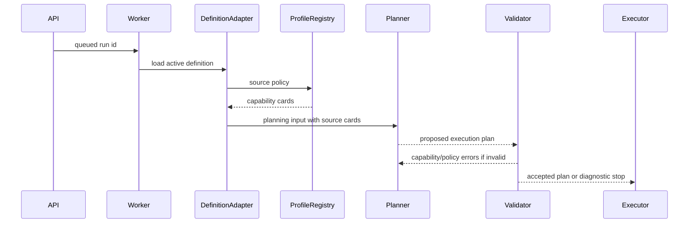
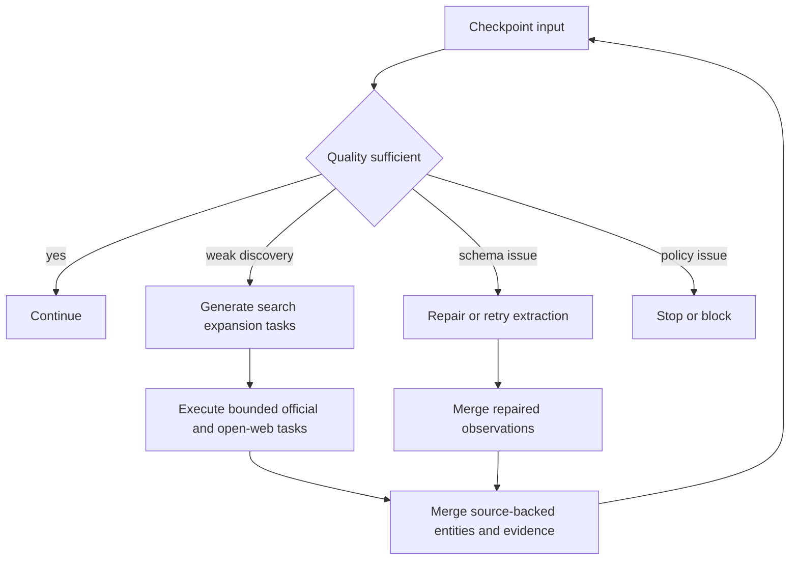
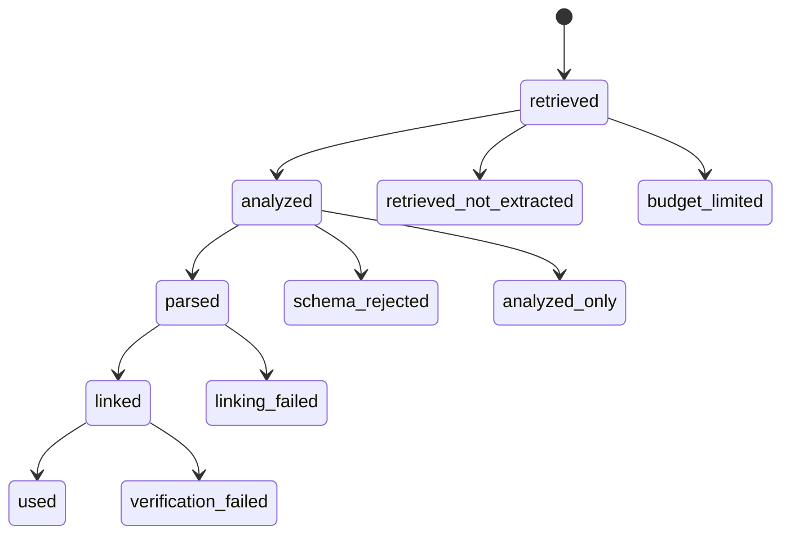
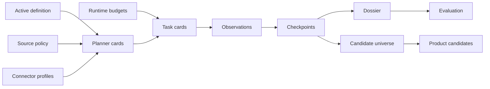
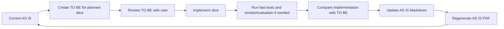

# Radar Search Pipeline AS IS

Status: AS IS

Product area: Radar candidate and signal search

Updated after slice: 0.7.6.3.6.12

Last updated: 2026-06-29

Canonical source: current implementation, tests, `ROADMAP.md`, and Radar run diagnostics

Generated PDF: `docs/radar/RADAR_SEARCH_PIPELINE_AS_IS.pdf`

## 1. Purpose

This document explains the current Radar search pipeline as it is implemented
today. It is the operational map for candidate discovery, source handling,
identity enrichment, signal search, diagnostic states, and benchmark evaluation.

The document has two jobs:

- help a user or new developer understand how Radar search currently works;
- help agents and developers find the correct extension point before changing
  planner, retrieval, extraction, registry lookup, checkpoints, signal search,
  dossier projection, or evaluation.

The Markdown file is the source of truth. The PDF is a generated review artifact.
Mermaid source can remain in Markdown, but the PDF must contain rendered diagrams
instead of raw diagram notation.

## 2. AS IS And TO BE Rule

There is exactly one current AS IS document:

- `docs/radar/RADAR_SEARCH_PIPELINE_AS_IS.md`
- `docs/radar/RADAR_SEARCH_PIPELINE_AS_IS.pdf`

Substantial Radar pipeline changes must start with a TO BE design:

- `docs/radar/to-be/RADAR_SEARCH_PIPELINE_TO_BE_<slice>.md`

The TO BE document describes the intended algorithmic change before
implementation. After implementation and validation, the accepted behavior is
merged into this AS IS document and the PDF is regenerated.

## 3. Glossary

| Term | Meaning |
|---|---|
| Radar definition | Persisted active configuration for one Radar, including criteria, signals, source policy, and scoring settings. |
| Candidate universe | The broad set of source-backed entities known to the run, including legal entities and review-needed sites, branches, projects, or assets. |
| Product candidate | A strict account candidate shown as a scored product row. Product candidates should be legal entities or resolved account-level entities. |
| Review-needed entity | A source-backed entity retained upstream with review flags, but not promoted as a confident product account. |
| Signal | A monitored buying-intent or activity indicator evaluated for candidate entities. |
| Source | A user-selected information source in Radar settings. |
| Connector profile | Human-readable config describing a connector, good inputs, bad inputs, expected facts, limitations, and credentials. |
| Capability card | Backend-compiled machine-readable connector capability used by preflight, planner input, and execution guards. |
| Planner source card | Compact planner-facing source description compiled from capability, source definition, and source obligation. |
| Source obligation | User-facing source usage mode such as `required_for_identity`, `required_for_coverage`, `preferred`, `fallback`, or `disabled`. |
| Retrieved source | URL/snippet/citation/source material returned by retrieval before extraction. |
| Analyzed source | Source material inspected by extraction or diagnostics but not necessarily linked to evidence. |
| Used source | Evidence-bearing source linked to a product candidate or finding. |
| Evidence ref | Stable source reference used to link extracted candidate/finding rows to normalized source records. |
| Checkpoint | Application-owned review point that decides whether execution continues, retries, expands, revises, stops for review, or fails hard. |
| Execution budget | Radar task budget for discovery, gate, signal, provider, and run-total work. |
| External-call budget | Budget for external actions such as OpenRouter calls, DaData lookups, provider retries, and source verification requests. |
| Budget reserve | A sub-allocation inside the run budget for registry identity, recall expansion, official coverage, open-web coverage, extraction recovery, or signal search. |
| Semantic task reserve | Application-level protected task slot for approved recall/coverage expansion tasks after the regular web-task budget is exhausted. It does not bypass external-call budgets. |
| Expansion target | A prioritized source-backed target that weak discovery should search next, such as a holding, legal entity, production site, branch, alias/language variant, or explicit benchmark target. |
| Expansion scheduler | Application-layer selector that orders guaranteed target-lane expansion probes, origin-aware completion probes, and optional expansion variants while recording scheduled/not-scheduled states. |
| Work scheduler | Central application-layer admission controller that decides which approved work items can consume shared budget and which must be rejected before provider execution. |
| Projection type loss | Diagnostic state where a source-backed review-needed entity is present, but its entity type was downgraded to `unknown_entity` during projection. |
| `not_observed` | A searched signal with no evidence found. It must not mean "not searched". |
| `not_searched_*` | Explicit unsearched state caused by budget, policy, missing scope, or pending output. |

## 4. High-Level Pipeline

<!-- diagram: high_level_pipeline -->

The pipeline is application-owned. Integrations execute bounded provider tasks,
but they do not own scoring, review semantics, source obligations, or final
candidate state.

## 5. Backend Roles

| Role | Current owner | Responsibility | Must not own |
|---|---|---|---|
| API route | `src/power_web_os/api` | Create runs, expose status, candidates, dossier, runtime/preflight DTOs. | Provider calls, scoring, SQL queries in routes. |
| Worker entrypoint | `src/power_web_os/jobs` | Load run id, call application executor, persist status. | Provider normalization or domain decisions. |
| Workflow wrapper | `src/power_web_os/workflows` | Wrap application execution in workflow state when needed. | SQLAlchemy queries, provider logic, scoring semantics. |
| Active definition adapter | `src/power_web_os/application/live_radar_definition_runtime.py` | Convert persisted definition payload into runtime Radar payload. | HTTP/provider details. |
| Connector profile registry | `src/power_web_os/application/connector_profiles.py` and `connector_capability_defaults.py` | Load connector profiles and compile capability cards. | User source obligations or provider calls. |
| Planner input builder | `src/power_web_os/application/live_radar_discovery_planning.py` | Build source-card-aware planning input and deterministic fallback plans. | Final truth or provider execution. |
| Planner adapter | `src/power_web_os/integrations/openrouter_discovery_planner.py` | Ask OpenRouter for structured discovery plans. | Source policy enforcement. |
| Plan acceptance | `src/power_web_os/application/live_radar_plan_acceptance.py` | Validate capabilities, source obligations, and safe repairs. | Provider calls. |
| Retrieval plan compiler | `src/power_web_os/application/live_radar_retrieval_plan.py` | Convert accepted plan steps into bounded provider task cards. | Scoring. |
| Web retrieval/extraction provider | `src/power_web_os/integrations/live_radar_openrouter.py` | Execute OpenRouter web/retrieval/extraction tasks under budget guard. | Execution budgets, final scoring, source obligations. |
| Source registry/provider orchestration | `src/power_web_os/application/radar_source_providers.py` | Execute structured company registry providers for allowed stages. | Signal evidence replacement. |
| Registry lookup term generator | `src/power_web_os/application/radar_registry_lookup_terms.py` | Build concrete lookup terms for registry providers. | Broad web discovery. |
| Search expansion service | `src/power_web_os/application/radar_search_expansion.py`, `radar_search_expansion_models.py`, and `radar_search_expansion_support.py` | Build prioritized expansion target queues and bounded source-profile-driven query variants when discovery/coverage is weak. | Direct provider calls. |
| Search expansion scheduler | `src/power_web_os/application/radar_search_expansion_scheduler.py` and `radar_search_expansion_selection.py` | Select guaranteed target-lane variants, prioritize explicit benchmark completion targets over incidental targets, and order selected work before optional expansion. | Provider calls or changing source policy. |
| Central work scheduler | `src/power_web_os/application/radar_work_scheduler.py` | Admit application-approved work lanes, protect shared OpenRouter capacity for guaranteed recall expansion, and record accepted/rejected work. | Provider calls, source policy mutation, or checkpoint decision policy. |
| Search expansion executor | `src/power_web_os/application/live_radar_search_expansion_execution.py` | Execute only scheduler-admitted checkpoint expansion tasks under source policy and budget guards. | Choosing checkpoint decisions or admitting work locally. |
| Extraction contract/repair | `src/power_web_os/application/live_radar_extraction_contract.py` | Validate and repair provider payload shape when deterministic repair is safe. | Silently converting unrecoverable output into success. |
| Checkpoint service | `src/power_web_os/application/live_radar_checkpoints.py` | Decide continue, retry, expand, repair, revise, stop, or fail. | Direct HTTP/provider calls. |
| Checkpoint action executor | `src/power_web_os/application/live_radar_checkpoint_actions.py` | Apply approved checkpoint actions under budgets and policy. | Unbounded loops. |
| Entity resolution | `src/power_web_os/application/live_radar_entity_resolution.py` | Distinguish legal entity, branch, production site, project, asset, and unknown entity. | Provider transport. |
| Candidate universe support | `src/power_web_os/application/live_radar_universe.py` and retrieved-candidate helpers | Preserve source-backed legal entities and review-needed upstream entities. | Product precision claims. |
| Dossier projection | `src/power_web_os/api/radar_dossier_mappers.py` and related mappers | Explain lifecycle, diagnostics, checkpoints, budgets, candidates, and sources. | Mutating run behavior. |
| Evaluation | `src/power_web_os/radar_evaluation.py` | Compare persisted run/dossier output to curated baseline. | Live provider calls. |

## 6. Inputs And Runtime Configuration

The live run is driven by these inputs:

- active `RadarDefinitionRecord` loaded by `radar_id`;
- canonical runtime Radar payload built from the active definition;
- `global_search_policy.sources`;
- source usage obligations from Radar settings;
- connector profiles under `config/connectors`;
- compiled capability cards and planner source cards;
- runtime config from `.env` and task context;
- execution budgets and external-call budgets;
- run profile such as `live`, `smoke`, `benchmark_smoke`, or `benchmark_live`;
- persisted run metadata from API queue time and worker execution time.

Secrets stay in `.env` or deployment secret storage. They are never passed to
planner source cards, dossier, journal, evaluation reports, or AS IS/TO BE docs.

## 7. Planning Loop

<!-- diagram: planner_sequence -->

Current planning behavior:

1. The worker loads the active persisted Radar definition. The hardcoded mini
   Radar is legacy/offline fallback only.
2. Connector profiles are compiled into source cards for configured sources.
3. Planner input includes source cards and source obligations. Source cards say
   what a source can do; obligations say how strongly the selected source must
   be used.
4. The planner may use OpenRouter and must return a structured plan.
5. Backend validation rejects incompatible source use, disabled sources, missing
   required source use, and lookup-only sources used for broad discovery.
6. Invalid plans can enter a bounded revision loop. If revision remains invalid,
   execution stops as review-needed or policy-blocked instead of falling into
   blind execution.

Planner calls count against OpenRouter external-call budgets, including total
OpenRouter run budget and planner-role budget.

## 8. Source Cards And Connector Profiles

Connector profiles are human-facing config. They describe a connector in terms a
connector author can understand:

- display name;
- description;
- good inputs;
- bad inputs;
- expected facts;
- limitations;
- credential environment variable names;
- runtime provider id.

Application code compiles those profiles into capability cards:

- lookup-only or broad-discovery-capable;
- identity/enrichment/coverage/signal applicability;
- required input kinds;
- returned fact kinds;
- useful-result criteria;
- accepted input shapes;
- bad input shapes;
- non-blocking outcomes;
- language/alias hints;
- connector capability class;
- credential requirements.

Planner source cards are compact, product-safe versions of the capabilities.
They contain no credentials, API keys, headers, tokens, or provider secrets.

## 9. Retrieval, Extraction, And Recovery Loop

Pipeline-critical LLM calls must return structured JSON. The shared contract is:

1. Call the primary role model.
2. Parse JSON and validate the role-specific application schema.
3. Retry the primary model once with strict repair context when output is
   non-JSON or schema-invalid.
4. Retry the configured backup model once when primary retry is still invalid.
5. Stop the affected branch with an exact diagnostic reason when recovery is
   exhausted.

Current role routing:

| Role | Primary model setting | Backup model setting | Temperature setting |
|---|---|---|---|
| Planner | `OPENROUTER_PLANNER_MODEL` | `OPENROUTER_PLANNER_BACKUP_MODEL`, then `OPENROUTER_BACKUP_MODEL` | `OPENROUTER_PLANNER_TEMPERATURE` |
| Extraction | `OPENROUTER_EXTRACTOR_MODEL` | `OPENROUTER_EXTRACTION_BACKUP_MODEL`, then `OPENROUTER_BACKUP_MODEL` | `OPENROUTER_EXTRACTOR_TEMPERATURE` |
| Signal/default | `OPENROUTER_MODEL` | future role-specific backup | `OPENROUTER_SIGNAL_TEMPERATURE` |
| Backup attempt | configured role backup | none | `OPENROUTER_BACKUP_TEMPERATURE` |

Default temperature is `0`. Retry and backup attempts count against both
external OpenRouter budgets and provider-retry budgets. Technical trace records
attempt role, attempt index, model, temperature, and failure reason without
headers, API keys, hidden reasoning, or raw provider dumps.

### Retrieval And Extraction Path

The retrieval/extraction path is split conceptually:

1. Retrieval obtains ranked sources, snippets, URLs, citations, and source
   outcomes.
2. Extraction maps task cards plus retrieved material into structured
   observations, candidates, source outcomes, coverage findings, and candidate
   universe gaps.
3. Schema validation checks provider output shape.
4. Deterministic repair attempts safe shape fixes.
5. If repair fails, one bounded primary retry can be attempted with strict JSON
   context.
6. If configured, one bounded backup extraction model retry can be attempted for
   extraction-stage tasks only.
7. If still invalid, the branch stops with an explicit diagnostic reason such as
   `primary_schema_invalid`, `backup_schema_invalid`, `backup_not_configured`,
   or `budget_exhausted_before_backup`.

Extraction recovery attempts are recorded in `extraction_recovery_records` and
must count against external-call and provider-retry budgets.

## 10. Registry Lookup Loop

Company registry providers are structured identity/enrichment sources. DaData is
the first implementation. Registry providers are not broad discovery engines and
must not replace web evidence for signals.

The current lookup flow:

1. Build concrete lookup terms from candidate names, retrieved snippets,
   identifiers, Russian aliases, English aliases, legal-form variants, and short
   fragments.
2. Reject placeholders such as "candidates from step 1" and broad natural
   language discovery queries.
3. Try terms in bounded order: identifiers, Russian legal-form terms, Russian
   short names, then English aliases.
4. Count each lookup term against DaData lookup budget.
5. Stop after a useful match.
6. Preserve each lookup attempt in `registry_lookup_attempts`.

Important semantics:

- one alias `no_match` is not a hard block;
- `registry_lookup_insufficient` means there was no concrete registry input;
- `identity_not_confirmed_after_all_terms` means concrete terms were tried but
  identity still was not confirmed;
- ambiguous but source-backed entities can be retained as review-needed upstream
  entities or linked facts.

## 11. Search Expansion Loop

<!-- diagram: checkpoint_loop -->

When discovery or coverage is weak, `RadarSearchExpansionService` first builds
a prioritized expansion target queue, then compiles bounded query variants for
the highest-priority targets.

Checkpoint recovery now uses the same target-aware expansion path. If the run
has weak recall, low linked-source coverage, explicit benchmark target hints, or
source-backed unresolved gaps, the checkpoint can choose `expand_sources`
before asking for a plan revision. This prevents `evidence_linking_failed` from
automatically consuming the revision cap when the real problem is that important
targets were not retrieved yet.

Target classes:

- `holding_or_group_target`;
- `production_site_or_branch_target`;
- `known_subsidiary_or_legal_entity_target`;
- `source_backed_universe_gap_target`;
- `alias_or_language_variant_target`;
- `benchmark_baseline_like_target` only when explicit benchmark context exists;
- `low_confidence_registry_suggestion_target`.

Each target records `target_id`, `target_label`, `target_type`, `source_refs`,
`why_target_exists`, priority, allowed source ids, expected fact kinds,
`budget_reserve_key`, execution status, and not-searched reason. It also records
selection context such as `target_origin`, `completion_rank_reason`,
`deprioritized_reason`, and `uncovered_baseline_target`. These fields explain
whether the target came from explicit benchmark context, retrieved evidence,
candidate gaps, aliases, or a generic seed.

Variant selection is target-aware and guarantee-aware. The planner no longer
takes a flat top-N list of query variants. It first deduplicates variants, then
selects benchmark target-lane minimums before optional variants. In
`benchmark_smoke`, the effective variant cap is raised to at least the sum of
required target lanes, so a low generic cap cannot make the guarantee impossible
before scheduler admission.

When benchmark target minimums are present, selection first tries to choose one
holding/group target, two legal/subsidiary targets, and two
production-site/branch targets. Optional alias, source-gap, or extra target
variants are added only after those minimums are selected. Production-site and
branch targets remain lane-prioritized because they drive review recall, while
product candidate projection remains strict.

Targets that are generated but do not receive an execution slot are kept in
`targets_not_searched` with a specific reason. Selection-level reasons include
`target_not_generated`, `no_executable_variant_for_target`, and
`selection_below_minimum`; scheduler/admission reasons remain budget-specific.

After target-lane ordering, `RadarWorkScheduler` performs central admission.
This is the boundary between "selected" and "allowed to spend provider budget".
For each scheduled expansion task it records a `RadarWorkItem`,
`RadarWorkAdmissionDecision`, lane summary, execution order, rejected work, and
guarantee failures. A rejected guaranteed work item is visible before provider
execution as `work_admission_rejected`; it is not counted as searched.

Query variants are compiled from connector source cards and policy:

- official/domain-capable sources produce `site:<domain> <target>` plus relation
  and industrial coverage queries;
- broad web sources produce relation, membership, identity, and industrial/site
  queries;
- lookup-only registry sources are not used for broad expansion tasks;
- source-specific domains come from the selected source/profile, not a hardcoded
  production branch;
- relation terms come from the radar definition and target context.

Expansion respects source policy and budget reserves. If open web is disabled,
open-web variants are not generated. If an official source is disabled,
official-domain variants are not generated. If a reserve is exhausted, the
target/task is recorded in `targets_not_searched` with `not_searched_reason`
instead of disappearing from diagnostics.

Production-site, branch, asset, and project targets use the dedicated
`production_site_coverage_probe` reserve. In smoke profile this reserve defaults
to `2`; `benchmark_smoke` overrides it to `3` so a bounded SIBUR contour smoke
can attempt the three curated production-site misses before broader live
benchmarking.

Budget reserves are not just labels. Expansion tasks registered under a
recall-expansion reserve can use two protected layers:

- an application-level semantic task reserve if the regular Radar web-task
  budget is exhausted;
- a protected `openrouter_recall_expansion` external-call slot if the regular
  `openrouter_web_task` role budget is exhausted.

Before a scheduled guaranteed expansion task reaches the provider, the executor
asks `RadarWorkScheduler` for admission. The scheduler checks total OpenRouter,
protected recall-expansion OpenRouter, OpenRouter server-tool web-search, and
budget-reserve capacity before the provider is called. If capacity is already
gone, the target is recorded as a rejected work item with a reason such as
`external_total_budget_limited`, `openrouter_recall_expansion_budget_limited`,
`server_tool_budget_limited`, or `budget_reserve_exhausted`.

Guaranteed recall-expansion work has one additional protection: every accepted
guaranteed expansion task receives a reserved first OpenRouter recall-expansion
call. Retries and optional work may use only headroom after those first calls
are protected. If a retry would spend the last call needed by another accepted
guaranteed task, it is blocked with
`guaranteed_external_reservation_protected`. If the scheduler cannot reserve
enough external capacity for guaranteed work before provider execution, the
admission reason is `guaranteed_external_reservation_insufficient`.

Both semantic and external layers must pass before the provider call is made.
Semantic task reserves do not bypass total OpenRouter calls, server-tool
web-search calls, source verification, source policy, or connector capability
guards. In `benchmark_smoke`, regular web-task calls are capped at `10`,
protected recall-expansion OpenRouter calls are capped at `7`, total OpenRouter
calls are capped at `20`, and server-tool web-search calls are capped at `60`.

Benchmark smoke also carries target-lane guarantees in task context. The current
minimums are one holding/group probe, two legal/subsidiary probes, and two
production-site/branch probes. The guarantee is evaluated from executed expansion
results, not from generated target queues. If the minimum is not met,
`target_probe_guarantee_failures` names the blocker, such as
`target_not_generated`, `no_executable_variant_for_target`,
`selection_below_minimum`, `target_not_selected`, `scheduled_below_minimum`,
`semantic_task_budget_limited`, `external_budget_limited`,
`source_policy_limited`, or `executed_below_minimum`.

After the lane minimums are selected, `benchmark_smoke` can run a bounded
coverage-completion selection pass. This pass does not call providers and does
not bypass the scheduler. It simply adds a small number of still-uncovered
generated targets to the selected variant set before work admission. The current
`benchmark_smoke` completion limit is `coverage_completion_target_limit=2`.
Completion targets are chosen by target origin, label quality, coverage novelty,
and target type. Explicit benchmark/baseline targets are ranked before
incidental source-backed targets; clean named targets are ranked before generic,
document-like, or numeric-only labels. This prevents a remaining benchmark target
such as an uncovered production site from losing completion slots to noisy
retrieved labels. If the completion pass still cannot select a target,
diagnostics use completion-specific reasons such as `completion_limit_reached`
rather than a blank `not_retrieved_in_run`, and include the rank reason that
explains why the target lost.

Expansion diagnostics include `expansion_target_summary_by_type`,
`search_expansion_selection_summary`, `search_expansion_selection_diagnostics`,
`expansion_schedule`, `target_lane_allocation`,
`search_expansion_results_by_target_type`, `search_expansion_execution_summary`,
`search_expansion_target_coverage`, `targets_not_searched`, semantic task
reserve counters, and external reserve counters. After `0.7.6.3.6.7`,
diagnostics also include
`work_scheduler_plan`, `work_scheduler_ledger`, `work_admission_decisions`,
`work_lane_summary`, `work_guarantee_failures`, `work_execution_order`,
`deferred_work_items`, and `rejected_work_items`. Scheduler diagnostics are
aggregated across all expansion portfolios in a run. Later checkpoints must not
overwrite earlier admissions, because that would hide which guaranteed lanes
were actually admitted before provider spending.

The execution summary is a funnel: generated targets, selected variants,
attempted tasks, externally executed provider calls, sources found, and
projected entities. A target with
`budget_decision.accepted=false` is not counted as searched. Evaluation can
therefore distinguish `expansion_not_selected`,
`completion_not_selected`,
`expansion_global_budget_limited`, `expansion_reserve_limited`,
`semantic_task_budget_limited`,
`expansion_searched_no_support`, `expansion_source_found_not_projected`, and
`present_not_projected` instead of reporting every production-site miss as a
blank `not_retrieved_in_run`.

For benchmark runs only, `task_context.benchmark_target_hints` can seed
`benchmark_baseline_like_target` expansion targets. Production runs ignore those
hints unless an explicit `benchmark_profile` is present.

## 12. Candidate Universe And Entity Resolution

The upstream candidate universe is recall-first. It can retain source-backed
entities that are not yet strict product accounts.

Current rules:

- legal entities can become product candidates when evidence and resolution are
  sufficient;
- weak legal-entity mentions can remain review-needed universe entries;
- branches, factories, production sites, projects, and assets can be retained
  as review-needed upstream entities or linked facts;
- unresolved sites, projects, or assets must not become high-confidence product
  account candidates;
- review flags explain why an entity needs human attention;
- typed upstream entities can upgrade duplicate `unknown_entity` universe rows
  instead of being skipped as duplicates.

Common review flags include:

- `requires_human_review`;
- `not_standalone_legal_entity`;
- `registry_match_ambiguous`;
- `official_source_cross_checked`;
- `candidate_universe_gap`.

Product candidate projection remains precision-first. Upstream universe
retention is allowed to be broader than product account output.

Projection must preserve review-needed metadata across handoffs:

- `entity_type`;
- `resolution_status`;
- `resolved_legal_name`;
- `not_candidate_reason`;
- `review_flags`;
- `source_refs`.

If a candidate-universe gap enters first without type metadata and a typed
upstream disambiguation record arrives later with the same name, the existing
universe row is upgraded in place. This prevents source-backed production sites
from degrading to `unknown_entity` before evaluation.

## 13. Checkpoints And Adaptive Actions

The checkpoint service reviews execution after key stages:

- after discovery;
- after qualification gates;
- after coverage checks;
- before signal search.

Possible decisions:

- `continue`;
- `retry_same_source`;
- `expand_sources` or search expansion;
- `repair_extraction`;
- `retry_extraction`;
- `revise_plan`;
- `stop_review_needed`;
- `fail_hard`.

Actions are bounded:

- no unbounded retries;
- no policy bypass;
- no hidden broad fallback;
- weak recall with uncovered target hints runs target-aware expansion before
  revision;
- repeated unlinked evidence after expansion can still route to `revise_plan`;
- no signal search until the pre-signal checkpoint allows it;
- all adaptive provider calls count against budgets.

If a stop is diagnostic rather than a runtime failure, the run can still produce
a completed snapshot with `stopped_for_review_reason` and explicit checkpoint
metadata.

## 14. Signal Search

Signal search is not candidate discovery. It runs only after candidate universe
and qualification/coverage checkpoints allow it.

Rules:

- signal tasks should use web/official evidence sources, not registry enrichment
  sources unless a connector capability explicitly supports signal evidence;
- signal prompts include one signal and the current candidate scope;
- signal extraction must not add new scored candidates;
- new entities found during signal search go to candidate universe gaps or
  diagnostics;
- unsearched signals become `not_searched_*`, not `not_observed`;
- `not_observed` is reserved for searched-negative evidence or invalid searched
  evidence.

## 15. Budget Model

Radar has two complementary budget layers.

Execution budgets:

- discovery tasks per rule;
- gate tasks per candidate/rule;
- signal tasks per candidate/signal;
- provider task keys;
- total web tasks per run.

External-call budgets:

- total OpenRouter HTTP calls;
- OpenRouter planner calls;
- OpenRouter web task calls;
- protected OpenRouter recall-expansion calls;
- OpenRouter server-tool web searches reported after the call;
- DaData/company registry lookups;
- source verification requests;
- provider retries per task.

Smoke and benchmark profiles set bounded task context budgets so acceptance runs
do not spread into uncontrolled provider calls. OpenRouter latency alone is not
an error; the controllable unit is number of external actions.

Budget reserves add an intent-level layer under the same run:

- `primary_discovery`;
- `registry_identity`;
- `recall_expansion`;
- `official_coverage_probe`;
- `open_web_coverage_probe`;
- `production_site_coverage_probe`;
- `extraction_recovery`;
- `signal_search`.

Reserve counters are reported as `budget_reserve_counters`. Exhausted reserves
are reported as `budget_reserve_exhaustion_events` and should produce explicit
not-searched diagnostics for skipped expansion targets or registry identity
attempts. Protected recall-expansion calls are reported in external counters as
`openrouter_recall_expansion:run`, while still incrementing the total
`openrouter:run` counter.

`RadarWorkScheduler` can reserve part of the total OpenRouter run capacity for
guaranteed recall-expansion lanes. Regular OpenRouter web-task calls are
rejected with `work_admission_reserved_capacity` when accepting them would
consume the shared capacity needed for admitted recall expansion. Protected
recall-expansion calls still count against `openrouter:run`; the reservation
only prevents earlier optional work from spending the last shared slots.

For guaranteed recall-expansion work, the reservation is tracked per accepted
task. Dossier and benchmark reports expose
`work_admission_reserved_capacity.guaranteed_recall_expansion`, including
reserved task count, first calls used, and first calls still remaining.

Semantic task reserves are separate from external-call reserves. They live in
`RadarExecutionBudget` and are configured through
`task_context.semantic_task_reserve_limits`. In `benchmark_smoke`, the current
defaults are:

- `recall_expansion`: `6`;
- `production_site_coverage_probe`: `3`;
- `official_coverage_probe`: `3`;
- `open_web_coverage_probe`: `3`.

They allow approved expansion tasks to execute after the regular web-task budget
is exhausted. They still increment visible total task counters and are reported
as `semantic_task_budget_counters` and
`semantic_task_budget_exhaustion_events`.

Source verification uses a per-run URL cache. The cache key lowercases the host,
strips URL fragments, and normalizes trailing slashes. Duplicate URL checks
reuse the cached reachability result and do not spend another
`source_verification` budget unit. Dossier and benchmark reports expose
`source_verification_cache_stats`,
`source_verification_unique_request_count`, and
`source_verification_duplicate_skip_count`.

## 16. Source Lifecycle

<!-- diagram: source_lifecycle -->

Product source lists remain strict: only evidence-bearing used sources appear as
product sources. Dossier/source lifecycle diagnostics are broader and must show
retrieved, analyzed, rejected, unlinked, verification-limited, and budget-limited
sources.

## 17. Dossier, Journal, Trace, And Evaluation

Radar exposes several diagnostic surfaces:

- run status and run metadata;
- dossier summary and source lifecycle;
- candidate universe and product candidates;
- checkpoint decisions and adaptive actions;
- source cards and capability validation;
- source obligation decisions and runtime outcomes;
- external-call budget counters;
- extraction recovery records;
- registry lookup terms and attempts;
- expansion target queue;
- search expansion query variants and results grouped by target;
- targets not searched and budget reserve counters;
- semantic task budget counters and target probe guarantees;
- source verification cache statistics;
- registry ambiguity fan-out summary;
- technical trace for sanitized developer inspection;
- benchmark and evaluation reports.

Forbidden everywhere:

- API keys;
- authorization headers;
- bearer tokens;
- raw prompts when not explicitly sanitized;
- raw hidden chain-of-thought;
- raw provider dumps that contain secrets or hidden reasoning keys.

## 18. Evaluation Loop

The benchmark/evaluation layer reads persisted run output and dossier data. It
does not call OpenRouter, DaData, or source providers.

Current SIBUR evaluation channels:

- `strict_recall` for legal-entity baseline hits;
- `review_recall` for production-site, branch, asset, or project hits retained
  as review-needed universe entities or linked facts;
- `precision` for strict product account candidates;
- false positives;
- false negatives;
- ambiguous matches;
- evidence quality buckets;
- optional coverage probe output that is diagnostic only and does not change the
  original metrics.

Review recall can match non-legal baseline entities through product-safe
diagnostic channels:

- `candidate_universe`;
- `upstream_disambiguation_results`;
- `linked_entity_facts`;
- `unresolved_candidate_gaps`.

The matcher is source-backed and baseline-driven. Exact normalized names remain
strongest, while production-site/branch review matches can tolerate generic
relation suffixes such as parenthesized department names when the meaningful
baseline tokens are present. `unknown_entity` rows do not count as review hits;
they become `projection_type_lost` when the entity text is present but the
review entity type was lost.

Evaluation is a measurement layer. If it exposes poor quality, the fix should be
planned as a follow-up slice rather than hidden inside the evaluation code.

## 19. Context Management

<!-- diagram: context_data_flow -->

| Receiver | Allowed context | Forbidden context |
|---|---|---|
| Planner | Radar goal, source cards, obligations, compact criteria/signals, budget hints. | Secrets, raw provider dumps, hidden reasoning, credentials. |
| Plan reviser | Product-safe checkpoint facts and capability validation errors. | Raw traces, hidden reasoning, secret-bearing payloads. |
| Web extractor | Task card, retrieved sources, expected schema, current candidate scope. | Full unrelated run history, secrets, scoring decisions. |
| Backup extractor | Failed extraction reason and strict task-specific JSON context. | Planner reasoning, broad source policy mutation. |
| Registry provider | Concrete legal names, INN, OGRN, legal-form variants, strong aliases. | Broad discovery queries and placeholders. |
| Checkpoint service | Counts, outcomes, warnings, budgets, source obligations, extraction issues. | Direct provider credentials or raw hidden reasoning. |
| Entity resolver | Provider observations, registry facts, source refs, task context. | HTTP client details. |
| Dossier mapper | Sanitized execution metadata and output snapshot. | Runtime side effects or scoring changes. |
| Evaluation | Persisted dossier/output and baseline fixture. | Live provider calls. |

## 20. Extension Points

| Change | Extension point | Required validation |
|---|---|---|
| New source connector | `config/connectors`, connector profile registry, source provider port/adapter. | Connector profile tests, preflight, source card validation. |
| Planner capability change | source card compiler, planning input, plan acceptance. | Planner/validator fake tests, no-secret trace tests. |
| Structured LLM role or model routing | role adapter, OpenRouter request builder, runtime config, universal LLM call contract ADR. | Non-JSON test, schema-invalid test, retry/backup budget test, no-secret trace test. |
| Search expansion strategy | `RadarSearchExpansionService`. | Unit tests for query families, policy filtering, caps, dedupe. |
| Registry lookup terms | `RegistryLookupTermGenerator`. | Unit tests for aliases, Russian/English/legal-form terms, identifiers, placeholders. |
| Extraction schema repair | extraction contract and OpenRouter provider recovery path. | Malformed-output fixtures, retry/backup budget tests. |
| Entity resolution semantics | entity resolution and candidate universe projection. | Legal entity vs site/branch/project/asset tests. |
| Checkpoint policy | checkpoint service/action executor. | Recorded/fake adaptive pipeline tests. |
| Signal search behavior | retrieval task compiler and staged execution signal phase. | Not-searched vs not-observed tests. |
| Dossier projection | API dossier mappers and source lifecycle. | Backend API/dossier tests. |
| Benchmark metrics | evaluation module and baseline fixtures. | Evaluation unit/report tests. |

## 21. Test Map

| Behavior | Typical tests |
|---|---|
| Active definition and runtime wiring | `tests/test_radar_preflight.py`, `tests/test_persisted_live_radar.py` |
| Connector profiles and source cards | `tests/test_connector_profiles.py`, `tests/test_live_icp_radar.py` |
| Source obligations | `tests/test_live_icp_radar.py`, `tests/test_radar_preflight.py` |
| Execution, semantic, and external-call budgets | `tests/test_radar_external_call_budget.py` |
| Central work scheduler and admission control | `tests/test_radar_work_scheduler.py` |
| Adaptive checkpoints | `tests/test_radar_adaptive_execution.py` |
| Search expansion and lookup terms | `tests/test_radar_search_expansion.py`, `tests/test_live_icp_radar.py` |
| Extraction recovery | `tests/test_live_icp_radar.py`, `tests/test_radar_adaptive_execution.py` |
| Dossier/API projection | `tests/test_backend_api.py` |
| Benchmark report | `tests/test_radar_benchmark.py` |
| Recall/precision evaluation | `tests/test_radar_evaluation.py` |
| Backend boundaries | `tests/test_backend_architecture_contract.py` |

## 22. AS IS / TO BE Maintenance Lifecycle

<!-- diagram: as_is_to_be_lifecycle -->

Required maintenance rules:

1. Before a substantial Radar pipeline change, create a TO BE document.
2. Generate or update the slice plan from that TO BE.
3. Implement the slice.
4. Run targeted tests and any required smoke/evaluation flow.
5. Update AS IS with implemented behavior.
6. Regenerate PDF.
7. Mark the roadmap slice Done only after AS IS/PDF are current.

## 23. Known Gaps

- This document is descriptive. It does not replace tests, dossier, trace, or
  benchmark reports.
- The AS IS document can drift if future slices skip the maintenance rule; the
  documentation contract test and slice acceptance criteria exist to reduce that
  risk.
- The PDF rendering command is intentionally project-local and may need tooling
  adjustment if the repository moves to another documentation stack.
