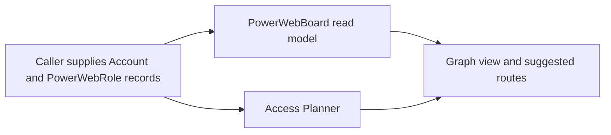

# Power Web Discovery AS IS

Status: current baseline before slice `0.7.6.6.0` implementation children.

## Executive statement

Power Web OS does not discover people today. The current product can display
already supplied roles and can build access routes from those supplied records,
but it has no people-search, identity-resolution, employment-validation or
relationship-discovery runtime.

## Current data flow

Current sequence: caller-supplied `Account` and `PowerWebRole` records ->
`PowerWebBoard` read model and Access Planner -> graph view and suggested
routes. There is no retrieval or identity-validation step in this sequence.

### `PowerWebRole`

`PowerWebRole` is a flat passed-in record containing role, optional person name,
state, influence and optional relation. It has no source references, provenance,
employment interval, identity decision or review history.

### `PowerWebBoard`

`PowerWebBoardBuilder` creates a deterministic read model from roles and missing
roles already present on `Account`. It does not search, retrieve, extract or
validate people.

### Access Planner

The deterministic Access Planner trusts roles and signals supplied by its
caller. It can suggest a partner introduction, technical benchmark,
procurement discovery or missing-stakeholder research. It does not prove that a
named person exists, currently works for the account or has the inferred
influence.

## Missing capabilities

- No independent `power_web_discovery` run, lineage, budget or artifact.
- No role-demand planning or source-lane scheduling.
- No public HH search or other people-source retrieval.
- No source-native `PersonProfile` retention.
- No reversible identity hypotheses or confirmed identity contract.
- No current/former/unknown employment validation.
- No evidence-backed relationship or influence projection.
- No benchmark, quality evaluator or path-level miss reasons.
- No privacy/retention enforcement specific to people data.

## Preserved compatibility boundary

Future discovery must hand reviewed results to the existing `PowerWebRole`,
`PowerWebBoard` and Access Planner contracts. Those contracts remain downstream
read models and must not become owners of retrieval or identity decisions.

## Slice 0.7.6.6.0 architecture change record

Slice `0.7.6.6.0` adds architecture contracts and documentation only. It does
not claim a runtime. The requirement mapping is:

- `PW-ASIS-01`: this document states the current absence explicitly.
- `PW-ARCH-01`: the reviewed target flow is defined in the TO BE document.
- `PW-ID-01`: confirmed identity requires corroboration and is reversible.
- `PW-GOV-01`: people-data boundaries are explicit.
- `PW-HH-01`, `PW-HH-02`: public-web feasibility is separate from HH API.
- `PW-BENCH-01`, `PW-BENCH-02`: the user benchmark is normalized, privacy-filtered, accepted and hash-frozen; it remains evaluator-only and no production search exists yet.
- `PW-CAP-01`: source lanes have capability outcomes.
- `PW-COMPAT-01`: Board and Access Planner remain compatible.
- `PW-PROC-01`: architecture validation is green only while all mandatory evidence and the accepted freeze remain intact.
