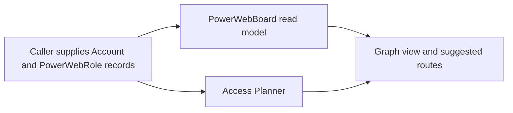

# Power Web Discovery AS IS

Status: current after slice `0.7.6.6.1`.

## Executive statement

Power Web OS does not discover people today. It can now prepare an immutable,
evidence-complete account handoff with exact product and semantic-role demand
snapshots. The current product can also display already supplied roles and
build access routes from those supplied records,
but it has no people-search, identity-resolution, employment-validation or
relationship-discovery runtime.

Power Web OS now has a persisted global discovery-configuration foundation. A
product owns versioned semantic buying roles. This foundation defines what a
future Power Web Discovery run must look for without hardcoding account job
titles, search hints or benchmark people into production configuration. Access
strategy is not an input to people discovery.

## Sales playbook foundation

The production path is:

```text
Playbook UI -> Products API -> SalesPlaybookService -> SQL repository
            -> mutable draft -> immutable published version -> active pointer
```

`ProductDefinition` and `BuyingRolePolicyVersion` are independent snapshots.
`SalesPlaybookDefinitionVersion` atomically references one compatible version
of each. New versions have no AccessPlaybook dependency. Historical access
snapshots remain readable for compatibility but cannot be changed or restored
into active discovery configuration. Draft updates use optimistic revision
checks; published versions are read-only and can only be activated or restored
into a new product-and-role draft.

The basic semantic-role policy contains a human name, responsibility in the
purchase or implementation, requiredness and organizational scope. Stable role
codes are system-owned. Decision rights, priority override and exclusions are
optional advanced guidance. Historical reason and expected-evidence values are
readable, but are not authored in the current UI and are not required by the
future RoleDemand contract. Roles do not contain people, job titles, source
URLs or search queries.

The global Playbook UI uses separate catalog and full-width product-detail
states. Product detail has Product, Buying roles and Versions tabs. A role
editor expands below its table row and shows four basic fields; optional fields
are collapsed under Advanced. Historical access rules appear only inside the
read-only detail of an old version and are labelled as compatibility data. The
existing account-specific explanation of route decisions remains available
under Access Plans as Rule analysis. `SmartDiagnostics` is seeded as an active
product with eight semantic roles.

## Account handoff and role demand

The implemented pre-search boundary is:

```text
completed Radar candidate run
  -> canonical evidence-complete candidate
  -> versioned Radar product policy
  -> immutable account identity snapshot
  -> product-scoped semantic RoleDemand sets
  -> optional correctly linked signal snapshot
  -> power_web_handoff.v1
```

A Radar owns an ordered, immutable-versioned list of published products. The
same product may be shared by several Radars. A handoff selects all bound
products by default or an explicit non-empty subset and freezes their active
Sales Playbook and Buying Role Policy versions. Similar roles from different
products remain separate and retain product lineage.

Accepted candidates are eligible immediately. Review-needed candidates require
an explicit persisted acknowledgement. The account identity is stable by INN,
then OGRN; without either it is provisional and scoped to the source candidate
run. Source-less, rejected and wrong-Radar candidates are blocked.

Signal context is optional and may only come from the latest completed Signal
Monitoring run for the same Radar, source candidate run and candidate scope.
The handoff copies only product-safe outcomes and evidence refs. It does not
change role policy or claim that people were searched.

The Radar Settings UI owns product bindings. Candidate detail has a Power Web
tab that shows readiness, product versions, signal lineage and review-needed
acknowledgement. A successful action says `Ready for people discovery` and
shows the immutable brief. It creates no `power-web-run-*`, candidate run,
signal run or provider call.

## Current data flow



Current sequence: caller-supplied `Account` and `PowerWebRole` records ->
`PowerWebBoard` read model and Access Planner -> graph view and suggested
routes. There is no retrieval or identity-validation step in this sequence.

### `PowerWebRole`

`PowerWebRole` is a flat passed-in record containing role, optional person name,
state, influence and optional relation. It has no source references, provenance,
employment interval, identity decision or review history.

### `PowerWebBoard`

`PowerWebBoardBuilder` creates a deterministic read model from roles and missing
roles already present on `Account`. It does not search, retrieve, extract or
validate people.

### Access Planner

The deterministic Access Planner trusts roles and signals supplied by its
caller. It can suggest a partner introduction, technical benchmark,
procurement discovery or missing-stakeholder research. It does not prove that a
named person exists, currently works for the account or has the inferred
influence.

## Missing capabilities

- No independent `power_web_discovery` run, lineage, budget or artifact.
- No job-title/query hypothesis generation or source-lane scheduling from role demands.
- No public HH search or other people-source retrieval.
- No source-native `PersonProfile` retention.
- No reversible identity hypotheses or confirmed identity contract.
- No current/former/unknown employment validation.
- No evidence-backed relationship or influence projection.
- No benchmark, quality evaluator or path-level miss reasons.
- No privacy/retention enforcement specific to people data.

## Preserved compatibility boundary

Future discovery must hand reviewed results to the existing `PowerWebRole`,
`PowerWebBoard` and Access Planner contracts. Those contracts remain downstream
read models and must not become owners of retrieval or identity decisions.

## Slice 0.7.6.6.0 architecture change record

Slice `0.7.6.6.0` adds architecture contracts and documentation only. It does
not claim a runtime. The requirement mapping is:

- `PW-ASIS-01`: this document states the current absence explicitly.
- `PW-ARCH-01`: the reviewed target flow is defined in the TO BE document.
- `PW-ID-01`: confirmed identity requires corroboration and is reversible.
- `PW-GOV-01`: people-data boundaries are explicit.
- `PW-HH-01`, `PW-HH-02`: public-web feasibility is separate from HH API.
- `PW-BENCH-01`, `PW-BENCH-02`: the user benchmark is normalized, privacy-filtered, accepted and hash-frozen; it remains evaluator-only and no production search exists yet.
- `PW-CAP-01`: source lanes have capability outcomes.
- `PW-COMPAT-01`: Board and Access Planner remain compatible.
- `PW-PROC-01`: architecture validation is green only while all mandatory evidence and the accepted freeze remain intact.

## Slice 0.7.6.6.0.1 implementation change record

- `PWF-PROD-01`: product lifecycle, mutable drafts and persistence are implemented.
- `PWF-ROLE-01`: published roles require semantic responsibility and evidence fields.
- `PWF-ROLE-02`: account title hypotheses cannot mutate role-policy fields.
- `PWF-ACCESS-01`: access routes reference existing semantic role codes only.
- `PWF-VERS-01`: published versions are immutable and stale drafts return a conflict.
- `PWF-API-01`: API state survives backend restart.
- `PWF-UI-01`: Product, Buying roles, Access rules and Versions are separate backend-backed views.
- `PWF-UI-02`: account-specific Playbook analysis is owned by Access Plans.
- `PWF-DEMO-01`: SmartDiagnostics has eight seeded semantic roles.
- `PWF-BENCH-01`: the benchmark amendment references configuration only and preserves blind leakage zero.
- `PWF-COMPAT-01`: legacy Playbook, Power Web Board and Access Planner remain compatible.
- `PWF-NET-01`: this slice performs no provider calls and creates no search runs.
- `PWF-PROC-01`: TO BE, manifest, validation report and this AS IS record are traceable.

The next runtime slice must consume an immutable active product and semantic
role-policy snapshot. It must not invent the required buying committee or read
account-specific job titles from this configuration.

## Slice 0.7.6.6.0.2 implementation change record

- `PWS-CFG-01`: the canonical discovery configuration is product plus semantic-role policy, without access strategy.
- `PWS-ROLE-01`: a role publishes with four basic business fields and empty advanced guidance.
- `PWS-ROLE-02`: requiredness provides deterministic priority defaults; manual override is advanced.
- `PWS-PLAN-01`: authored expected evidence and title/query hints are not required RoleDemand inputs.
- `PWS-ACCESS-01`: new publications create no access snapshot and access mutation is rejected.
- `PWS-ACCESS-02`: historical access snapshots remain readable but are not reactivated by restore.
- `PWS-API-01`: simplified configuration survives API, database and restart round-trips.
- `PWS-UI-01`: product catalog and full-width product detail are separate navigation states.
- `PWS-UI-02`: the role editor expands inline at the table width and exposes four basic controls.
- `PWS-TABS-01`: workspace sections share one underline-tab component; pills remain filters and mode controls.
- `PWS-COMPAT-01`: legacy Playbook, Power Web Board and Access Planner remain operational.
- `PWS-BENCH-01`: the accepted benchmark remains evaluator-only with blind leakage zero.
- `PWS-NET-01`: the slice performs no provider calls and creates no search runs.
- `PWS-PROC-01`: TO BE, tests, machine validation and this finalized AS IS record are traceable.

## Slice 0.7.6.6.1 implementation change record

- `PW-HO-POL-01`: Radar-product bindings are a separate ordered immutable policy.
- `PW-HO-PROD-01`: each handoff freezes exact active product and role-policy versions.
- `PW-HO-ELIG-01`: accepted and acknowledged review-needed admission is explicit.
- `PW-HO-PROV-01`: only canonical evidence-complete candidates enter the handoff.
- `PW-HO-ID-01`: stable INN/OGRN and provisional scoped account identities are deterministic.
- `PW-HO-ROLE-01`: RoleDemand contains semantic policy and no titles, queries or expected answers.
- `PW-HO-ROLE-02`: product role sets are never silently merged.
- `PW-HO-SIG-01`: signal context is optional and lineage-checked.
- `PW-HO-IDEM-01`: persisted handoff snapshots are immutable and idempotent.
- `PW-HO-API-01`: policy and handoffs survive API/worker restart.
- `PW-HO-UI-01`: Radar Settings and candidate detail expose the same backend truth.
- `PW-HO-ARCH-01`: Power Web application logic remains provider-neutral and package-owned.
- `PW-HO-BENCH-01`: blind controls remain evaluator-only with leakage zero.
- `PW-HO-NET-01`: provider calls and new pipeline runs are zero.
- `PW-HO-PROC-01`: TO BE, manifest, tests, Docker evidence, validation and AS IS are traceable.
