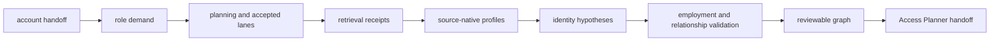

# Power Web TO BE 0.7.6.6.0

Status: Reviewed architecture; user benchmark accepted and frozen; implementation children not started.

AS IS: `../RADAR_POWER_WEB_DISCOVERY_AS_IS.md`
Acceptance manifest: `RADAR_POWER_WEB_DISCOVERY_TO_BE_0.7.6.6.0.acceptance.json`

## Decision context

Candidate Discovery finds accounts. Signal Monitoring checks events for those
accounts. Power Web Discovery is the third independent pipeline: it finds and
validates people, roles and relationships for an already selected account, then
hands only review-allowed states to Access Planner.

This slice defines contracts and acceptance evidence. It does not implement
production retrieval, persistence, API, jobs or UI.

## Intended flow

Target sequence: account handoff -> role demand -> accepted source plan ->
retrieval receipts -> source-native profiles -> identity hypotheses ->
employment and relationship validation -> reviewable graph -> Access Planner
handoff.

## Ownership and isolation

`power_web_os.application.radar.power_web_discovery` owns provider-neutral
roles, profiles, identity hypotheses, claims, source capabilities, graph
contracts, benchmark contracts and validation rules.

It must not import Candidate Discovery or Signal Monitoring internals, FastAPI,
SQLAlchemy, Celery, HTTP clients or provider SDKs. Later adapters implement
ports in integrations. API, persistence and workers remain outer layers.

## Contracts

- `RoleDemand`: required role, scope, aliases, expected evidence and reason.
- `PersonProfile`: one named or anonymous source-native profile.
- `IdentityHypothesis`: possible, probable, confirmed_same, confirmed_different or rejected.
- `PersonIdentity`: confirmed identity over retained profile references.
- `EmploymentClaim`: employer, unit, title, interval and current/former/unknown.
- `RelationshipClaim`: typed and dated relationship with evidence.
- `InfluenceHypothesis`: evidence-backed role/influence hypothesis and review state.
- `SourceEvidence`: URL, safe excerpt, dates, capability and claim refs.
- `PowerWebGap`: path-level role/source/profile/identity/employment/relationship gap.
- `PowerWebArtifact`: immutable lineage, profiles, decisions, graph, gaps and diagnostics.

## Identity rules

Recall-first means source-backed profiles and ambiguous hypotheses are retained.
It does not mean automatic merging.

A confirmed same-person decision requires at least two independent compatible
dimensions, no unresolved hard contradiction, retained source profiles and
a reversible merge/unmerge decision. Name, title, employer, one photograph,
an image fingerprint or an LLM opinion cannot confirm identity alone.

Exact and perceptual duplicate-image fingerprints are non-biometric clues.
There is **no face similarity**, no face embeddings and no reverse-face search
in the approved architecture.

## Governance

Artifacts retain no raw HTML, no raw provider payload, no binary images, no
private contacts and no automated outreach instruction. The pipeline must not
bypass authentication, CAPTCHA, robots or source restrictions. It retains only
public product-safe excerpts, URLs, dates, source metadata and allowed image
fingerprints.

## HH public-web lane

`hh_public_web` uses ordinary web search with domain restriction `hh.ru`.
Queries are account-, role-, unit-, geography- and alias-aware. Indexed snippets
and accessible pages are source leads, not confirmed identities. Anonymous
profiles stay anonymous and contacts are never extracted.

The mandatory bounded feasibility probe covers:

1. organization + technical role;
2. organization + title/unit;
3. role + geography + profile/resume.

`hh_authorized_api` is deferred. No HH API credentials, calls or budget are
required by slices `0.7.6.6.1-0.7.6.6.9`. Licensed API work belongs to
`0.7.6.6.2.1`.

## Source capability matrix

Every lane has an access mode, allowed operations, fields, freshness, bounded
cost, retention policy and terminal outcome. Initial cards cover HH public web,
official company pages, professional networks, publications/events,
procurement/patents, industry web, generic web, image evidence and deferred HH
API.

The terminal outcomes are `available`, `public_search_only`, `blocked_auth`,
`blocked_policy`, `deferred` and `unsupported`.

## Planning, budgets and checkpoints

Future behavior slices will define exact limits, but this architecture fixes
independent budget dimensions:

- planning calls;
- search/retrieval tasks per role and lane;
- provider calls and retries;
- source verification requests;
- profile extraction/repair attempts;
- identity pair evaluations;
- bounded gap-driven enrichment.

Checkpoints occur after role demand, plan acceptance, retrieval, profile
extraction, identity evaluation, employment validation and graph projection.
Every task and lane ends as executed, not found, policy limited, budget limited,
provider failed or schema failed. No “not found” may hide incomplete coverage.

## Benchmark contract

The versioned benchmark separates:

- `planning_context`: account, product, role policy and allowed lanes;
- `guided_hints`: explicit diagnostic hints used only in guided mode;
- `blind_controls`: people, URLs, pair labels, employment and relationships
  loaded only by the evaluator after a run.

Minimum dataset coverage is one evidence-rich account, eight role demands, ten
profile controls, four same-person pairs, four different-person pairs, all
employment states, three relationship/influence controls and one anonymous
HH-style profile. Every control has `as_of`, provenance and expected state.

Frozen future quality thresholds are: blind leakage 0; false confirmed merges
0; confirmed identity precision 100%; same-person hypothesis retention 100%;
probable/confirmed same-person recall at least 80%; required-role coverage at
least 80%; employment accuracy at least 90%; no provenance-free confirmed
relationships or graph items; unexplained misses 0.

The user-supplied `sibur_priority_contacts.xlsx` benchmark was normalized into
`benchmark.user.json`, accepted and canonical-hash frozen on 2026-07-17. The
accepted v1 dataset contains 10 source-native profiles, 4 same-person and 4
different-person pairs, current/former/unknown employment controls and 4
relationship/influence controls. The source workbook is not committed because
it contains private contact and outreach fields; the source hash, selected
public rows and privacy filter are recorded in `benchmark.source.json` and
`BENCHMARK_REVIEW.md`.

## Access Planner handoff

Only explicitly allowed reviewed states are adapted to compatibility
`PowerWebRole` records. Source profiles and hypotheses remain available in the
Power Web artifact. Access Planner receives evidence refs and unresolved gaps;
it never decides whether two profiles are the same person.

## Requirement traceability

- `PW-ASIS-01`: current absence is documented without future claims.
- `PW-ARCH-01`: pipeline boundary, roles and handoffs are defined.
- `PW-ID-01`: identity confirmation is corroborated and reversible.
- `PW-GOV-01`: privacy, retention, image and no-outreach rules are enforced.
- `PW-HH-01`: three public HH query patterns have receipts.
- `PW-HH-02`: HH API calls and required credentials equal zero.
- `PW-BENCH-01`: benchmark schema and blind isolation are machine tested.
- `PW-BENCH-02`: user benchmark is accepted and hash-frozen.
- `PW-CAP-01`: every planned lane has a capability outcome.
- `PW-COMPAT-01`: existing Board and Access Planner remain green.
- `PW-PROC-01`: AS IS, TO BE, ADRs, tests and validation are traceable.

## Test plan

Contract tests cover anonymity, provenance, identity contradictions, image
evidence and graph explanation. Benchmark tests cover minima, blind leakage and
freeze drift. Capability tests prove domain-derived HH queries, safe receipts,
zero API calls and deferred API status. Architecture tests protect imports and
existing Board/Planner behavior.

## Acceptance and out of scope

The architecture is accepted only when all `PW-*` requirements pass. Production
search, persistence, API, jobs, UI, biometric matching, private contacts and
outreach are out of scope.
