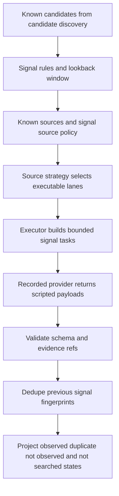

# Radar Signal Monitoring AS IS

Status: AS IS
Pipeline id: `signal-monitoring`
Generated PDF: `docs/radar/pipelines/signal-monitoring/RADAR_SIGNAL_MONITORING_AS_IS.pdf`
Current slice: `0.7.6.4.5: First recorded TOIR signal monitoring loop`

## 1. Purpose

Signal monitoring is the frequent Radar loop that checks already known
candidates for recent intent evidence. It does not rediscover companies. It
starts from candidate-discovery output, signal rules, source policy, known
sources, model profile summary, and signal budgets.

The current implementation is a recorded no-network harness. It proves the
pipeline contract, source strategy, extraction recovery, dedupe semantics,
budget states, and report projection without live OpenRouter, DaData, workers,
API routes, or UI controls.

## 2. Current Runtime Surface

The implemented surface is intentionally small:

- `SignalMonitoringInput` carries candidates, signal rules, known sources,
  source cards, signal source policy, signal budget, lookback window, model
  profile id, and previous signal fingerprints.
- `SignalMonitoringSourceStrategy` chooses source lanes before task execution.
- `SignalMonitoringExecutor` builds tasks and executes them against a scripted
  provider port.
- `radar_signal_monitoring.py` loads a recorded fixture, runs the executor, and
  writes a product-safe report.
- `power_web_os.demo run-recorded-signal-monitoring` is the demo command.

There is no live provider integration in this pipeline yet.

## 3. High-Level Flow

<!-- diagram: high_level_pipeline -->



## 4. Current Recorded TOIR Loop

The recorded ТОиР fixture lives at:

```text
demo/fixtures/radar_signal_monitoring/toir_recorded_signal_monitoring.json
```

It uses five known SIBUR-context entities:

| Candidate | Type | Monitoring role |
|---|---|---|
| `nizhnekamskneftekhim` | legal entity | tender, searched-negative vacancy, duplicate implementation signal |
| `kazanorgsintez` | legal entity | tender, vacancy, digitalization signals |
| `zapsibneftekhim` | legal entity | budget-limited tail tasks |
| `gubkinsky-gpp` | production site | budget-limited review-needed site tasks |
| `tobolsk-site` | production site | budget-limited review-needed site tasks |

The fixture has three signal rules:

| Signal code | Meaning |
|---|---|
| `toir_tender` | Tender, procurement, repair, service, ТОиР, EAM/CMMS opportunity. |
| `toir_vacancy` | Vacancy indicating maintenance planning, EAM, CMMS, or 1C ТОИР activity. |
| `toir_digitalization` | News or article about 1C ТОИР, EAM, CMMS, or maintenance digitalization. |

## 5. Source Strategy

The current recorded loop uses one reusable known source lane:

```text
known_source -> sibur_known_sources
```

Open web is disabled in the fixture so the run stays no-network and
deterministic. The implemented source strategy still supports the broader
planned order:

1. known candidate-discovery sources;
2. official/company sources;
3. signal-specific source hints;
4. open web if policy and source capability allow it.

Source eligibility is capability-based. Registry/enrichment-only sources are
not used for signal evidence unless their connector profile says they support
signal evidence.

## 6. Task Building And Budgets

The executor builds tasks as:

```text
candidate x signal rule x selected source lane
```

For the recorded ТОиР fixture this creates 15 tasks. The fixture caps signal
provider calls at 6, so the first six tasks are executed and the remaining
tasks become `not_searched_budget_limited`.

Current signal counters include:

| Counter | Meaning |
|---|---|
| `signal_tasks_built` | Total signal task cards produced before budget gates. |
| `signal_provider_calls` | Scripted provider calls spent by the run. |
| `signal_extraction_retries` | Primary retry count after invalid extraction shape. |
| `signal_backup_retries` | Backup retry count after primary retry failure. |
| `signal_lookback_queries` | Candidate/signal/source task checks considered for the lookback window. |

## 7. Extraction And Evidence Contract

Provider payloads must be JSON objects with:

```text
sources: list[SignalSourceRef]
observations: list[object]
```

The executor repairs narrow list/object shape mistakes, retries the primary
provider once when allowed by signal budget, and can call a backup provider in
tests. The recorded ТОиР fixture uses valid scripted payloads and does not call
backup.

An `observed` signal must include evidence refs that resolve to returned
sources. Missing evidence refs become `evidence_linking_failed`, not a product
signal.

## 8. Signal States

Product and diagnostic states are deliberately separate:

| State | Meaning |
|---|---|
| `observed` + `searched` | Fresh source-backed signal was found. |
| `not_observed` + `searched` | The signal was actually searched and no fresh evidence was found. |
| `duplicate_existing_signal` | Evidence matches a previous signal fingerprint and is not new. |
| `not_searched_budget_limited` | Task was not searched because a signal budget was exhausted. |
| `not_searched_policy_limited` | Source policy/capability prevented search. |
| `schema_recovery_needed` | Provider output stayed invalid after allowed recovery. |
| `evidence_linking_failed` | Observation did not link to returned source refs. |
| `review_needed` | Evidence or candidate state needs human review. |

`not_observed` never means "we did not search".

## 9. Report Output

The demo command writes:

```text
demo/output/radar_signal_monitoring_report.json
```

The report contains:

- artifact metadata and fixture path;
- model profile summary for `signal_monitoring_default`;
- candidate and signal-rule summaries;
- task list;
- observations and evidence refs;
- source strategy decisions;
- provider attempts;
- budget counters;
- diagnostics.

The report does not include raw prompts, hidden reasoning, headers, API keys,
or raw provider dumps.

## 10. Demo Command

Run the recorded loop from the repository root:

```bash
python -m power_web_os.demo run-recorded-signal-monitoring \
  --signal-monitoring-fixture demo/fixtures/radar_signal_monitoring/toir_recorded_signal_monitoring.json \
  --signal-monitoring-output demo/output/radar_signal_monitoring_report.json
```

Expected report states:

| Category | Expected example |
|---|---|
| New signal | Tender, vacancy, or digitalization observation with evidence refs. |
| Repeated signal | `duplicate_existing_signal` for a previous fingerprint. |
| Searched negative | `not_observed` only after a searched task. |
| Budget limited | Tail tasks become `not_searched_budget_limited`. |

## 11. Extension Points

Next runtime slices can extend this AS IS surface by adding:

- persisted signal run records;
- API/worker execution;
- UI controls for candidate discovery versus signal monitoring;
- live source adapters;
- durable last-seen fingerprint storage;
- signal-specific source settings in Radar UI/config.

These additions should keep the same product rule: searched-negative and
not-searched states must remain separate.

## 12. Test Map

Current tests cover:

- signal contracts, retry/backup semantics, dedupe, evidence linking, and
  budget states;
- source strategy ordering and capability-based source eligibility;
- recorded ТОиР loop report generation;
- demo command output;
- product-safe report redaction;
- pipeline documentation contract.

## 13. Out Of Scope

- Live OpenRouter/DaData/SPARK calls.
- API endpoints, worker jobs, scheduler, or DB migration.
- UI controls.
- Candidate rediscovery.
- Sales notification, CRM handoff, or Power Web route update.
- Live quality or benchmark claim.
