# Radar Signal Monitoring AS IS

Status: AS IS

Pipeline id: `signal-monitoring`

Generated PDF: `docs/radar/pipelines/signal-monitoring/RADAR_SIGNAL_MONITORING_AS_IS.pdf`

Current slice: `0.7.6.4.18.2.2: Signal event-time integrity, source capability binding and expanded live quality benchmark`

Implemented TO BE: `docs/radar/pipelines/signal-monitoring/to-be/RADAR_SIGNAL_MONITORING_TO_BE_0.7.6.4.18.2.2.md`

Validation report: `docs/radar/pipelines/signal-monitoring/validation/0.7.6.4.18.2.2/VALIDATION_REPORT.md`

## 1. Purpose And Boundary

Signal Monitoring checks already discovered candidates for time-bounded intent
evidence. It consumes an immutable, evidence-complete candidate-discovery run,
but it does not rediscover companies, expand the candidate universe, call the
candidate-discovery executor or spend candidate-discovery budgets.

The pipeline supports deterministic recorded execution and persisted live
execution through its own API, Celery job, provider adapter, output repository
and budget report. A signal run is linked to its source candidate run by
`source_run_id`; candidate history continues to select only
`pipeline_id=candidate_discovery`.

## 2. Implemented Flow

```mermaid
flowchart TD
  A[Completed candidate run] --> B[Freeze candidates rules sources and as-of]
  B --> C[Resolve initial or incremental windows]
  C --> D[Build deterministic multi-lane plan]
  D --> E[Accept plan and account for every source decision]
  E --> F[Schedule within signal-only budget]
  F --> G[Known URL retrieval]
  F --> H[Official domain retrieval]
  F --> I[Criterion-specific retrieval]
  F --> J[Separate open-web retrieval]
  G --> K[Safe receipt and source lifecycle]
  H --> K
  I --> K
  J --> K
  K --> L[Validate entity criterion date source and restrictions]
  L --> M[Coverage checkpoint]
  M -->|valid evidence| N[Observed]
  M -->|complete coverage no evidence| O[Not observed]
  M -->|incomplete or failed| P[Explicit review or not-searched state]
  N --> Q[Fingerprint and source-key dedupe]
  O --> R[Advance successful lane watermarks]
  P --> S[Do not advance failed lane watermark]
  Q --> T[Persist standalone report]
  R --> T
  S --> T
```

<!-- diagram: signal_monitoring_pipeline -->



## 3. Input And Source Planning

`SignalMonitoringInputAssembler` accepts only a completed candidate run from
the same Radar. The default scope contains evidence-complete accepted and
review-needed candidates; `accepted_only` and explicit candidate/signal
whitelists are supported. The input snapshot freezes candidate provenance,
signal rules, source policy, the common `as_of`, previous fingerprints,
previous source keys and per-lane watermarks.

For each `candidate x criterion`, the deterministic planner considers:

- up to two concrete known-source URLs;
- an official-domain task when policy permits it;
- configured criterion-specific sources;
- a separate open-web task when policy permits it.

Known-source tasks carry URL, title, snippet and source identity. Registry refs
without a URL are not treated as fresh-signal sources. Official tasks contain
real domain restrictions. Every selected source decision appears in the lane
ledger as `scheduled`, `executed`, `not_scheduled_budget_limited`,
`not_executable` or `policy_limited`; selected decisions cannot silently
disappear. These are the implemented contracts `SM-PLAN-01`, `SM-SRC-01`,
`SM-SRC-02` and `SM-SRC-03`.

## 4. Retrieval Audit And Source Lifecycle

Every executed task produces a product-safe `SignalSearchExecutionReceipt`
with query, candidate, criterion, lane, URL/domain constraints, engine,
effective window, timestamps, result count, normalized source refs and terminal
outcome (`SM-AUD-01`). Provider annotations and citations are sanitized and
normalized; credentials, headers, raw payloads and hidden reasoning are never
persisted.

The source lifecycle records planned, requested, retrieved, verified, linked,
used, no-results, rejected and failed transitions. This makes a searched
negative result auditable: the report shows where the pipeline searched, under
which restrictions and what came back.

## 5. Evidence Validation And Checkpoints

A positive signal is accepted only when all checks pass:

- the evidence belongs to the requested candidate;
- it supports the requested criterion;
- its date is within the effective window;
- every used ref resolves to normalized evidence;
- policy and source capability permit the evidence;
- known-source evidence belongs to the requested URL family;
- generated summary and score do not contradict the evidence.

Irrelevant group-company pages, another legal entity's evidence, out-of-window
documents and unresolved refs cannot become `observed` (`SM-VAL-01`,
`SM-VAL-02`). One bounded query revision is allowed per candidate/criterion;
primary and backup retries remain bounded and visible.

After required lanes finish, the checkpoint produces `observed`,
`not_observed`, bounded revision, `review_needed_coverage_incomplete`,
`not_searched_budget_limited` or `provider_or_schema_recovery_needed`.
`not_observed` is legal only when all required lanes have successful receipts
and no valid evidence (`SM-OBS-01`). Failure or missing coverage is never
reported as proof that no signal exists.

`not_observed` never means "the pipeline did not search". It means the required
search coverage is proven by successful receipts and yielded no valid signal.

## 5.1 Event-Time Integrity And Source Capability

Signal evidence separates retrieval time, publication time and event time:

- `retrieved_at` records when the pipeline obtained a page and never proves
  freshness;
- `published_at` records a publication date when it can be established from
  safe source metadata, URL/title/snippet hints or provider extraction;
- `event_at` / `event_end_at` records the event interval when the source text
  supports it.

Temporal statuses are `confirmed_in_window`,
`review_needed_date_unknown`, `review_needed_date_conflict` and
`rejected_out_of_window`. Relevant evidence with no reliable date is retained
for human review. Known out-of-window evidence is retained as rejected evidence
but cannot be a confirmed source. When one task has both confirmed and rejected
evidence, only confirmed refs are published in `source_refs`; rejected or
unknown evidence remains in the artifact for audit/control evaluation.

Every source carries a generic capability such as `official_press`,
`generic_web`, `project_or_asset_history`, `identity_only`, `registry` or
`unknown`. Identity-only and registry sources may support candidate identity,
but they cannot confirm a fresh signal. Candidate/source binding is checked
before known-source scheduling so another entity's page cannot become a
candidate-specific signal source.

## 6. Time Windows And Incremental Runs

Initial lookback precedence is:

1. explicit API run override;
2. criterion `initial_lookback_days` when present;
3. Radar `monitoring_policy.lookback_window`;
4. 365-day fallback.

The CLI passes no implicit seven-day override. The benchmark Radar therefore
uses its configured 90 days unless a run explicitly requests 365 days.
`SM-WIN-01` covers this precedence.

Without an explicit override, a repeated run resolves an independent watermark
for `candidate_id + signal_code + source_lane`. Its window begins at the last
successful `searched_through_at` minus a two-day overlap and ends at the new
`as_of` (`SM-WIN-02`). Only successful searched receipts advance that lane.
Provider errors, schema failures, policy skips and budget limits do not advance
it (`SM-WIN-03`).

Overlap dedupe uses both exact fingerprints and stable
`candidate + criterion + canonical evidence URL` keys. Different provider
wording therefore cannot republish an old event as new (`SM-DED-01`).

## 7. Budgets And Models

Signal Monitoring owns independent counters and never reads or mutates
candidate-discovery budgets.

| Profile | Tasks | Provider calls | Extraction retries | Backup retries | Lookback queries | Source verifications | Query revisions |
|---|---:|---:|---:|---:|---:|---:|---:|
| `signal_monitoring_smoke` | 6 | 8 | 2 | 1 | 6 | 12 | bounded |
| `signal_monitoring_quality` | 48 | 60 | 8 | 4 | 60 | 120 | 1 per candidate/criterion |

The live adapter uses `signal_monitoring_default`. Transport and schema errors
become explicit review/recovery states, not false searched-negative results.

## 8. Persisted Artifact And API

`radar_signal_monitoring_report` stores run lineage, immutable input, model
profile, search plan, plan acceptance, source-lane ledger, receipts, source
lifecycle, window policy, watermarks before/after, validation records,
checkpoint decisions, observations, provider attempts, signal-only budgets and
diagnostics. It survives API and worker restarts.

The API remains additive and backward compatible:

```text
GET  /api/radars/{radar_id}/signal-monitoring/preflight
POST /api/radars/{radar_id}/signal-monitoring-runs
GET  /api/radars/{radar_id}/signal-monitoring-runs
GET  /api/signal-monitoring-runs/{run_id}
GET  /api/signal-monitoring-runs/{run_id}/report
```

Recorded contract execution remains available through:

```powershell
python -m power_web_os.demo run-recorded-signal-monitoring
```

Persisted live execution uses `run-live-signal-monitoring` with the API at
`http://127.0.0.1:8001`, a completed source candidate run, candidate ids,
signal codes and either the smoke or quality profile.

## 9. Validation Evidence

Recorded positive-control benchmark contains known events for industrial
candidates and two criteria. It requires exact evidence matching, zero
accepted irrelevant controls and complete lane/receipt accounting.

Persisted live acceptance used source candidate run
`radar-run-3bbf9c0f-330e-4468-8901-966a751234a8`:

- initial quality run `signal-run-010ef75d-c626-44e3-a025-56c95522c1a8`:
  six candidates, two criteria, 12 candidate/criterion pairs, 27 executed
  tasks, four observed outcomes, two unknown-date review items, four of four
  positive controls matched by candidate/criterion/URL-set/date, two negative
  controls retained unconfirmed, zero retrieved-at freshness violations and
  zero confirmed out-of-window evidence;
- incremental quality run `signal-run-df00b3b8-267c-4091-a4dd-8167434e2cf3`:
  six candidates, 25 executed tasks, 24 loaded previous source keys, 25
  incremental windows, three duplicate review items, zero previous sources
  republished and zero observed outcomes republished as new.

Both reports remained readable through the persisted API contour. The machine
validation report is the closure authority, not these prose numbers.

## 10. Requirement Change Record

Slice `0.7.6.4.18.2.1` finalized the following mandatory requirements in this
AS IS: `SM-PLAN-01`, `SM-SRC-01`, `SM-SRC-02`, `SM-SRC-03`, `SM-AUD-01`,
`SM-OBS-01`, `SM-WIN-01`, `SM-WIN-02`, `SM-WIN-03`, `SM-VAL-01`,
`SM-VAL-02`, `SM-DED-01`, `SM-ARCH-01` and `SM-PROC-01`.

Slice `0.7.6.4.18.2.2` finalized the following mandatory requirements in this
AS IS: `SM-TIME-01`, `SM-TIME-02`, `SM-TIME-03`, `SM-CAP-01`,
`SM-BIND-01`, `SM-BIND-02`, `SM-QUERY-01`, `SM-RETRY-01`, `SM-SCORE-01`,
`SM-BENCH-01`, `SM-BENCH-02`, `SM-BENCH-03`, `SM-DED-02`, `SM-AUD-02`,
`SM-ARCH-02` and `SM-PROC-02`.

The traceability chain is TO BE -> acceptance manifest -> exact tests -> two
persisted live reports -> validation JSON/Markdown -> this AS IS
(`SM-PROC-01`, `SM-PROC-02`). Signal Monitoring remains isolated from
candidate-discovery internals (`SM-ARCH-01`, `SM-ARCH-02`).

## 11. Process Rule

Every future Radar slice marked `Pipeline` and `Behavior change: true` requires
an AS IS baseline, TO BE Markdown/PDF, acceptance manifest, mapped tests,
diagnostic run, bounded autofix/RCA loop, persisted validation report with
`validation_status=PASS`, and final TO BE-to-AS IS reconciliation. The roadmap
tracker refuses `Done` when this evidence is missing or failed.

## 12. Product UI Contract

The Radar `Runs` tab exposes Signal Monitoring through its persisted API. It has
its own preflight, run action, history selector, status, budget summary and
report. Every selected signal run displays `source_run_id` and automatically
selects that candidate-discovery run. Candidate history and counters remain
unchanged by signal runs. The full cross-pipeline contract lives in
`docs/radar/pipelines/RADAR_PIPELINE_SPLIT_UI_CONTRACT.md`.

## 13. Out Of Scope

- recurring scheduler and notification delivery;
- persisted/UI per-criterion depth, cadence and source settings, planned in
  `0.7.6.4.18.3.1`;
- candidate rediscovery or candidate-universe expansion;
- public quality claims from one acceptance pair.
