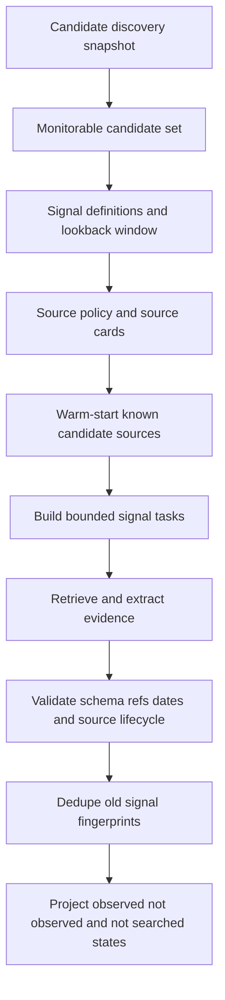

# Radar Signal Monitoring TO BE: 0.7.6.4.1

Status: TO BE design
Slice: `0.7.6.4.1: Pipeline Documentation Registry And Signal-monitoring TO BE`
Product area: Radar signal monitoring
Created: 2026-07-01
Pipeline id: `signal-monitoring`
Registry: `docs/radar/pipelines/README.md`
Generated PDF: `docs/radar/pipelines/signal-monitoring/to-be/RADAR_SIGNAL_MONITORING_TO_BE_0.7.6.4.1.pdf`

## 1. Decision Context

Candidate discovery has become a mature upstream search pipeline. It finds and
qualifies account-level candidates and review-needed upstream entities. Signal
monitoring is a different product loop: after candidates exist, the system must
repeatedly check recent evidence for configured intent signals.

The two loops must stay separate because their cadence, budgets, source
strategy, model roles, and diagnostic states differ. Candidate discovery can run
infrequently. Signal monitoring is expected to run weekly or on another
product-configured cadence.

## 2. AS IS Problem Statement

Today the implemented Radar pipeline mixes candidate discovery and signal search
inside one large execution story. That was useful while proving the first Radar,
but it is now too broad:

- discovery tuning can accidentally affect monitoring behavior;
- signal search does not yet own a separate budget and model-role profile;
- there is no reviewed signal-monitoring algorithm document;
- future signal tests have no dedicated contract surface;
- known candidate sources are not yet treated as warm-start material for a
  repeated monitoring loop.

This TO BE does not claim that signal-monitoring runtime exists. It defines the
target design for the next implementation slices.

## 3. Intended Pipeline Behavior

Signal monitoring starts from known candidates, not from an open-ended company
search. It answers: "For these candidates and these configured signal rules, was
there new source-backed evidence in the lookback window?"

High-level flow:

1. Load the latest accepted candidate-discovery snapshot or an explicit
   candidate set.
2. Materialize monitorable candidates and review-needed entities that are
   allowed by policy.
3. Load signal definitions, lookback window, source policy, and signal model
   profile.
4. Warm-start from known candidate sources: used, retrieved, analyzed, and
   verified lifecycle records from candidate discovery.
5. Compile source capabilities and reject sources that cannot provide signal
   evidence.
6. Build bounded signal tasks per candidate, signal code, source lane, and time
   window.
7. Retrieve and extract signal evidence.
8. Validate extraction schema, evidence refs, source lifecycle, and time window.
9. Dedupe against previously observed signal fingerprints.
10. Project product signal states and diagnostic states into dossier/report.

<!-- diagram: high_level_pipeline -->

## 4. Roles Changed Or Introduced

| Role | Responsibility |
|---|---|
| Signal candidate materializer | Converts accepted discovery output into the set of candidates/entities eligible for monitoring. |
| Signal task builder | Builds bounded tasks by candidate, signal rule, source lane, and lookback window. |
| Signal source strategy | Reuses known candidate sources first, then schedules allowed fresh searches when needed. |
| Signal extractor | Extracts strict task-specific signal evidence JSON from retrieved material. |
| Signal evidence judge | Checks whether evidence actually supports the signal and links to valid source refs. |
| Signal novelty/dedupe judge | Decides whether the evidence is new for the monitoring window or already known. |
| Signal backup extractor | Runs only after deterministic repair and primary retry fail. |
| Signal dossier mapper | Explains observed, searched-negative, not-searched, budget-limited, and review-needed states. |

## 5. Context Passed Between Roles

Signal monitoring receives product-safe context only:

- candidate id, display name, legal identifiers, entity type, and review flags;
- accepted or review-allowed candidate-discovery source refs;
- signal definitions and expected evidence semantics;
- lookback window and last-seen signal fingerprints;
- source cards and source obligations;
- signal-specific task and external-call budgets;
- model role profile for signal tasks.

It must not pass secrets, raw hidden reasoning, raw provider dumps, or unrelated
candidate-discovery traces into model prompts or product dossier.

## 6. Source Strategy

Signal monitoring should search in this order:

1. Existing candidate sources from the last discovery run when they are still
   relevant to the lookback window.
2. Official or preferred sources selected in the Radar source policy.
3. Open web sources only when policy and budget allow them.
4. Fallback sources only after preferred lanes are exhausted or unavailable.

Registry/enrichment connectors such as DaData-like sources are not signal
evidence by default. The algorithm must not hardcode provider names; it should
use compiled connector capabilities. A future SPARK-like connector can
participate only if its profile says it returns signal evidence or useful
source-backed facts for the signal task.

## 7. Budget And Model Profile Semantics

Signal monitoring owns separate budget and model settings from candidate
discovery.

Required future budget groups:

- signal task count;
- signal OpenRouter calls;
- signal extraction retries;
- source verification requests;
- known-source reinspection tasks;
- fresh signal search tasks;
- per-candidate and per-signal caps.

Required future model roles:

- signal planner or deterministic task builder;
- signal extractor;
- signal evidence judge;
- signal novelty/dedupe judge;
- signal extraction backup model.

The default should be conservative and bounded. Monitoring frequency should not
cause a weekly run to spend candidate-discovery-scale budget.

## 8. Diagnostic States

Product signal states:

- `observed`: signal evidence was found, linked, and accepted for the window;
- `not_observed`: the signal was actually searched and no evidence was found.

Diagnostic states:

- `not_searched_budget_limited`;
- `not_searched_policy_limited`;
- `not_searched_missing_candidate_scope`;
- `schema_recovery_needed`;
- `evidence_linking_failed`;
- `duplicate_existing_signal`;
- `review_needed`.

`not_observed` must never mean "we did not search".

## 9. Dossier, Trace, And Evaluation Visibility

Dossier/report should show:

- monitored candidates and skipped candidates;
- signal tasks by source lane;
- reused known sources versus fresh searches;
- observed and searched-negative signal states;
- not-searched reasons;
- retry/backup extraction records;
- dedupe decisions and signal fingerprints;
- source lifecycle for signal evidence;
- budget counters and budget exhaustion events.

Technical trace may include sanitized provider request summaries, but no raw
secrets, headers, hidden reasoning, or raw provider dumps.

## 10. Relationship To Candidate Discovery

Candidate discovery remains the upstream account/entity discovery pipeline.
Signal monitoring consumes discovery output but does not mutate it.

Signal monitoring may report that a candidate is not monitorable because it is
unresolved, not review-allowed, missing source scope, or blocked by policy. It
should not silently promote unresolved branches/sites into product accounts.

## 11. Test Plan For 0.7.6.4.2

The next implementation slice should add a recorded no-network harness before
any live provider run.

Required scenarios:

- candidate exists and a new signal is found;
- candidate exists and signal is searched-negative;
- known discovery source contains the signal and is reused;
- fresh source search finds the signal when known sources are insufficient;
- source is retrieved but evidence ref does not link;
- malformed extraction JSON triggers deterministic repair, primary retry, then
  backup model;
- duplicate old signal is not reported as new;
- budget exhaustion produces `not_searched_budget_limited`;
- policy-forbidden source produces `not_searched_policy_limited`;
- dossier and trace contain no secrets or hidden reasoning markers.

## 12. Acceptance Criteria

This TO BE is accepted when:

- the pipeline registry points to the signal-monitoring TO BE;
- the PDF exists next to the Markdown;
- the design explains inputs, roles, source strategy, budgets, model roles,
  diagnostic states, and next tests;
- no runtime signal-monitoring behavior is implied as already implemented;
- `0.7.6.4.2` can be implemented from this document without re-deciding the
  basic architecture.

## 12.1 Contract Harness Added In 0.7.6.4.2

The first implementation slice adds an application-level recorded harness, not
live runtime execution.

New contract boundary:

- `SignalMonitoringRun`;
- `SignalMonitoringInput`;
- `SignalMonitoringPlan`;
- `SignalMonitoringCandidate`;
- `SignalMonitoringSignalRule`;
- `SignalSearchTask`;
- `SignalEvidence`;
- `SignalObservation`;
- `SignalMonitoringOutcome`.

The harness records provider attempts and budget counters, validates strict
signal extraction shape, repairs narrow list/object shape mistakes, retries the
primary provider once, then optionally tries a backup provider. If evidence refs
do not resolve to returned sources, the signal becomes `evidence_linking_failed`
instead of `observed`.

The key product rule is enforced in tests: `not_observed` is only emitted with
`search_status=searched`. Budget, policy, missing candidate scope, schema
recovery, duplicate old signals, and evidence-linking failures remain explicit
diagnostic states.

## 13. Explicit Out Of Scope

- Runtime signal monitoring.
- UI controls.
- New providers or connector profiles.
- Production scheduling.
- Live OpenRouter/DaData/SPARK calls.
- Quality benchmark claims.

## 14. Open Questions For Later Slices

- Which candidates are review-allowed for monitoring by default?
- Should signal monitoring store a durable last-seen fingerprint table or keep
  v1 as report-only metadata?
- Which signal definitions need source-specific query templates?
- Which model family should be default for strict signal extraction?
