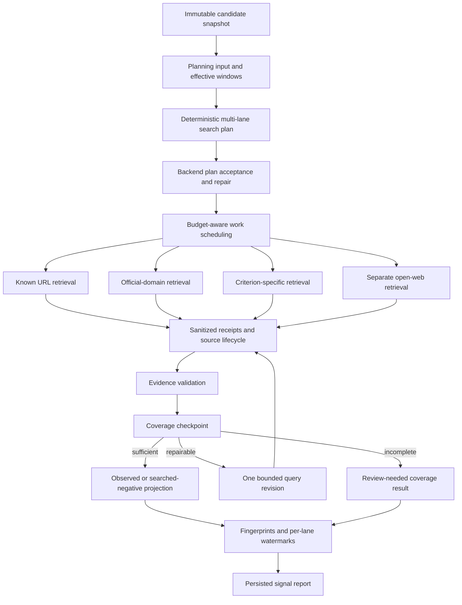

# Radar Signal Monitoring TO BE: 0.7.6.4.18.2.1

Status: Implemented

Pipeline id: `signal-monitoring`

Baseline AS IS: `docs/radar/pipelines/signal-monitoring/RADAR_SIGNAL_MONITORING_AS_IS.md`

Baseline diagnosis: `docs/radar/pipelines/signal-monitoring/diagnostics/SIGNAL_RUN_c8adb584_BASELINE.md`

Acceptance manifest: `RADAR_SIGNAL_MONITORING_TO_BE_0.7.6.4.18.2.1.acceptance.json`

Generated PDF: `docs/radar/pipelines/signal-monitoring/to-be/RADAR_SIGNAL_MONITORING_TO_BE_0.7.6.4.18.2.1.pdf`

## 1. Decision Context

The first persisted live signal-monitoring runtime proved API, job, provider,
budget and persistence separation. It did not prove search-strategy quality.
The baseline run selected several source capabilities but collapsed every
candidate/criterion pair into one opaque known-source task. Negative results
could therefore be technically searched while remaining operationally
unauditable.

This slice adopts the mature candidate-discovery execution shape without
coupling the two pipelines. Signal monitoring receives pipeline-owned planning,
backend acceptance, scheduling, retrieval receipts, evidence validation,
checkpoints and incremental time windows. Shared code is limited to genuinely
provider-neutral source cards, retrieval normalization and budget contracts.

## 2. Intended Pipeline

<!-- diagram: signal_monitoring_search_pipeline -->

## 3. Roles And Ownership

| Role | Owns | Does not own |
|---|---|---|
| Planning input builder | Immutable candidates, criteria, source cards and effective windows | Provider calls |
| Search planner | Deterministic lane-aware strategy and query variants | Final source obligation authority |
| Plan acceptance service | Backend validation, safe repair and deterministic fallback | Retrieval |
| Retrieval plan compiler | Executable source-specific task cards | Budget admission |
| Work scheduler | Required-lane guarantees and explicit unscheduled decisions | Provider semantics |
| Provider adapter | One bounded retrieval request and sanitized response normalization | Product outcomes |
| Evidence validator | Entity, criterion, date, source-ref and policy checks | Search scheduling |
| Checkpoint service | Coverage sufficiency, one query revision or review-needed stop | Persistence/API |
| Window policy | Initial windows, incremental watermarks and overlap | Signal scoring |

The signal-monitoring application package remains independent from
candidate-discovery internals, FastAPI, SQLAlchemy, Celery, HTTP clients and
provider SDKs.

## 4. Source And Scheduling Semantics

For each `candidate_id + signal_code` pair, the accepted plan accounts for:

1. Up to two reusable known sources with concrete URLs.
2. An official-company domain task when policy and capability allow it.
3. Criterion-specific sources when configured.
4. A separate open-web task when open web is enabled.

Official and open-web lanes are required coverage by default when executable.
Known and criterion-specific lanes are required only when usable sources are
available. Identity-only registry records without retrievable content are not
fresh-signal sources.

Every selected decision must become scheduled work or an explicit terminal
ledger decision. A selected lane may never disappear between strategy and
execution.

## 5. Retrieval And Audit Contract

Every executed task produces a product-safe `SignalSearchExecutionReceipt`
containing candidate, criterion, lane, query, requested URLs/domains, engine,
effective window, timestamps, result count, normalized source refs and terminal
outcome. OpenRouter message annotations and citations are normalized through the
same provider-neutral retrieval path used by candidate discovery.

The source lifecycle records planned, requested, retrieved, verified, linked,
used, no-results, rejected and failed states. Raw provider payloads, headers,
credentials and hidden reasoning are never persisted.

## 6. Evidence And Checkpoint Semantics

An observed signal requires a candidate match, criterion match, date inside the
effective window, resolvable evidence refs, an allowed source and evidence that
supports the projected summary/score.

`not_observed` means that all required executable lanes completed successfully
and the accepted plan found no valid evidence. If any required lane is blocked,
failed, budget-limited or schema-invalid, the pair becomes review-needed or
coverage-incomplete instead of searched-negative.

One bounded query revision is allowed per candidate/criterion pair. Provider
schema recovery retains the existing bounded primary and backup retry model.

## 7. Time Windows And Watermarks

One `as_of` timestamp is frozen when the signal run is created. Initial lookback
precedence is:

1. Explicit run override.
2. Optional per-criterion `initial_lookback_days`.
3. Persisted Radar `monitoring_policy.lookback_window`.
4. 365 days.

The CLI passes no override unless the operator supplies one. The benchmark Radar
therefore retains its configured 90-day policy; the positive-control quality run
uses an explicit 365-day window.

Incremental windows are keyed by candidate, criterion and source lane. A
successful searched receipt advances `searched_through_at`; provider, policy,
budget or schema failures do not. The next normal window starts two days before
the previous watermark to tolerate delayed indexing. Fingerprint dedupe prevents
the overlap from publishing old evidence as new.

## 8. Budgets

The existing six-task smoke profile remains a cheap runtime wiring check. A new
`signal_monitoring_quality` profile allows 16 primary tasks, 24 provider calls,
four primary/schema retries, two backup retries, 20 lookback queries, 40 source
verifications and one query revision per candidate/criterion pair.

No signal task consumes candidate-discovery task, expansion or provider budget.

## 9. Artifact And Compatibility

Existing APIs remain compatible. `lookback_days` stays an optional one-run
override. The signal report adds search plan, plan acceptance, source-lane
ledger, execution receipts, source lifecycle, window policy, watermarks,
evidence-validation summary and checkpoint decisions.

Watermarks remain in persisted signal output JSON for this slice; no database
schema migration is required.

## 10. Requirements And Evidence Matrix

| ID | Mandatory behavior | Recorded/test evidence | Live evidence |
|---|---|---|---|
| `SM-PLAN-01` | Every selected source decision has a scheduling/execution outcome | Planner/scheduler contract | Lane ledger completeness |
| `SM-SRC-01` | Known-source tasks use concrete source contracts | Provider request test | Receipt URL/title evidence |
| `SM-SRC-02` | Official tasks constrain real domains | Acceptance/provider test | Official-lane receipt |
| `SM-SRC-03` | Open web is a separate task | Scheduler test | Separate open-web receipt |
| `SM-AUD-01` | Every executed task has a safe receipt | Artifact contract | 100% receipt coverage |
| `SM-OBS-01` | Incomplete required coverage cannot become `not_observed` | State matrix | Zero false searched-negative rows |
| `SM-WIN-01` | Initial precedence and 365-day fallback | Window policy tests | Persisted effective window |
| `SM-WIN-02` | Incremental windows use per-lane watermarks | Sequential persisted test | Second live run |
| `SM-WIN-03` | Failed lanes do not advance watermarks | Partial-failure test | Retry evidence |
| `SM-VAL-01` | Positive evidence validates entity, criterion, date and source | Positive controls | Known public events found |
| `SM-VAL-02` | Irrelevant documents do not become signals | Negative controls | No false observed control |
| `SM-DED-01` | Overlap does not republish old evidence | Sequential dedupe test | Second live run |
| `SM-ARCH-01` | Pipeline dependency boundary remains isolated | Architecture test | Not applicable |
| `SM-PROC-01` | TO BE, tests, validation and AS IS are traceable | Documentation gate | PASS validation report |

## 11. Acceptance Scenario

Recorded acceptance uses at least four known positive events across two
industrial candidates and two criteria plus irrelevant controls. It must detect
all positives, accept no irrelevant control, and expose complete required-lane
and receipt ledgers.

Live acceptance rebuilds Docker, runs two industrial candidates and two
criteria with the quality profile and an explicit 365-day initial window, finds
at least two curated public events with valid URLs/dates, produces no false
observed negative control, then runs again without an override to prove
incremental watermarks and duplicate suppression. Both reports must survive an
API restart.

## 12. Process Gate

This slice introduces the reusable Radar evidence loop. A behavior-changing
Radar slice cannot move to Done without TO BE Markdown/PDF, an acceptance
manifest, a PASS validation report, reconciled deviations and an AS IS document
updated after the validated slice.

## 13. Out Of Scope

- Candidate rediscovery or candidate-universe expansion.
- Full recurring scheduling and notifications.
- UI editing for per-criterion depth, cadence, overlap or sources.
- Public quality claims from one acceptance run.
- Production hardcoding of positive-control companies or events.
