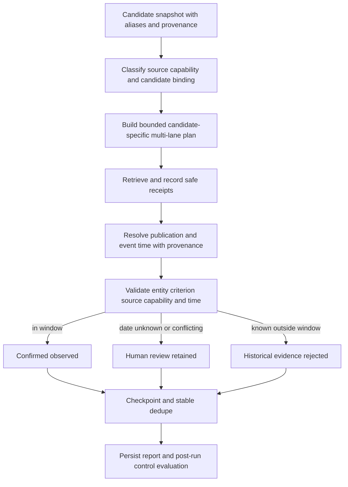

# Radar Signal Monitoring TO BE: 0.7.6.4.18.2.2

Status: Implemented

Pipeline id: `signal-monitoring`

Baseline AS IS: `docs/radar/pipelines/signal-monitoring/RADAR_SIGNAL_MONITORING_AS_IS.md`

Baseline RCA: `docs/radar/pipelines/signal-monitoring/diagnostics/SIGNAL_RUN_9d018757_863de7ce_QUALITY_RCA.md`

Acceptance manifest: `RADAR_SIGNAL_MONITORING_TO_BE_0.7.6.4.18.2.2.acceptance.json`

Generated PDF: `docs/radar/pipelines/signal-monitoring/to-be/RADAR_SIGNAL_MONITORING_TO_BE_0.7.6.4.18.2.2.pdf`

## 1. Decision

Signal Monitoring remains recall-first but distinguishes confirmed freshness
from temporal uncertainty. Relevant evidence without a reliable date is
retained for human review. Retrieval time never substitutes for publication or
event time. Known-source work is candidate-bound and capability-aware.

<!-- diagram: signal_monitoring_pipeline -->

## 2. Temporal Contract

Sources expose independent `retrieved_at` and `published_at`. Evidence exposes
`event_at`, optional end date, temporal status, date basis, confidence and safe
date evidence. Legacy `observed_at` is accepted only as retrieval time.

Temporal statuses are `confirmed_in_window`,
`review_needed_date_unknown`, `review_needed_date_conflict` and
`rejected_out_of_window`. A fresh publication about a future plan can be a
current signal. If no reliable publication/event date exists, relevant
evidence is retained for review and never counted as a confirmed control.

Requirements: `SM-TIME-01`, `SM-TIME-02`, `SM-TIME-03`, `SM-SCORE-01`.

## 3. Source Capability And Candidate Binding

Every source is classified as `identity_only`, `official_press`, `event_feed`,
`project_or_asset_history`, `registry`, `generic_web` or `unknown`. Every
candidate/source relation is classified as `matched_candidate`, `group_only`,
`cross_entity`, `unknown_owner` or `no_url` with basis, confidence and reason.

Only candidate-matched signal-capable URLs become known-source tasks.
Identity/registry and excluded refs remain visible in a binding ledger. Unknown
capability with matched ownership may be searched, but cannot confirm a signal
without runtime capability and temporal validation. Rules are generic; company
names and benchmark domains exist only in fixtures and validation docs.

Requirements: `SM-CAP-01`, `SM-BIND-01`, `SM-BIND-02`, `SM-ARCH-02`.

## 4. Planning And Recovery

The assembler preserves candidate aliases and candidate-specific source refs.
Each candidate/criterion pair has at most two known-source tasks plus one
official and one open-web task. Primary query uses the legal name and configured
criterion evidence; one accepted alias query is available for bounded revision.
Transport errors receive one primary retry before the lane becomes incomplete.

Confirmed and unknown-review evidence receive stable source keys. Incremental
runs project `duplicate_existing_signal` or `duplicate_existing_review` rather
than republishing old rows.

Requirements: `SM-QUERY-01`, `SM-RETRY-01`, `SM-DED-02`, `SM-AUD-02`.

## 5. Expanded Benchmark

Post-run acceptance uses source candidate run
`radar-run-3bbf9c0f-330e-4468-8901-966a751234a8`, six explicit candidates
(three accepted and three review-needed), criteria `S1` and `S2`, and exactly
twelve candidate/criterion pairs. Control URLs, accepted equivalent URL sets
and expected dates are loaded only after the run and must not occur in planning
metadata.

The quality budget is 48 tasks, 60 provider calls, 8 extraction retries, 4
backup retries, 60 lookback queries, 120 source verifications and one revision
per pair. Required acceptance lanes must not be budget-limited.

Requirements: `SM-BENCH-01`, `SM-BENCH-02`, `SM-BENCH-03`.

## 6. Validation And Closure

The validator matches controls by candidate, criterion, canonical URL or an
explicit accepted URL set for the same public event, and expected date/range.
It separately reports confirmed, unknown/conflicting, out-of-window,
binding-rejected and duplicate evidence. Aggregate observed count is not a
positive-control metric.

Two persisted Docker/API runs, an API restart and full requirement traceability
are mandatory. This document becomes `Implemented` only after validation PASS;
the implemented behavior is then reconciled into AS IS.

Requirement: `SM-PROC-02`.

## 7. Requirement Traceability

Mandatory IDs: `SM-TIME-01`, `SM-TIME-02`, `SM-TIME-03`, `SM-CAP-01`,
`SM-BIND-01`, `SM-BIND-02`, `SM-QUERY-01`, `SM-RETRY-01`, `SM-SCORE-01`,
`SM-BENCH-01`, `SM-BENCH-02`, `SM-BENCH-03`, `SM-DED-02`, `SM-AUD-02`,
`SM-ARCH-02`, `SM-PROC-02`.

## 8. Implementation Evidence

The implemented validation pair is:

- first live quality run `signal-run-010ef75d-c626-44e3-a025-56c95522c1a8`;
- second incremental run `signal-run-df00b3b8-267c-4091-a4dd-8167434e2cf3`.

The first run produced six candidates, twelve candidate/criterion pairs, four
observed outcomes, two unknown-date review items, zero retrieved-at freshness
violations and zero confirmed out-of-window evidence. The post-run evaluator
matched four of four positive controls, two negative controls and the required
unknown-date control. The second run loaded previous source keys, used
incremental windows and republished zero previous sources.
