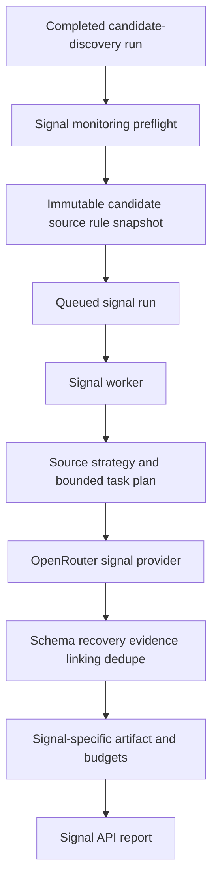

# Radar Signal Monitoring TO BE 0.7.6.4.18.2

Status: TO BE
Pipeline id: `signal-monitoring`
Slice: `0.7.6.4.18.2`

## 1. Decision context

Signal monitoring becomes an independently queued, persisted, provider-backed
pipeline over a completed candidate-discovery snapshot. It does not rediscover
companies and does not share candidate-discovery task or provider budgets.

The default scope contains evidence-complete accepted and review-needed public
candidates. A caller may narrow that scope by candidate id or signal code.

## 2. AS IS problem

The package already owns deterministic planning, source-lane selection,
budgets, extraction recovery, deduplication, and report projection, but it only
runs against recorded providers. There is no durable lifecycle, API/job entry,
live provider adapter, persisted incremental fingerprint history, or explicit
link to the candidate-discovery run that supplied the monitored candidates.

## 3. Intended runtime

Lifecycle state is stored in shared `radar_runs` with
`pipeline_id=signal_monitoring` and `source_run_id`. Candidate and signal output
payloads use separate persistence tables and repositories.

## 4. Roles

| Role | Owns | Does not own |
|---|---|---|
| Input assembler | Validate source run, select candidates, snapshot rules/sources, load previous fingerprints | Provider calls, signal decisions |
| Queued run service | Idempotent signal run creation and lineage | Task execution |
| Persisted executor | Durable lifecycle, worker orchestration, output persistence | Signal semantics |
| Signal executor | Source strategy, tasks, signal budgets, retry/backup, observation states | SQLAlchemy, FastAPI, Celery, HTTP |
| OpenRouter provider | Signal-specific request/response transport | Candidate selection, status policy |
| Artifact projector | Product-safe report, summary, budgets, diagnostics | Retrieval or acceptance |

## 5. Context handoff

The immutable input snapshot contains:

- signal run id, Radar id, and source candidate run id;
- candidate scope mode and selected candidate ids;
- accepted/review-needed surface status and product-safe source refs;
- signal rules and expected evidence;
- known sources and source policy;
- lookback window and previous fingerprints;
- model profile id and signal-only budget settings.

The source run must be completed candidate discovery for the same Radar. Public
candidate ids must be unique and every selected candidate must have resolvable
provenance.

## 6. Sources, budgets, and failure semantics

Source order remains known source, official/company, signal-specific, then open
web when allowed. Signal monitoring never adds candidates.

The acceptance smoke profile is bounded to six tasks, eight provider calls, one
retry per task, two extraction retries per run, one backup retry, six lookback
queries, and twelve source-verification reservations.

`not_observed` requires an accepted provider attempt for the same task.
Budget/policy/missing-scope branches stay `not_searched_*`. Transport failures
become `review_needed` with a product-safe `provider_error` diagnostic. Invalid
schema follows primary retry and backup retry before `schema_recovery_needed`.

## 7. Persistence and API

API surface:

- `GET /api/radars/{radar_id}/signal-monitoring/preflight`;
- `POST /api/radars/{radar_id}/signal-monitoring-runs`;
- `GET /api/radars/{radar_id}/signal-monitoring-runs`;
- `GET /api/signal-monitoring-runs/{run_id}`;
- `GET /api/signal-monitoring-runs/{run_id}/report`.

Existing candidate-discovery catalog, latest run, and run-history behavior must
continue filtering to `pipeline_id=candidate_discovery`.

## 8. Artifact and visibility

The report contains lineage, immutable input, plan/tasks, observations,
evidence, source decisions, provider attempts, model profile, budget settings,
counters, exhaustion events, diagnostics, and completion state. It excludes
secrets, headers, raw provider bodies, prompts, and hidden reasoning.

The first slice exposes this through API and CLI/demo. Full live UI wiring and
the cross-pipeline UI contract remain in `0.7.6.4.18.3`.

## 9. Test mapping

- Unit: input scope, lineage validation, budget limits, retry/backup, provider
  errors, status invariants, artifact redaction.
- Recorded: all observation/search states and incremental dedupe across two
  persisted runs.
- Persistence: migration defaults, separate output repository, restart-safe
  report.
- API/jobs: idempotent queue, run-only job payload, pending/missing states,
  candidate latest-run isolation.
- Architecture: signal package cannot import candidate internals or
  infrastructure.
- Live: rebuilt Docker, three candidates, two signals, at least one accepted
  provider attempt, zero candidate-discovery execution.

## 10. Acceptance criteria

- Candidate and signal run ids are distinct and linked.
- Signal budgets and output are independent.
- Every task has an observation or explicit not-searched reason.
- `not_observed` cannot exist without real search.
- The report survives API restart.
- A bounded live run performs at least one successful provider search while
  creating no candidate-discovery run.

## 11. Out of scope

- Recurrence scheduler and automatic cadence.
- Candidate-universe expansion or product-acceptance changes.
- Full live frontend interaction.
- Broad quality benchmark or public quality claim.

## 12. Open questions

No implementation-blocking questions remain. Budget and model quality tuning
after the first live proof must be handled as separate evidence-backed slices.
