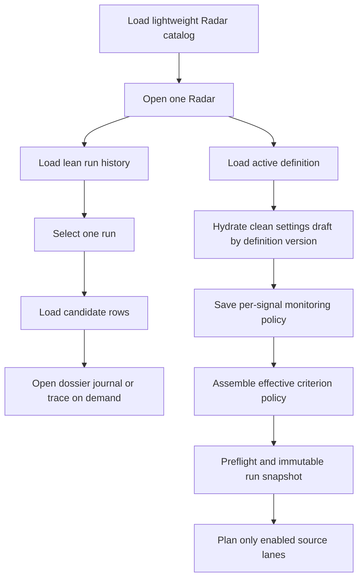

# Radar Signal Monitoring TO BE: 0.7.6.4.18.3.1

Status: Implemented

Pipeline id: `signal-monitoring`

Baseline AS IS: `docs/radar/pipelines/signal-monitoring/RADAR_SIGNAL_MONITORING_AS_IS.md`

Acceptance manifest: `RADAR_SIGNAL_MONITORING_TO_BE_0.7.6.4.18.3.1.acceptance.json`

Generated PDF: `docs/radar/pipelines/signal-monitoring/to-be/RADAR_SIGNAL_MONITORING_TO_BE_0.7.6.4.18.3.1.pdf`

## 1. Decision Context

Radar settings must be loaded from the persisted active definition and must
control Signal Monitoring without hidden defaults. The current frontend first
creates an empty definition from catalog summary data, eagerly downloads every
Radar detail, and does not refresh a clean draft when the complete definition
arrives. The SIBUR benchmark detail is 33.3 MB because run histories expose
full metadata.

This slice replaces that flow with selected-Radar hydration and resource-level
lazy loading. Per-signal initial depth, incremental overlap, cadence policy and
source lanes become persisted runtime inputs. Cadence remains policy metadata;
automatic recurring scheduling is not introduced.

## 2. Intended Flow

## 3. Configuration Contract

Each intent signal gains `monitoring_policy` with `enabled`,
`initial_lookback_days`, `incremental_overlap_days`, `cadence` and
`source_lanes`. Initial depth is 1..3650 days; overlap is 0..90 and cannot
exceed initial depth; cadence is manual, daily, weekly or monthly; an enabled
criterion has at least one lane from known_source, official_company,
signal_specific and open_web.

Initial window precedence is explicit run override, criterion policy, Radar
policy, then default 365. Criterion overlap applies per candidate, criterion and
lane. Criterion lanes are intersected with global source policy. Effective
values and their basis are persisted in monitoring input and report. Missing
legacy fields resolve visibly from defaults rather than silently.

## 4. API And Loading Contract

Catalog responses remain summary-only. Radar detail returns active definition
and no run history by default; compatibility history is opt-in and lean. Run
history contains display metadata but not full run metadata. Full metadata and
configuration snapshots are loaded only for one selected run.

The frontend does not request details for unopened Radars. Definition, history,
candidates, dossier, journal, trace, signal report and cumulative surface have
independent loading/error/cache state. Empty data is shown only after a
successful empty response. Stale requests cannot replace a newly selected
Radar. Local drafts are explicit and cannot silently shadow backend state.

## 5. Product UI

Settings show current active definition separately from the selected run's
immutable snapshot and overrides. A clean draft refreshes when definition
identity/version changes; a dirty draft produces an explicit conflict. Signal
rows expose depth, overlap, cadence policy and lane toggles. Loading uses
skeletons or LoaderCircle; progress bars are reserved for measurable progress.
Configured scoring that is not yet runtime-effective is labelled accordingly.

## 6. Acceptance

- `SM-CFG-01`: per-signal policy survives API, DB and restart round-trip.
- `SM-CFG-02`: effective precedence and basis are visible in preflight/report.
- `SM-CFG-03`: planner schedules only criterion-enabled lanes.
- `SM-WIN-04`: criterion overlap controls incremental windows and failed lanes do not advance watermarks.
- `RADAR-API-01`: benchmark detail and 20-run history are each at most 250 KB.
- `RADAR-LAZY-01`: catalog performs no Radar detail fanout and diagnostics load by selected tab.
- `RADAR-UI-01`: ten cold opens show 2 rules, 3 signals and 3 sources without an empty fallback.
- `RADAR-UI-02`: slow, failed, stale and dirty-draft states are explicit and safe.
- `SM-PROC-03`: TO BE, manifest, tests, validation and finalized AS IS remain traceable.

## 7. Out Of Scope

No automatic scheduler, notifications, provider tuning, candidate-discovery
change, evidence semantics change, budget redesign, scoring formula execution
or cross-pipeline score projection.

## 8. Reconciliation

Implemented behavior matches this design. The Docker acceptance found and fixed
one additional race: a state-dependent definition loader repeatedly invalidated
its own in-flight request and could leave Settings in a permanent loading
state. The final loader uses a stable callback, request identity guard and
explicit loaded-definition cache.

Validation: `docs/radar/pipelines/signal-monitoring/validation/0.7.6.4.18.3.1/VALIDATION_REPORT.md`.
