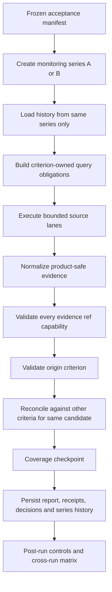

# Signal Monitoring TO BE 0.7.6.4.19.1

Status: Implemented (acceptance amendment v2 approved)

## 1. Decision Context

Slice `0.7.6.4.19.1` corrects the live-quality blocker recorded in
`docs/radar/pipelines/validation/0.7.6.4.19/BLOCKING_RCA.md`. The failed live
run `signal-run-55a9cfb4-b0f1-48ee-8aef-df20a236266f` completed all required
lanes, but reproduced only two of four positive controls, reached only one
negative control, and accepted one XLSX source classified as `identity_only`.

The source candidate run remains
`radar-run-b03fac86-7307-448f-8deb-c1ea1794956c`. Candidate discovery,
scheduling UI and candidate-universe expansion are out of scope.

## 2. AS IS Problem

The current planner contains special `S1`, `S2` and `2026` query branches
instead of taking search vocabulary from the Radar criterion. Parsed evidence
is projected only against the criterion of the task that retrieved it. A valid
S2 source returned by an S1 task can therefore be lost. Capability validation
rejects a response only when every returned source is identity-only, allowing
an identity XLSX to survive inside a mixed response. Finally, all previous
signal outputs for a Radar are loaded into every new run, so two genuinely
independent initial runs cannot be proven without deleting history.

## 3. Intended Flow

Initial A and B use different `monitoring_series_id` values and therefore both
start with empty fingerprints, source keys and watermarks. Incremental C uses
the B series and loads only B history. The normal default series preserves
existing product behavior.

## 4. Criterion-Owned Planning

Each signal criterion exposes additive `search_terms` and
`evidence_match_terms`. The planner combines candidate legal name, aliases,
criterion terms, source lane and effective window. It does not branch on
criterion codes or a calendar year. Each candidate/criterion pair receives a
stable `criterion_obligation_id`, a primary query and at most one alternate
query. Search terms are product configuration, not benchmark controls.

The SIBUR benchmark definition contains generic TOIR/reliability vocabulary for
S1 and modernization/capacity vocabulary for S2. It contains no control URLs,
event dates or expected benchmark answers.

## 5. Cross-Criterion Evidence Reconciliation

Successful parsed provider output remains available in memory as a product-safe
evidence bundle. After retrieval and before the final checkpoint, evidence is
tested against every other enabled criterion for the same candidate.

Reuse is accepted only when entity matching, configured criterion phrases,
source binding, source capability and temporal validation all pass. The target
observation receives its own validation decision and keeps the origin task,
origin criterion, receipt and source ref. Reuse never marks another lane as
executed and never advances its watermark. Evidence from another candidate,
without configured criterion terms, or matching only a broad keyword is
retained as a rejected reconciliation record.

## 6. Capability And URL Semantics

Capability is checked per evidence ref. `identity_only` and `registry` refs can
remain as identity or review provenance but cannot be included in confirmed
source refs and always have score zero. Structured XLS/XLSX/CSV/XML/JSON files
cannot be promoted from product-safe text alone. Mixed responses confirm only
through independently signal-capable refs.

A shared canonical URL identity is used by evidence validation, dedupe and the
post-run evaluator. Fragments and tracking parameters (`utm_*`, `erid`,
`gclid`, `yclid`) are ignored. Host, path and non-tracking query parameters
remain strict; domain-only control matching is forbidden.

## 7. Acceptance Freeze And Audit

Before live execution, the adjacent acceptance manifest is frozen into a
session file containing its SHA-256 and git commit. The acceptance runner checks
the hash before A, B and C. Controls are never included in input snapshots,
tasks, queries, source contracts or provider requests. If the frozen manifest
changes, the run fails. The original v1 manifest and its machine `FAIL` remain
archived byte-for-byte. After the bounded five-cycle RCA, an explicitly
reviewed v2 amendment may change only the reproducibility criterion; controls,
accepted URLs, dates and semantic integrity requirements remain unchanged.

The machine report contains a per-control cross-run matrix with states
`found_in_both`, `found_only_in_a`, `found_only_in_b`, `found_in_neither`,
`found_under_other_criterion` and `found_and_rejected`. Aggregate observed count
cannot close the slice.

## 8. Requirements And Tests

- `SM-REP-01`: one byte-identical frozen manifest is used for A, B and C.
- `SM-REP-02`: A and B independently start with empty history.
- `SM-REP-03`: each initial run finds at least three positive controls, one run
  finds all four, and the union of both runs finds all four.
- `SM-DRIFT-01`: the only accepted per-run miss is explicitly classified as
  provider search drift and cannot hide a semantic, temporal or source-policy
  failure.
- `SM-QUERY-02`: query obligations come from criterion configuration.
- `SM-XCRIT-01`: valid cross-criterion evidence is independently validated.
- `SM-XCRIT-02`: irrelevant or cross-candidate evidence is never copied.
- `SM-CAP-03`: identity-only and registry refs confirm zero fresh signals.
- `SM-URL-01`: URL identity ignores tracking only and remains host/path strict.
- `SM-DED-03`: C inherits B and republishes no previous signal or review item.
- `SM-PROC-03`: RCA, TO BE, manifest, tests, three live reports, validation and
  finalized AS IS are traceable.

## 9. Hard Acceptance

Both A and B must contain exactly six evidence-complete candidates, three
accepted and three review-needed, two criteria and twelve pairs. Each must find
at least three of four positive controls, one initial run must find all four,
and their aggregate must find all four. A per-run miss is accepted only for the
explicitly frozen `khimprom-modernization-automation-2025` control and is
classified as `provider_search_drift`. Each run must reject at least two frozen
negative controls, retain at least one unknown-date control and contain zero false-positive,
identity-confirmed, receipt-gap, orphan-decision, false-not-observed,
score-zero-confirmed or required-budget-limited records.

C must use per-lane B watermarks, load prior source keys, republish zero old
confirmed or review items and advance only successful lanes. All three reports
must remain byte-stable and readable after API/worker restart. Only a
machine-generated `PASS`, this document marked `Implemented`, and reconciled AS
IS documentation allow the slice to become Done.

## 10. Open Questions

The exact-URL stability issue is intentionally deferred to dedicated provider
search-routing experiments. A failed aggregate control, a run below three of
four, or any semantic integrity failure remains an acceptance failure.

## 11. Approved Acceptance Amendment

The original v1 manifest SHA-256
`9dfab1ee6a2a449109d35b8cf53b097cae3a4b48797bfedfb4c7214df2d6d82e`
and its `FAIL` report are preserved as `*.v1.json` / `VALIDATION_REPORT_V1.md`.
The approved amendment follows the user decision recorded after the bounded
autofix limit was exhausted. It does not claim that the second run passed the
old DoD and does not change any benchmark control. It separates functional
pipeline correctness from provider-search stability, which is tracked as
follow-up work.
