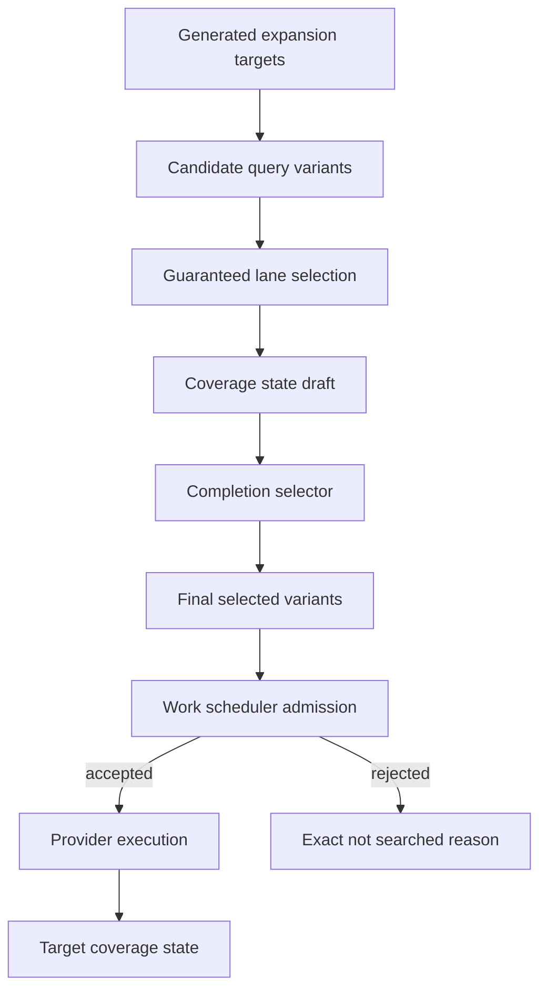
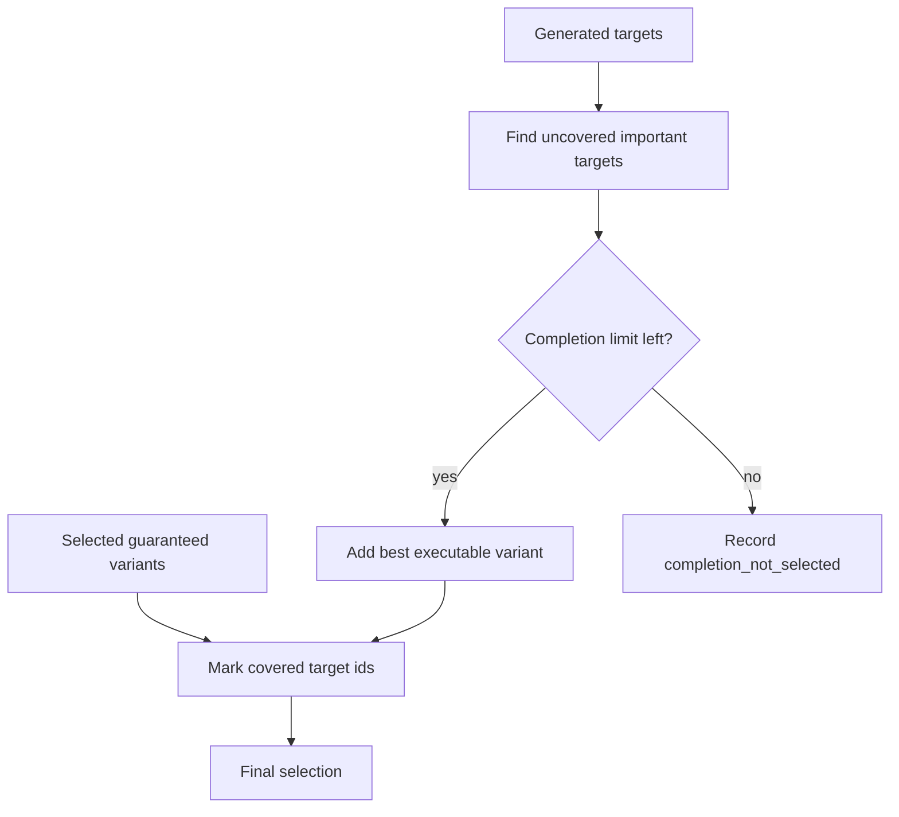

# Radar Search Pipeline TO BE: 0.7.6.3.6.10

Slice: Coverage-aware expansion completion for uncovered targets

Status: TO BE

Date: 2026-06-29

## 1. Decision Context

The latest bounded Docker benchmark smoke proved that the selector, work
scheduler, and guaranteed first-call reservation now work together:

- holding/group, legal/subsidiary, and production-site lanes were selected;
- scheduler admitted guaranteed work before provider execution;
- every admitted guaranteed expansion task received its protected first
  OpenRouter call.

The remaining failure is narrower. A target such as `tobolsk-site` can be
generated by benchmark context, but remain unselected or unexecuted after the
minimum lane requirements are satisfied. This is no longer a hidden budget
consumer problem. It is a target coverage completion problem.

## 2. AS IS Problem

Current flow:

1. `RadarSearchExpansionService` builds an expansion target queue.
2. `select_guaranteed_variants` chooses enough variants to satisfy lane
   minimums.
3. `schedule_guaranteed_expansion_variants` places guaranteed variants before
   optional variants.
4. `RadarWorkScheduler` admits work under budget and reservation rules.
5. The executor runs admitted tasks.

This works for lane minimums, but it does not ask a second question:

> Which important generated targets are still uncovered after the minimum set?

Therefore a benchmark can pass the lane minimums and still leave a known
production-site target in `expansion_not_selected`.

## 3. Intended Behavior

After the guaranteed minimum selection, Radar should run a bounded completion
selection pass:

1. Keep all guaranteed lane-minimum variants selected first.
2. Compute target coverage state for generated targets.
3. Identify high-priority uncovered targets:
   - generated but not selected;
   - selected but not scheduled;
   - selected but rejected before execution;
   - not yet represented by an executed expansion result.
4. Add a small number of completion variants for uncovered targets before
   generic optional variants.
5. Send the final selected variants to the existing scheduler and budget guards.

The completion pass does not call providers. It only changes which already
generated variants are included in the candidate work set.

## 4. Changed Roles

| Role | TO BE change |
|---|---|
| Search expansion service | Builds target queue and candidate variants as today. |
| Guaranteed selector | Still satisfies lane minimums first. |
| Completion selector | New application-layer helper. Adds bounded variants for uncovered important targets after minimums. |
| Work scheduler | Remains the owner of admission and protected budget. It receives a better selected work set. |
| Executor | Still runs only admitted tasks. No provider shortcut is added. |
| Dossier/report mapper | Shows target coverage state and completion selection diagnostics. |
| Evaluation | Classifies misses more narrowly when a completion pass searched, skipped, or still did not select a target. |

## 5. Context Passed Between Roles

The completion selector receives product-safe context only:

- generated expansion targets;
- candidate variants;
- variants selected by the guaranteed selector;
- previous search expansion results;
- previous `targets_not_searched`;
- benchmark task context when `benchmark_profile` is explicit;
- completion limits from task context.

It does not receive raw prompts, hidden reasoning, credentials, headers, or raw
provider dumps.

## 6. Source, Budget, And Checkpoint Semantics

Completion selection must respect the same source policy and connector
capabilities as normal expansion because it can only select variants already
generated by `RadarSearchExpansionService`.

Budget semantics:

- completion variants go through `RadarWorkScheduler`;
- scheduler can accept or reject them before provider spending;
- accepted completion variants spend the same external-call budgets as other
  recall-expansion work;
- no new unguarded provider loop is introduced.

Default benchmark-smoke limits:

- `coverage_completion_target_limit=2`;
- completion targets are selected after lane minimums and before ordinary
  optional variants.

Checkpoint semantics:

- completion is part of `expand_sources`, not a new checkpoint action;
- if completion still does not search a generated target, dossier must say
  `completion_not_selected`, `completion_budget_limited`,
  `completion_source_policy_limited`, or another exact reason;
- signal search still starts only after the pre-signal checkpoint allows it.

## 7. Target Coverage State

Each generated target should be summarized with a compact state:

| State | Meaning |
|---|---|
| `generated` | Target exists in expansion queue. |
| `selected` | At least one variant was selected. |
| `scheduled` | Scheduler received work for this target. |
| `admitted` | Scheduler accepted the work. |
| `executed` | Provider call ran. |
| `source_found` | Executed call returned at least one source. |
| `projected` | Executed call produced candidate/universe observation. |
| `not_selected` | Target stayed outside selected variants. |
| `not_admitted` | Scheduler rejected the work before provider execution. |
| `not_executed` | Provider call was skipped by budget/policy. |

## 8. Diagrams

### Expansion Selection Flow



### Completion Selection



## 9. Test Plan

Unit tests:

- generated but not selected production-site target is added by completion;
- already selected/executed target is not selected again;
- completion respects target limit;
- completion prioritizes production-site/branch target before generic optional
  target;
- completion diagnostics explain unselected targets.

Integration/fake pipeline tests:

- weak discovery creates three site targets, minimum covers two, completion
  selects the third;
- scheduler receives minimum plus completion work;
- if budget rejects completion work, report says completion budget/admission
  reason instead of generic `expansion_not_selected`.

Evaluation/report tests:

- false negative in completion-selected but not executed target becomes a
  completion-specific bucket;
- benchmark report exposes target coverage state and completion summary;
- dossier contains no secrets, headers, raw prompts, or hidden reasoning.

Validation:

```bash
python -m pytest tests/test_radar_search_expansion.py tests/test_radar_benchmark.py tests/test_radar_evaluation.py -q
python -m pytest tests/test_backend_api.py tests/test_radar_pipeline_documentation_contract.py -q
python -m pytest tests/test_backend_architecture_contract.py -q
python -m pytest
```

## 10. Acceptance Criteria

- Bounded benchmark smoke no longer leaves a generated important target with a
  blank `expansion_not_selected` reason when completion budget is available.
- `benchmark-sibur-holding-contour` keeps `strict_recall >= 1.0` and
  `review_recall >= 0.6667`.
- If `tobolsk-site` remains missed, the reason is narrower than the current
  `expansion_not_selected`: searched-no-support, admission-limited,
  budget-limited, source-policy-limited, or projection gap.
- `benchmark_live` remains blocked until benchmark smoke is interpretable.

## 11. Out Of Scope

- No new provider adapter.
- No UI changes.
- No DB migration.
- No SIBUR-specific production hardcode.
- No signal-scoring changes.
- No unbounded budget increase.

## 12. Open Questions

- Should completion target limits differ for `benchmark_live` later?
- Should evaluation baseline hints influence production runs? Current answer:
  no; they are only allowed in explicit benchmark profiles.
