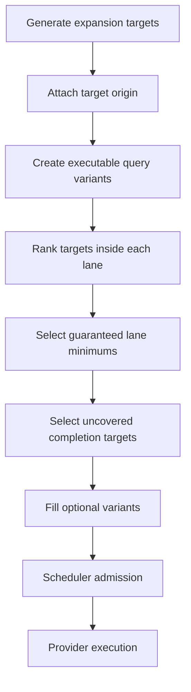

# Radar Search Pipeline TO BE 0.7.6.3.6.11

Status: TO BE

Slice: `0.7.6.3.6.11: Completion target prioritization for uncovered benchmark targets`

Product area: Radar candidate and signal search

Generated PDF: `docs/radar/to-be/RADAR_SEARCH_PIPELINE_TO_BE_0.7.6.3.6.11.pdf`

## 1. Decision Context

The expanded `benchmark_smoke_plus` run proved that a larger bounded budget
materially improves SIBUR contour recall:

- strict recall reached `1.0`;
- review recall stayed at `0.6667`;
- the only missed baseline entity was `tobolsk-site`.

The remaining miss is no longer a hidden budget problem. Radar generated an
executable expansion target for `Tobolsk production site`, but the selection
layer ranked incidental production-site targets ahead of that explicit
benchmark target.

## 2. AS IS Problem

Current target selection sorts completion targets mostly by target lane,
numeric priority, and query text. It does not distinguish:

- explicit benchmark/baseline targets;
- source-backed incidental targets found during retrieval;
- generic industrial search terms;
- noisy document-like labels;
- numeric-only labels.

As a result, a known uncovered benchmark target can lose completion slots to
less important targets such as document titles, generic site terms, or
incidental branches.

## 3. Intended Behavior

The selector must rank targets by intent before ranking by text.

Priority order inside a lane:

1. explicit benchmark/baseline targets that are not already selected;
2. concrete named targets from retrieved source evidence;
3. generic source-backed universe gaps;
4. noisy document-like labels;
5. numeric-only labels.

This priority must apply to:

- guaranteed lane selection;
- bounded completion selection;
- optional variant fill after guarantees and completion.

The scheduler remains the admission owner. The selector only decides what work
should be offered to the scheduler first.

## 4. Roles Changed

| Role | Change |
|---|---|
| Search expansion service | Adds target origin metadata to expansion targets. |
| Search expansion selector | Uses target origin and label quality to rank guaranteed and completion targets. |
| Dossier/report projection | Shows why a target was prioritized or deprioritized. |
| Evaluation | Keeps `completion_not_selected` diagnostics, now with better selection reasons. |

## 5. Context Passed Between Roles

Expansion targets receive additive fields:

- `target_origin`;
- `completion_rank`;
- `completion_rank_reason`;
- `deprioritized_reason`;
- `uncovered_baseline_target`.

These fields are product-safe. They contain no prompts, provider dumps,
headers, credentials, or hidden reasoning.

## 6. Selection Flow

<!-- diagram: completion target prioritization -->

## 7. Ranking Rules

The selector computes a stable rank key:

1. lane priority;
2. target origin priority;
3. label quality penalty;
4. target priority;
5. query text.

Origin priority:

| Origin | Priority |
|---|---:|
| `benchmark_context` | 0 |
| `retrieved_source` | 10 |
| `candidate_gap` | 20 |
| `generated_alias` | 30 |
| `unknown` | 40 |

Label penalties:

| Label pattern | Penalty |
|---|---:|
| clean concrete named target | 0 |
| generic industrial phrase | 20 |
| document-like prefix such as `pdf` | 30 |
| numeric-only label | 40 |

## 8. Budget Semantics

No budget is bypassed.

The selector may move a target earlier, but the work scheduler and existing
external-call guards still decide whether it can run.

If a high-priority target cannot run, the dossier must say whether it was:

- not executable;
- not admitted by scheduler;
- blocked by source policy;
- blocked by budget;
- searched without support;
- projected incorrectly.

## 9. Test Plan

Unit tests must verify the changed selector directly:

- explicit benchmark production-site target outranks incidental retrieved
  production-site targets;
- clean named target outranks document-like `pdf ...` target;
- clean named target outranks numeric-only target;
- `completion_target_limit=5` selects a `tobolsk-site`-like benchmark target
  before incidental production-site targets;
- ranking diagnostics explain why skipped targets lost.

Report/evaluation tests must verify:

- target origin and rank reasons are visible in dossier/report payloads;
- a missed explicit target is no longer explained only as generic
  `completion_not_selected` when it was deprioritized incorrectly.

## 10. Acceptance

Fast acceptance:

- selector tests prove benchmark targets are selected before incidental targets;
- benchmark report tests expose ranking metadata;
- existing scheduler/admission tests remain green.

Manual acceptance:

- run bounded `benchmark_smoke_plus`;
- `tobolsk-site` must either be selected/executed or receive a more precise
  blocker than plain `completion_not_selected`.

## 11. Out Of Scope

- No scoring change.
- No UI change.
- No new provider integration.
- No SIBUR hardcode in production runtime.
- No automatic move to `benchmark_live`.
