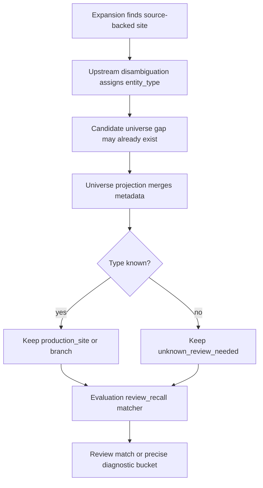

# Radar Search Pipeline TO BE 0.7.6.3.6.12

Status: TO BE

Slice: `0.7.6.3.6.12: Review-needed entity projection and evaluation matcher parity`

Generated PDF: `docs/radar/to-be/RADAR_SEARCH_PIPELINE_TO_BE_0.7.6.3.6.12.pdf`

## 1. Decision Context

The last Docker `benchmark_smoke_plus` proved that recall expansion can now
find the remaining Tobolsk production-site evidence. The run still reported
`tobolsk-site` as a false negative because the found review-needed entity was
not evaluated as a production-site match.

This is no longer a scheduler, selection, or provider-search problem. It is a
handoff problem between upstream disambiguation, candidate-universe projection,
and offline evaluation.

## 2. AS IS Problem

Current behavior:

1. Expansion retrieves source-backed material about Tobolsk.
2. Upstream disambiguation can represent `Тобольская промышленная площадка` as
   `entity_type=production_site`.
3. A candidate-universe gap with the same name can enter the universe first
   without entity type metadata.
4. Candidate-universe metadata enrichment defaults missing metadata to
   `unknown_entity`.
5. The later typed upstream entity is skipped as duplicate because the name is
   already present.
6. Evaluation sees either `unknown_entity` or a name variant that is too strict
   to match the curated baseline.

The result is misleading: Radar did find the object, but evaluation reports it
as missed.

## 3. Intended Pipeline Behavior

Review-needed upstream entities must preserve their semantic type across the
pipeline:

- `production_site`, `branch`, `asset`, and `project` must not degrade to
  `unknown_entity` when the type is already known.
- If an untyped universe row already exists and a typed upstream row arrives
  later, the existing row must be upgraded in place.
- `resolution_status`, `resolved_legal_name`, `not_candidate_reason`,
  `review_flags`, and `source_refs` must be merged rather than dropped.
- Product candidates remain strict and are not changed by this slice.
- Evaluation counts review-needed production-site matches through
  `candidate_universe`, `upstream_disambiguation_results`, or linked facts when
  the name/alias match is source-backed.

## 4. Roles Changed

| Role | Change |
|---|---|
| Candidate universe support | Preserve entity type and review metadata for review-needed upstream entities. |
| Staged execution projection | Merge typed upstream metadata into existing universe rows instead of skipping duplicates. |
| Evaluation | Match production-site baseline entities against review-needed universe/upstream entities with tolerant source-backed name matching. |
| Dossier/report | Continue exposing product candidates strictly, while review recall can use diagnostic universe entities. |

## 5. Context Passed Between Roles

The following fields must survive the projection boundary:

- `entity_type`
- `resolution_status`
- `resolved_legal_name`
- `not_candidate_reason`
- `review_flags`
- `source_refs`
- `linked_legal_name` when available

If the same entity appears in several diagnostic lists, the more specific
metadata wins over `unknown_entity` and empty fields.

## 6. Flow Diagram

## 7. Evaluation Semantics

Evaluation should remain offline and provider-free.

For non-legal baseline entities:

- exact normalized name remains strongest;
- alias match remains valid;
- source-backed partial match may be medium-confidence;
- production-site wording can tolerate suffixes such as `(Дирекция компании)`
  or extra relation words such as `СИБУР`.

This is not SIBUR hardcode. It is generic review-needed site matching over the
curated baseline aliases and source-backed observed names.

## 8. Diagnostics

False-negative diagnostics should distinguish:

- `not_retrieved_in_run`: no source text or observed entity exists;
- `present_not_projected`: source text exists, but no observed entity exists;
- `projection_type_lost`: observed entity exists but type was downgraded to
  `unknown_entity`;
- `present_not_matched`: observed entity exists with a type/name mismatch;
- budget/selection buckets for targets that were never executed.

## 9. Test Plan

Unit tests:

- candidate-universe metadata enrichment preserves an existing
  `production_site` type when observation metadata is absent;
- a typed upstream entity upgrades an existing duplicate `unknown_entity` row;
- gap payloads preserve `entity_type`, `not_candidate_reason`, and
  `review_flags`;
- evaluation matches `Тобольская промышленная площадка (Дирекция компании)`
  to `Тобольская промышленная площадка СИБУР`;
- evaluation reports `projection_type_lost` when only an `unknown_entity`
  observed row exists for a production-site baseline.

Regression tests:

- `tests/test_radar_evaluation.py`
- `tests/test_live_icp_radar.py`
- `tests/test_radar_benchmark.py`
- architecture and documentation contracts.

## 10. Acceptance Criteria

- If a Docker smoke run finds source-backed Tobolsk production-site evidence,
  `tobolsk-site` is not reported as false negative due to projection loss.
- `review_recall` reaches `1.0` when all three production-site baseline entities
  are present as review-needed or linked upstream entities.
- Product `/candidates` remains strict.
- `benchmark_live` remains blocked until bounded smoke is fully interpretable.

## 11. Out Of Scope

- No scoring changes.
- No scheduler or budget changes.
- No provider changes.
- No UI changes.
- No SIBUR-specific production runtime hardcode.
