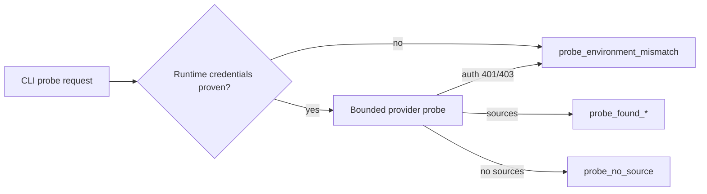

# Radar Search Pipeline TO BE 0.7.6.3.6.13

Status: TO BE

Slice: 0.7.6.3.6.13 - Legal/subsidiary completion fairness and coverage-probe runtime parity

Product area: Radar candidate and signal search

Date: 2026-06-30

## 1. Decision Context

The previous slice proved that review-needed production-site projection works. In the latest bounded Docker smoke, the benchmark reached `review_recall=1.0`: Gubkinsky GPP, Vyngapurovsky GPP, and the Tobolsk industrial site were retained and counted as review-needed upstream entities.

The remaining misses are legal/subsidiary entities:

| Target | Current bucket | Plain meaning |
|---|---|---|
| `nizhnekamskneftekhim` | `completion_not_selected` | Radar generated the target but did not give it an execution slot before completion stopped. |
| `kazanorgsintez` | `expansion_global_budget_limited` | Radar reached the target class, but budget ended before this target produced a projected entity. |

There is a second diagnostic problem: `probe-radar-coverage` can fail locally with OpenRouter `401 User not found`, while Docker API/worker successfully calls OpenRouter in the same acceptance run. That means the probe can use a different runtime/credential path than the worker.

## 2. AS IS Problem Statement

The current pipeline has three relevant stages:

1. `RadarSearchExpansionService` generates target-aware expansion variants.
2. `select_guaranteed_variants` selects guaranteed lane targets and optional completion targets.
3. `RadarWorkScheduler` admits selected work under budget.

The scheduler can only admit work it receives. If legal/subsidiary completion targets are not selected, the scheduler cannot protect them. If they are selected but rejected, the report needs to say exactly why.

Today, completion target diagnostics can collapse into broad reasons such as `completion_not_selected` or `expansion_global_budget_limited`. These reasons are too vague for RCA.

## 3. Intended Pipeline Behavior

The target flow should become explicit:

1. Generate targets from benchmark hints, source-backed gaps, retrieved sources, and candidate universe.
2. Select guaranteed minimum lanes: holding/group, legal/subsidiary, production-site/branch.
3. Detect satisfied lanes. If production-site minimums are satisfied, do not let extra production-site variants consume completion slots before uncovered legal/subsidiary targets.
4. Select completion targets using lane fairness:
   - uncovered legal/subsidiary targets first;
   - benchmark-context targets before generated aliases;
   - one noisy target cannot consume all slots;
   - optional aliases and duplicate variants come after legal completion coverage.
5. Scheduler admits selected tasks under external and semantic budgets.
6. Every target receives a final diagnostic state.

## 4. Roles Changed

| Role | Current responsibility | TO BE change |
|---|---|---|
| Search expansion service | Build targets and query variants. | Keep building targets; expose enough metadata for legal completion fairness. |
| Selection layer | Pick guaranteed and completion variants. | Own target ordering and fairness before scheduler admission. |
| Work scheduler | Admit selected work under budget. | Continue owning budget admission; do not guess missing targets. |
| Evaluation diagnostics | Classify false negatives from dossier/report metadata. | Use more precise completion/admission/budget buckets. |
| Coverage probe CLI | Run optional post-run web probes. | Either use API/worker-equivalent runtime config or fail early as `probe_environment_mismatch`. |

## 5. Context Passed Between Roles

Selection receives:

- generated targets;
- target type;
- target origin;
- benchmark uncovered flag;
- completion rank reason;
- variants grouped by target;
- lane minimums;
- completion target limit.

Scheduler receives only selected work. It records:

- accepted/rejected decision;
- lane;
- budget key;
- reason;
- message.

Dossier/report receives:

- `legal_subsidiary_completion_summary`;
- `legal_subsidiary_completion_targets`;
- selected/executed/projected counts;
- per-target final state and blocker reason.

## 6. Source, Budget, And Checkpoint Semantics

This slice does not loosen source policy. It only changes how already-allowed expansion targets are prioritized and diagnosed.

Budget rules:

- Selection cannot bypass scheduler admission.
- Scheduler remains the budget owner.
- If selected legal work is rejected, the reason must be `scheduler_rejected` or a budget-specific reason, not `completion_not_selected`.
- If a target was never selected, the reason must be selector/completion-specific.

Checkpoint semantics:

- Weak discovery still routes to expansion.
- After expansion, remaining false negatives should not be explained by generic wording when target state is known.

## 7. Coverage Probe Runtime Parity

The coverage probe must stop pretending that a local credential mismatch is a provider-quality result.

TO BE behavior:

- If running through local provider adapter and no OpenRouter credentials are available in the current process, return `probe_environment_mismatch` before provider calls.
- If provider returns OpenRouter 401/403 credential-style errors, classify as `probe_environment_mismatch`.
- Prefer API/worker path in future if durable probe endpoint is added. This slice may keep the CLI provider path, but it must report mismatch honestly.

## 8. Diagrams

### Completion target path

### Probe parity path

## 9. Test Plan

Unit tests should cover changed logic directly:

- completion selector chooses uncovered legal/subsidiary targets after production-site minimums are satisfied;
- optional aliases cannot consume all completion slots before legal/subsidiary targets;
- completion diagnostics distinguish cap exhaustion, selector priority loss, scheduler rejection, external budget, and source policy;
- evaluation maps precise reasons to precise false-negative buckets;
- coverage probe returns `probe_environment_mismatch` for missing credentials or OpenRouter auth errors.

Integration tests:

- selected legal/subsidiary work is admitted when budget exists;
- scheduler rejection is visible as admission failure, not selector failure;
- benchmark report exposes legal completion summary.

## 10. Acceptance Criteria

- `review_recall` remains `1.0` in recorded/fake coverage and should not regress in bounded Docker smoke without provider drift.
- `nizhnekamskneftekhim` and `kazanorgsintez` are either found/projected or receive precise non-generic blocker reasons.
- No legal/subsidiary miss is reported only as broad `completion_not_selected` when target state is available.
- `probe-radar-coverage` no longer reports OpenRouter `401 User not found` as normal provider failure.
- `benchmark_live` remains blocked until bounded smoke is interpretable.

## 11. Out Of Scope

- No new source provider.
- No UI changes.
- No scoring relaxation.
- No model-role policy changes.
- No SIBUR hardcode in production runtime.
