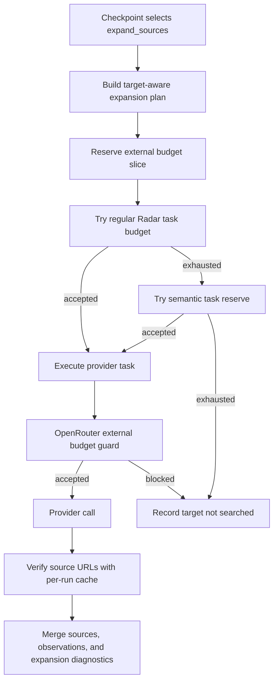

# Radar Search Pipeline TO BE: 0.7.6.3.6.4

Status: TO BE

Slice: `0.7.6.3.6.4: Semantic task-budget reserves, verification dedupe, and benchmark target execution guarantees`

Generated PDF: `docs/radar/to-be/RADAR_SEARCH_PIPELINE_TO_BE_0.7.6.3.6.4.pdf`

## 1. Decision Context

The latest bounded SIBUR benchmark smoke proved that connector profiles, source
cards, recall expansion, and protected OpenRouter recall-expansion calls work.
The remaining blocker is budget allocation:

- regular Radar web-task budget can stop expansion before protected OpenRouter
  reserve is useful;
- source verification can spend the run limit on repeated URL checks;
- benchmark smoke can generate important targets without proving that each
  target lane was actually executed.

This slice keeps the run bounded, but reserves small semantic task slots for
approved recall expansion and makes verification dedupe visible in dossier and
benchmark reports.

## 2. AS IS Problem Statement

Current execution has two different budget layers:

- `RadarExecutionBudget` counts semantic web tasks such as discovery, gate,
  coverage, and signals.
- `RadarExternalCallBudget` counts OpenRouter, DaData, provider retry, and
  source-verification calls.

`0.7.6.3.6.3` protected OpenRouter calls for recall expansion, but it did not
protect the application-level semantic task slot. A selected expansion task can
therefore be stopped by `total_run_budget_exhausted` before OpenRouter is even
called.

Source verification also checks each source record independently. If several
sources point to the same URL, they can consume several verification budget
units and hide useful budget state from the benchmark RCA.

## 3. Intended Pipeline Behavior



Rules:

- semantic task reserves apply only to approved expansion tasks;
- reserves do not bypass OpenRouter/DaData/source-verification budgets;
- benchmark target guarantees are based on executed expansion results, not on
  generated or selected targets;
- repeated URL verification reuses a per-run cached result and does not spend
  another source-verification budget unit.

## 4. Roles Changed

| Role | TO BE behavior |
|---|---|
| `RadarExecutionBudget` | Supports `semantic_task_reserve_limits` and records reserve counters/exhaustion events. |
| Search expansion executor | Passes the expansion variant reserve key into task-budget reservation and records semantic budget blockers separately from external blockers. |
| Source verification | Maintains a per-run URL cache and exposes cache hit/duplicate skip counters. |
| Dossier projection | Shows semantic task budget counters, target probe guarantees, and verification cache stats. |
| Benchmark report | Includes target-lane guarantee status and verification dedupe counters. |
| Evaluation | Matches source-backed SIBUR Holding aliases in evaluation only, without production hardcode. |

## 5. Context Passed Between Roles

New additive task context:

- `semantic_task_reserve_limits`;
- `benchmark_target_probe_minimums`.

New additive execution metadata:

- `semantic_task_budget_counters`;
- `semantic_task_budget_exhaustion_events`;
- `target_probe_guarantees`;
- `target_probe_guarantee_failures`;
- `source_verification_cache_stats`;
- `source_verification_unique_request_count`;
- `source_verification_duplicate_skip_count`.

## 6. Source, Budget, And Checkpoint Semantics

`benchmark_smoke` uses explicit semantic reserves:

- `recall_expansion`: 6;
- `production_site_coverage_probe`: 3;
- `official_coverage_probe`: 3;
- `open_web_coverage_probe`: 3.

Target probe minimums:

- holding/group: 1;
- legal/subsidiary: 2;
- production-site/branch: 2.

If a minimum is not met, the report must name the blocker:

- `target_not_generated`;
- `target_not_selected`;
- `semantic_task_budget_limited`;
- `external_budget_limited`;
- `source_policy_limited`;
- `executed_below_minimum`.

## 7. Dossier, Trace, And Evaluation Visibility

The dossier and benchmark report must show:

- regular task counters and semantic reserve counters separately;
- external OpenRouter budget counters separately from semantic task counters;
- target probe guarantees and failures by target type;
- source-verification unique request count and duplicate skip count;
- remaining false negatives with narrower diagnostic buckets.

Evaluation may improve alias matching for SIBUR Holding through the baseline
aliases. This is evaluation-only logic and must not change production candidate
projection.

## 8. Test Plan

Fast tests must cover the changed pieces directly:

- semantic task reserve accepts an expansion task after general web-task budget
  is exhausted;
- semantic reserve exhaustion records `semantic_task_reserve_exhausted`;
- source verification dedupes normalized duplicate URLs;
- benchmark report exposes semantic counters, target guarantees, and
  verification cache stats;
- evaluation matches source-backed `SIBUR Holding` aliases;
- dossier response exposes additive fields without secrets or hidden reasoning.

Regression commands:

```bash
python -m pytest tests/test_radar_search_expansion.py tests/test_radar_adaptive_execution.py -q
python -m pytest tests/test_radar_benchmark.py tests/test_radar_evaluation.py -q
python -m pytest tests/test_live_icp_radar.py tests/test_backend_api.py -q
python -m pytest tests/test_backend_architecture_contract.py tests/test_radar_pipeline_documentation_contract.py -q
python -m pytest
```

## 9. Acceptance Criteria

- Target probe guarantees show executed or precisely blocked holding, legal,
  and production-site lanes.
- Duplicate source URLs do not consume duplicate verification budget units.
- `review_recall` does not regress below `0.3333`.
- `strict_recall` does not regress below `0.6667` unless provider-output drift is
  clear.
- `benchmark_live` remains blocked until bounded smoke is interpretable.

## 10. Out Of Scope

- No DB migration.
- No UI change.
- No new provider adapter.
- No model-role leaderboard.
- No SIBUR-specific production hardcode.
