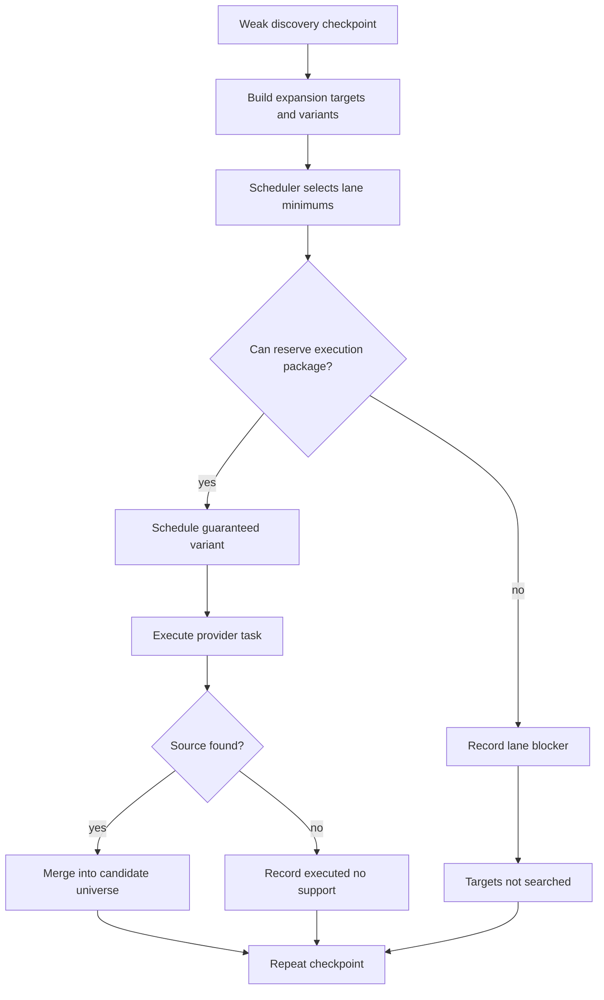

# Radar Search Pipeline TO BE 0.7.6.3.6.5

Status: TO BE

Slice: 0.7.6.3.6.5

Title: Guaranteed expansion execution scheduler and external-budget lane allocation

Generated PDF: `docs/radar/to-be/RADAR_SEARCH_PIPELINE_TO_BE_0.7.6.3.6.5.pdf`

## 1. Decision Context

Docker `benchmark_smoke` run `radar-run-44abf1c6-5070-4b2a-84cd-9d37df6cb429`
proved that the Radar runtime now has healthy wiring:

- API/worker path executed.
- Source cards and capability decisions were present.
- Search expansion generated target queues.
- Source verification dedupe worked.
- Evaluation improved to `strict_recall=0.8889` and `review_recall=0.3333`.

The remaining blocker is narrower: important expansion lanes were generated but
were not executed before external budgets were exhausted:

- holding/group: `0/1`;
- legal/subsidiary: `0/2`;
- production-site/branch: `1/2`.

Coverage probe found official sources for all remaining misses. Therefore the
next correction is not connector wiring, DaData behavior, or model selection.
The correction is execution scheduling and budget allocation for guaranteed
recall expansion lanes.

## 2. AS IS Problem Statement

AS IS expansion has target lanes and semantic reserves, but execution is still
too opportunistic:

1. Search expansion generates many targets and variants.
2. A diversified selector picks a small set.
3. Each selected variant competes for semantic task budget and external-call
   budget when the provider call is reached.
4. Earlier discovery, gate, retry, source verification, and OpenRouter server
   tool usage can exhaust shared budgets before the guaranteed target lanes
   execute.
5. The report can now explain the miss, but the algorithm does not yet reserve
   the minimum execution package up front.

This is why `poliom`, `gubkinsky-gpp`, and `tobolsk-site` were classified as
`expansion_not_selected` even though a targeted coverage probe found official
sources for all three.

## 3. Intended Pipeline Behavior

When a checkpoint selects recall expansion in `benchmark_smoke` or another
profile with target-lane minimums, expansion execution must use a scheduler:

1. Build expansion target queue as today.
2. Build candidate query variants as today.
3. Select guaranteed variants by target lane before selecting optional variants.
4. Reserve a small execution package for the guaranteed variants:
   - semantic task reserve;
   - OpenRouter recall-expansion call slot;
   - expected OpenRouter server-tool search slice;
   - source verification slice.
5. Execute guaranteed variants before optional expansion and before noisy
   gate/cross-check fan-out can consume the same budget.
6. Record an explicit state for every target:
   - generated;
   - selected;
   - scheduled;
   - reserved;
   - executed;
   - source found;
   - projected;
   - not selected;
   - selected but not scheduled;
   - scheduled but budget not reserved;
   - reserved but provider blocked.

The scheduler must not bypass hard external budgets. It can only allocate the
configured budget in a more useful order.

## 4. Roles Changed

| Role | TO BE change |
|---|---|
| Search expansion service | Still owns target and variant generation. It remains provider-free. |
| Search expansion scheduler | New application role. Selects guaranteed lane variants and optional variants, and records scheduling decisions. |
| Search expansion executor | Executes scheduled variants in scheduler order and records exact execution state. |
| External budget | Supports preflight allocation checks for guaranteed expansion packages without spending provider calls. |
| Dossier/report mapper | Shows scheduled/reserved/executed counts by lane and exact blockers. |
| Evaluation diagnostics | Uses scheduled/executed/projection states to classify false negatives more narrowly. |

## 5. Context Passed Between Roles

Scheduler input:

- expansion targets and variants;
- `benchmark_target_probe_minimums`;
- source cards and source policy already reflected in variants;
- external budget counters and limits;
- semantic task budget counters and limits;
- target type, reserve key, query, source ids, expected fact kinds.

Scheduler output:

- ordered variants to execute;
- `expansion_schedule`;
- `target_lane_allocation`;
- `target_lane_budget_reservations`;
- `targets_not_searched` updates for unscheduled or unreserved targets;
- summary by target type.

Provider execution input:

- scheduled variant;
- generated task;
- semantic reserve key;
- protected OpenRouter recall-expansion marker.

Provider execution output:

- existing `WebSearchProviderResult`;
- budget decision;
- source count;
- candidate observation count;
- execution status.

## 6. Source, Budget, And Checkpoint Semantics

### Source semantics

The scheduler uses only source-profile-derived variants. It must not hardcode
SIBUR, DaData, or OpenRouter-specific business behavior. SIBUR names can appear
only in benchmark fixtures/context.

### Budget semantics

The scheduler may reorder work and reserve budget slices, but it cannot create
unbounded execution:

- every scheduled task still consumes semantic task budget;
- every OpenRouter call still consumes total OpenRouter budget;
- recall expansion OpenRouter calls consume `openrouter_recall_expansion`;
- server-tool usage is still counted after provider response;
- verification budget remains bounded and deduped.

The scheduler should distinguish budget blockers:

- `external_total_budget_limited`;
- `openrouter_recall_expansion_budget_limited`;
- `server_tool_budget_limited`;
- `source_verification_budget_limited`;
- `semantic_task_reserve_exhausted`;
- `budget_reserve_exhausted`;
- `source_policy_limited`.

### Checkpoint semantics

Weak discovery should route to expansion. If guaranteed expansion cannot execute
minimum lanes, the run may stop for review, but it should explain the specific
lane and budget blocker. It should not look like a clean empty result or a vague
`not_retrieved_in_run`.

## 7. Dossier, Trace, And Evaluation Visibility

Dossier and benchmark report must expose:

- `expansion_schedule`;
- `target_lane_allocation`;
- `target_lane_guarantee_status`;
- scheduled/reserved/executed/source-found/projected counts;
- lane-specific budget blockers;
- verification cache stats;
- target probe guarantee failures.

Evaluation should classify false negatives using this order:

1. found and projected;
2. found but not projected;
3. executed no support;
4. reserved but provider blocked;
5. scheduled but budget not reserved;
6. selected but not scheduled;
7. not selected;
8. not generated.

## 8. Diagram

<!-- diagram: guaranteed expansion scheduling -->

## 9. Test Plan

Unit tests:

- scheduler selects at least one holding, two legal/subsidiary, and two
  production-site variants when enough variants exist;
- one noisy target with many aliases cannot consume the guaranteed set;
- scheduled variants are ordered before optional variants;
- exhausted total OpenRouter budget produces `external_total_budget_limited`;
- exhausted recall-expansion budget produces
  `openrouter_recall_expansion_budget_limited`;
- exhausted server-tool budget produces `server_tool_budget_limited`;
- exhausted semantic reserve produces `semantic_task_reserve_exhausted`;
- generated but unscheduled targets get `selected_but_not_scheduled` or
  `not_selected`, not a blank miss.

Pipeline tests:

- weak discovery executes guaranteed lane variants before optional variants;
- production-site target source creates review-needed universe entity;
- budget-blocked guaranteed lane appears in `targets_not_searched` and
  `target_probe_guarantee_failures`;
- signal search starts only after checkpoint permits continuation.

Report/evaluation tests:

- benchmark report exposes scheduled/reserved/executed counts by lane;
- false negative for a scheduled-but-blocked target is not
  `not_retrieved_in_run`;
- false negative for found-but-not-projected target gets a projection bucket;
- report contains no secrets, headers, raw prompts, or hidden reasoning.

## 10. Acceptance Criteria

- Docker `benchmark_smoke` for `benchmark-sibur-holding-contour` either
  satisfies lane minimums or reports exact budget/policy blockers for every
  missing lane.
- `review_recall` does not regress below `0.3333`.
- `strict_recall` does not regress below `0.8889` unless provider-output drift
  is visible in the report.
- Remaining false negatives are narrower than `expansion_not_selected`.
- `benchmark_live` remains blocked until this bounded smoke is interpretable.

## 11. Out Of Scope

- No new provider adapter.
- No UI changes.
- No model-role evaluation.
- No scoring relaxation.
- No SIBUR-specific runtime branch.
- No broad benchmark quality claim.

## 12. Open Questions

- Whether `benchmark_live` should use higher server-tool budgets after this
  slice proves that lane scheduling is correct.
- Whether source verification should get separate purpose-specific counters in
  a later slice if dedupe is not enough.
