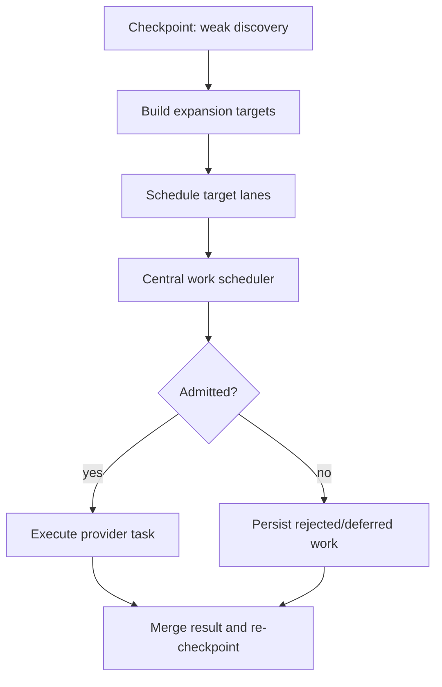
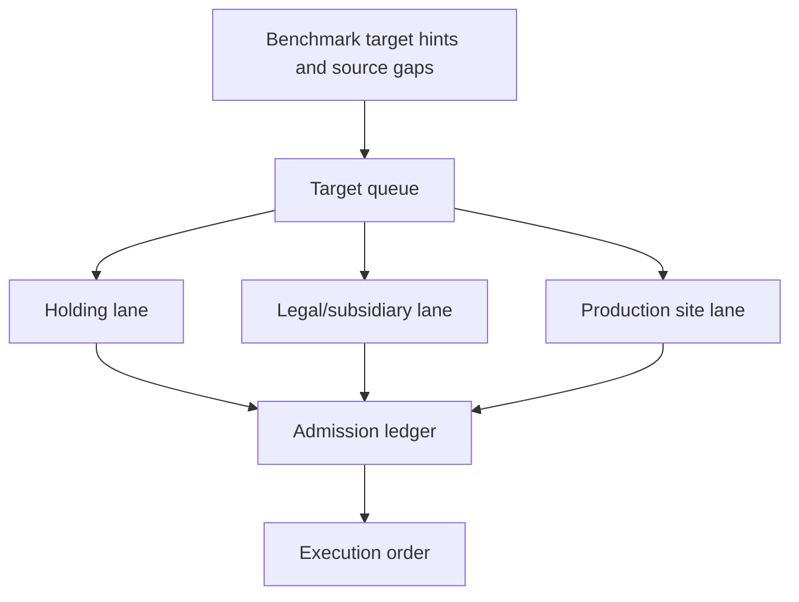

# Radar Search Pipeline TO BE 0.7.6.3.6.7

Status: TO BE

Slice: `0.7.6.3.6.7: Central Radar work scheduler and budget admission control`

Generated PDF: `docs/radar/to-be/RADAR_SEARCH_PIPELINE_TO_BE_0.7.6.3.6.7.pdf`

## 1. Decision Context

Recent SIBUR benchmark smoke runs proved that source cards, recall expansion,
semantic reserves, and external-call counters exist, but no single application
component owns the full order of work. Planner calls, discovery extraction,
retries, registry lookup, verification, expansion, and signal search all reserve
budget locally. As a result, benchmark target probes can be selected correctly
but still fail late because earlier optional work has already consumed the shared
OpenRouter run budget.

This slice adds a central application-layer work scheduler. It is not a provider
adapter and it does not call OpenRouter, DaData, Redis, Celery, FastAPI, or SQL.
It decides admission and ordering before local executors can spend protected
capacity.

## 2. AS IS Problem Statement

- `RadarSearchExpansionService` builds target queues and query variants.
- `radar_search_expansion_scheduler.py` orders guaranteed target lanes before
  optional expansion variants.
- `RadarExecutionBudget` tracks semantic web tasks.
- `RadarExternalCallBudget` tracks OpenRouter, DaData, provider retry, source
  verification, and reserve counters.
- `live_radar_search_expansion_execution.py` still performs local preflight,
  budget-reserve, protected-task marking, and execution decisions.

This means the system can explain the failure after the fact, but cannot protect
important work before optional provider calls spend the shared budget.

## 3. Intended Pipeline Behavior

The application layer creates a `RadarWorkScheduler` for the run. The scheduler
builds a small work portfolio for the current run profile and admits work items
by lane.

For `benchmark_smoke`, the scheduler protects capacity for these minimum lanes:

| Lane | Minimum |
|---|---:|
| holding/group recall expansion | 1 |
| legal/subsidiary recall expansion | 2 |
| production-site/branch recall expansion | 2 |

Regular planner/discovery/gate work can still run, but it must not consume the
OpenRouter run capacity reserved for admitted recall expansion. If configured
budgets cannot satisfy the guaranteed lanes, the run records an admission
failure before pretending that the probes were executable.

## 4. Roles Changed

| Role | TO BE responsibility |
|---|---|
| `RadarWorkScheduler` | Own run work portfolio, lane admission, protected capacity, execution order, and human-readable rejection reasons. |
| `RadarExternalCallBudget` | Continue counting actual external calls, but honor scheduler-reserved OpenRouter capacity for protected recall expansion. |
| `RadarExecutionBudget` | Continue counting semantic tasks and semantic reserves. It does not decide global work order. |
| Search expansion scheduler | Keep target-lane ordering logic; no longer owns admission. |
| Search expansion executor | Execute only admitted work items and persist skipped/rejected items from scheduler decisions. |
| Dossier/benchmark mapper | Surface work scheduler plan, ledger, decisions, guarantee failures, and rejected/deferred work. |

## 5. Context Passed Between Roles

Scheduler input is product-safe and deterministic:

- radar id and task context;
- source policy and source cards where available;
- benchmark target probe minimums;
- execution budget settings;
- external budget settings and current counters;
- generated expansion targets and query variants;
- checkpoint id and phase for adaptive actions.

Scheduler output is also product-safe:

- `work_scheduler_plan`;
- `work_scheduler_ledger`;
- `work_admission_decisions`;
- `work_lane_summary`;
- `work_guarantee_failures`;
- `work_execution_order`;
- `deferred_work_items`;
- `rejected_work_items`.

## 6. Source, Budget, And Checkpoint Semantics

Checkpoint still decides whether weak discovery needs expansion. The change is
what happens next: expansion goes through scheduler admission before execution.

Admission rules:

- guaranteed lanes are admitted before optional work;
- regular OpenRouter work cannot consume capacity reserved for recall expansion;
- protected recall expansion still counts against total OpenRouter budget;
- source policy and connector capabilities remain authoritative for which
  source can be used;
- if total or lane-specific budget is insufficient, the rejection reason is
  recorded before provider execution.

## 7. Diagrams

<!-- diagram: to_be_strategy_pipeline -->

<!-- diagram: to_be_expansion_target_queue -->

## 8. Dossier, Trace, And Evaluation Visibility

Dossier and benchmark report must show whether work was:

- generated;
- scheduled;
- admitted;
- executed;
- deferred;
- rejected by source policy;
- rejected by semantic task budget;
- rejected by external-call budget;
- rejected because protected capacity was insufficient.

The report must no longer rely only on late `target_probe_guarantee_failures`
to explain why the benchmark did not run a lane.

## 9. Test Plan

- Scheduler unit tests:
  - deterministic benchmark portfolio;
  - guaranteed lanes admitted before optional variants;
  - regular OpenRouter calls are blocked when they would consume reserved recall capacity;
  - protected recall expansion can use the reserved capacity and still increments total counters;
  - insufficient budget produces admission failure before provider calls.
- Pipeline tests:
  - weak discovery runs scheduler-backed expansion;
  - rejected expansion work appears in `targets_not_searched` with scheduler reason;
  - optional work does not hide guarantee failures behind generic budget exhaustion.
- API/report tests:
  - dossier exposes scheduler plan, ledger, decisions, lane summary, rejected/deferred work;
  - benchmark report includes scheduler summary and remains secret-safe.
- Documentation tests:
  - TO BE PDF exists and contains rendered diagrams;
  - AS IS Markdown/PDF are synced after implementation.

## 10. Acceptance Criteria

- `benchmark_smoke` either executes minimum target lanes or records exact
  scheduler admission blockers.
- No hidden external-call consumer bypasses scheduler reservation for recall
  expansion.
- Remaining false negatives have scheduler-visible reasons.
- `benchmark_live` remains blocked until bounded smoke is interpretable.

## 11. Explicit Out Of Scope

- No DB migration.
- No UI changes.
- No new provider adapter.
- No SIBUR-specific production runtime branch.
- No final quality claim for the benchmark.

## 12. Open Questions

- Whether future slices should make every provider call a first-class
  `RadarWorkItem`, including planner and registry lookup. This slice starts with
  the budget-critical recall-expansion admission path and protected OpenRouter
  capacity.
