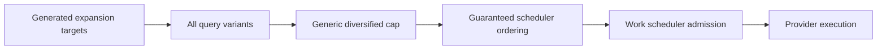
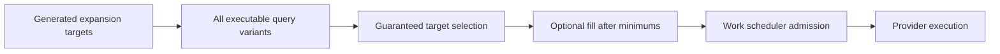

# Radar Search Pipeline TO BE: 0.7.6.3.6.8

## Slice And Decision Context

Slice `0.7.6.3.6.8` fixes the next blocker found after central work
scheduler admission was added. The scheduler can now protect budget and show
accepted or rejected work, but it only receives the work that the search
expansion selector gives it. The latest Docker `benchmark_smoke` showed that
the selector passed only one legal/subsidiary target and one production-site
target even though benchmark minimums require two of each.

The decision: target-lane minimums must be enforced before scheduler admission,
not after variant selection has already clipped the candidate list.

## AS IS Problem Statement

Current flow:

Problem: the generic cap can remove legal or production-site variants before
the guaranteed scheduler ever sees them. The final report then says
`scheduled_below_minimum`, but the scheduler cannot fix the missing work because
it was never selected.

## Intended Pipeline Behavior

New flow:

The selector must:

- read `benchmark_target_probe_minimums`;
- raise the effective variant cap to at least the sum of required lanes;
- choose required lane variants first: holding/group, legal/subsidiary,
  production-site/branch;
- only then add optional variants;
- record exact selection diagnostics before provider spending.

## Roles Changed

| Role | Change |
|---|---|
| Search expansion service | Pass benchmark lane minimums into variant selection. |
| Variant selector | Own guaranteed target selection before scheduler admission. |
| Work scheduler | Continue to own budget admission only; do not guess missing targets. |
| Dossier/report mapper | Surface selected guaranteed count, optional count, missing lanes, and selection failure reasons. |

## Context Passed Between Roles

Selector input:

- generated targets;
- executable query variants;
- `benchmark_target_probe_minimums`;
- source-policy-derived executable sources;
- configured max variant cap.

Selector output:

- selected variants;
- selected guaranteed count;
- selected optional count;
- effective max variants;
- missing lane diagnostics;
- target-level `not_searched_reason`.

## Source, Budget, And Checkpoint Semantics

The selector does not call providers and does not spend budget. It only decides
which variants are eligible to be submitted to scheduler admission.

If minimums cannot be met, the reason must be clear before external calls:

- `target_not_generated`;
- `no_executable_variant_for_target`;
- `source_policy_limited`;
- `selection_below_minimum`.

Budget-related failures remain scheduler/execution concerns:

- `external_total_budget_limited`;
- `server_tool_budget_limited`;
- `budget_reserve_exhausted`;
- `semantic_task_budget_limited`.

## Dossier, Trace, And Evaluation Visibility

The dossier and benchmark report must show:

- target count by type;
- selected guaranteed count by type;
- selected optional count;
- effective variant cap;
- selection diagnostics;
- target probe failures with selection-specific reasons when work never reached
  scheduler admission.

Evaluation must not classify a generated-but-unselected benchmark target as a
blank `not_retrieved_in_run`. It should remain `expansion_not_selected` with a
more specific selection reason when available.

## Test Plan

- Unit tests for selector:
  - 10 legal and 10 site targets with minimums 2+2 select at least 2+2 before optional;
  - optional variants cannot appear before all possible guaranteed minimums;
  - `max_variants=3` with total minimum 5 uses effective cap 5;
  - generated production-site targets that are not selected produce selection diagnostics;
  - generated targets without executable variants produce `no_executable_variant_for_target`.
- Scheduler integration tests:
  - scheduler receives 5 guaranteed benchmark work items when enough variants exist;
  - selected-work shortage is reported as selection failure, not external budget failure.
- API/report tests:
  - benchmark report exposes selected guaranteed counts and missing lane reasons;
  - no secrets, raw prompts, headers, or hidden reasoning fields.

## Acceptance Criteria

- Docker `benchmark_smoke` for `benchmark-sibur-holding-contour` selects at least
  one holding/group, two legal/subsidiary, and two production-site/branch
  variants before scheduler admission when such targets and executable variants
  exist.
- If a minimum is not met, the reported reason is exact and appears before
  provider spending.
- `review_recall` does not regress below `0.6667`.
- `strict_recall` does not regress below `1.0` unless provider output drift is
  explicitly shown.

## Out Of Scope

- No provider changes.
- No UI changes.
- No database migration.
- No SIBUR hardcode in production runtime.
- No benchmark quality claim or `benchmark_live` enablement.

## Open Questions

None for implementation. If live provider output drifts during acceptance, the
run should be diagnosed separately without changing this selector contract.
