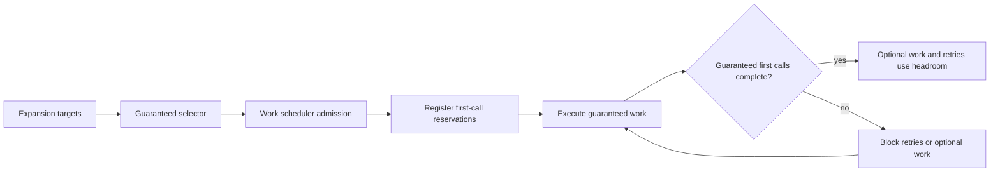

# Radar Search Pipeline TO BE: 0.7.6.3.6.9

## Slice And Decision Context

Slice `0.7.6.3.6.9: External recall-budget lane reservation and guaranteed expansion execution`.

The previous slice fixed target selection before scheduler admission. Docker smoke
`radar-run-e8936402-b242-4d63-a076-7d563441b7b0` proved that the selector now
selects enough guaranteed work:

- holding/group: selected `2`, required `1`;
- legal/subsidiary: selected `4`, required `2`;
- production-site/branch: selected `4`, required `2`.

The run still missed the full production-site guarantee because only one
production-site task executed. The immediate cause was exhaustion of
`openrouter_recall_expansion` before all accepted guaranteed tasks had made
their first provider call.

## AS IS Problem Statement

The scheduler admits guaranteed expansion work, but the external OpenRouter
recall-expansion budget is still counted as one flat pool.

That means a retry or earlier expansion task can consume a call that was needed
for a later guaranteed production-site task. The final diagnosis is better than
before, but the system still allows this sequence:

1. selector chooses enough guaranteed tasks;
2. scheduler admits enough guaranteed tasks;
3. execution starts;
4. an earlier task retry consumes shared recall budget;
5. a later guaranteed task is skipped as budget-limited.

This is not a selection defect anymore. It is a missing external-call
reservation rule.

## Intended Pipeline Behavior

The benchmark smoke pipeline should treat guaranteed expansion tasks as having a
reserved first OpenRouter recall-expansion call.

The intended order is:

1. Build expansion targets.
2. Select guaranteed variants first.
3. Scheduler admits the guaranteed work.
4. Scheduler registers the first-call reservation for every accepted guaranteed
   recall-expansion task.
5. Execution runs guaranteed tasks first.
6. Retries and optional tasks may use only the remaining headroom.
7. If headroom is exhausted, optional/retry work is limited before it can steal
   another guaranteed task's first call.

## Roles Changed

| Role | Change |
|---|---|
| `RadarSearchExpansionService` | Still owns target and variant generation; no provider calls. |
| `RadarWorkScheduler` | Registers guaranteed recall-expansion first-call reservations during admission. |
| `RadarExternalCallBudget` | Protects first provider call per guaranteed task from retries and optional work. |
| staged execution | Executes the accepted work portfolio and records clearer budget reasons. |
| benchmark report | Shows selected, admitted, reserved, executed, and skipped lane counts. |

## Context Passed Between Roles

The scheduler receives selected expansion variants with `schedule_role`.

For every accepted guaranteed expansion item it passes to the external budget:

- `task_id`;
- `reserve_key`;
- `lane`;
- `target_id`;
- `target_type`;
- `schedule_role=guaranteed`.

The budget records:

- protected task ids;
- which protected tasks are guaranteed;
- which guaranteed tasks have spent their first call;
- remaining guaranteed first-call reserve.

## Source, Budget, And Checkpoint Semantics

This slice does not change source policy or scoring.

It changes budget semantics:

- the first OpenRouter call of an accepted guaranteed expansion task is protected;
- retries cannot consume the last call needed by another unexecuted guaranteed task;
- optional expansion cannot consume guaranteed first-call reserve;
- `benchmark_smoke` gets small operational headroom above the minimum five
  guaranteed expansion calls.

New or clarified reasons:

- `guaranteed_external_reservation_insufficient`;
- `guaranteed_external_reservation_protected`;
- `optional_work_budget_limited`;
- `openrouter_recall_expansion_budget_limited`.

## Dossier, Trace, And Evaluation Visibility

The dossier/report should show:

- guaranteed external call reservation count;
- guaranteed external calls used;
- guaranteed external calls remaining;
- failures caused by lack of recall-expansion headroom.

Evaluation does not change metric definitions. It should simply receive a run
where the guaranteed production-site lane was actually attempted, or a precise
pre-provider reason why this was impossible.

## Diagram

## Test Plan

- Unit tests for the external budget:
  - protected retry cannot steal the first call reserved for another guaranteed task;
  - guaranteed first call succeeds after retry headroom is blocked;
  - insufficient recall-expansion limit is reported before execution.
- Scheduler tests:
  - accepted guaranteed work registers protected first-call reservations;
  - optional work remains admitted only when headroom exists.
- Benchmark profile tests:
  - `benchmark_smoke` has recall-expansion headroom above the five-call minimum.
- Dossier/report tests:
  - reservation metadata is visible and contains no secrets.

## Acceptance Criteria

- Docker `benchmark_smoke` reaches a terminal state.
- Selection remains satisfied.
- Scheduler admission remains satisfied.
- External recall-expansion budget protects first calls for:
  - at least one holding/group task;
  - at least two legal/subsidiary tasks;
  - at least two production-site/branch tasks.
- If the second production-site task is still not executed, the reason is not
  ambiguous shared-budget loss.

## Out Of Scope

- No UI change.
- No database migration.
- No new provider adapter.
- No scoring change.
- No SIBUR-specific production hardcode.
- No benchmark quality claim.

