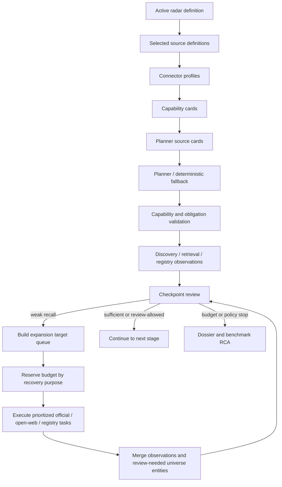
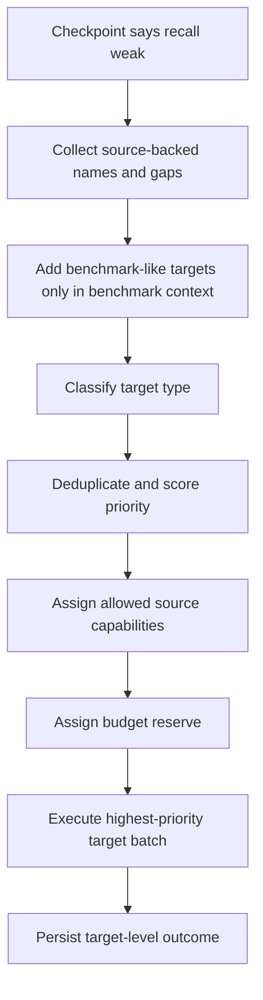

# Radar Search Pipeline TO BE: 0.7.6.3.6

Status: TO BE design
Slice: `0.7.6.3.6: Source-profile-driven recall expansion, budget reserves, and expansion target prioritization`
Product area: Radar candidate and signal search
Created: 2026-06-27
Source of truth for AS IS: `docs/radar/RADAR_SEARCH_PIPELINE_AS_IS.md`
Generated PDF: `docs/radar/to-be/RADAR_SEARCH_PIPELINE_TO_BE_0.7.6.3.6.pdf`

## 1. Decision Context

The current SIBUR benchmark smoke no longer looks like a basic Docker,
credential, or runtime wiring problem. It reaches the Radar pipeline, but the
result is still not ready for a broader `benchmark_live` run because the
pipeline can spend too much bounded work on early registry/cross-check branches
before recall-critical coverage expansion has a chance to run.

This TO BE changes the strategy layer. It does not tune DaData directly. The
same algorithm must work if DaData is replaced by SPARK, Kontur, an MCP source,
or any other structured registry provider whose connector profile compiles to
equivalent capabilities.

## 2. AS IS Problem Statement

Current behavior is too provider-shaped and too first-path-shaped:

- connector profiles exist, but their compiled cards do not yet provide enough
  strategy guidance for target prioritization and budget reservation;
- weak discovery can create expansion tasks, but the target set can remain too
  narrow and may focus on early promoted candidates instead of uncovered
  holding/subsidiary/site/alias targets;
- registry ambiguity can fan out into many cross-check tasks before official or
  open-web recall expansion covers the important misses;
- expansion diagnostics exist in runtime evidence, but dossier and benchmark
  report visibility is incomplete;
- source budget exhaustion can look like poor data quality even when official
  sources are findable by targeted queries.

The desired fix is not:

- hardcode SIBUR aliases into production runtime;
- hardcode DaData-specific behavior;
- blindly increase all budgets;
- run a larger benchmark before the bounded smoke explains what happened.

## 3. Intended Pipeline Behavior

The pipeline should become source-profile-driven:

1. Load active Radar definition and selected sources.
2. Load connector profiles for selected sources.
3. Compile connector profiles into capability cards with strategy-relevant
   fields.
4. Compile planner source cards from capability cards plus source obligations.
5. Build or revise the execution plan.
6. Validate the plan against capabilities and obligations.
7. During checkpoint review, if recall/coverage is weak, build an expansion
   target queue.
8. Allocate protected budget reserves before executing recovery actions.
9. Execute expansion by target priority and source capability, not by provider
   name.
10. Cap registry ambiguity fan-out and preserve ambiguity as review-needed
    metadata when needed.
11. Project expansion targets, skipped reasons, and budget reserve spend into
    dossier and benchmark report.

<!-- diagram: to_be_strategy_pipeline -->



## 4. Roles Changed

| Role | TO BE change |
|---|---|
| Connector profile registry | Loads richer human connector profiles and compiles provider-neutral capabilities. |
| Capability compiler | Adds accepted input shapes, bad input shapes, returned fact kinds, useful-result criteria, ambiguity semantics, and language/alias hints. |
| Planner source card compiler | Produces compact strategy guidance for the planner without exposing credentials or internal provider details. |
| Planner / plan reviser | Receives richer source cards and must plan source use according to capability and obligation, not source id alone. |
| Plan acceptance | Rejects incompatible source usage and validates obligation satisfaction against capability and useful-result semantics. |
| Checkpoint service | Detects weak recall/coverage and requests expansion by target class and reserve availability. |
| Search expansion service | Builds a prioritized expansion target queue, then bounded query variants per target/source capability. |
| Checkpoint action executor | Executes expansion under reserve-aware budgets and caps ambiguity fan-out. |
| Registry provider orchestration | Treats registry providers generically as capability-backed identity/enrichment sources; no DaData-specific strategy branch. |
| Dossier mapper / benchmark report mapper | Surfaces expansion targets, reserve counters, skipped reasons, ambiguity caps, and target-level outcomes. |

## 5. Context Passed Between Roles

Planner input receives:

- radar goal and compact qualification/signal summary;
- source obligations;
- planner source cards with best-for / not-for guidance;
- budget hints by purpose, not raw secrets;
- current checkpoint facts during revision.

Search expansion receives:

- checkpoint facts;
- source policy and obligations;
- source cards/capabilities;
- retrieved/analyzed source names and gaps;
- review-needed universe entities;
- benchmark false-negative-like targets only when benchmark context is explicit;
- current budget reserve snapshot.

Registry providers receive:

- concrete lookup terms only;
- identifiers when available;
- legal-form aliases;
- source-backed strong aliases;
- no broad discovery query and no placeholder candidate scope.

Dossier/report receive:

- sanitized expansion targets;
- query variants;
- reserve counters;
- skipped/blocked reasons;
- ambiguity summaries;
- no secrets, raw prompts, hidden reasoning, headers, tokens, or raw provider
  dumps.

## 6. Connector Capability Semantics

Connector profiles remain human-authored. They should not mention internal Radar
stage names such as `qualification_gate` or `signal_search`. The application
compiles them into internal capability cards.

Required additive profile/capability concepts:

- `accepted_input_shapes`:
  - `broad_query`;
  - `concrete_company_name`;
  - `inn`;
  - `ogrn`;
  - `domain_or_url`;
  - `alias`;
  - `candidate_scope`.
- `bad_input_shapes`:
  - `placeholder_scope`;
  - `vague_broad_query`;
  - `signal_evidence_replacement`;
  - `ambiguous_alias_only`.
- `returned_fact_kinds`:
  - `legal_identity`;
  - `registry_status`;
  - `address`;
  - `okved_or_industry`;
  - `ownership_or_relation`;
  - `official_coverage_evidence`;
  - `open_web_coverage_evidence`;
  - `signal_evidence`.
- `useful_result_criteria`:
  - identifier match;
  - strong normalized name match;
  - source-backed relation;
  - official-domain support;
  - valid searched-negative result.
- `non_blocking_outcomes`:
  - alias no-match;
  - ambiguous but source-backed relation;
  - insufficient concrete input;
  - partial relation-only result.

Example: a DaData-like and SPARK-like connector can both compile to:

```text
capability_class = lookup_only_identity_enrichment
accepted_input_shapes = [concrete_company_name, inn, ogrn, alias]
bad_input_shapes = [broad_query, placeholder_scope]
returned_fact_kinds = [legal_identity, registry_status, address, okved_or_industry]
does_not_return = [broad_coverage_evidence, signal_evidence]
```

Application behavior must use `capability_class` and fact/input capabilities,
not `provider_id == "dadata"`.

## 7. Recall Expansion Target Queue

Weak recall should produce target-oriented recovery, not only query-oriented
recovery.

Target classes, highest priority first:

1. `holding_or_group_target`
2. `known_subsidiary_or_legal_entity_target`
3. `production_site_or_branch_target`
4. `source_backed_universe_gap_target`
5. `alias_or_language_variant_target`
6. `benchmark_baseline_like_target` only in benchmark/evaluation context
7. `low_confidence_registry_suggestion_target`

Each target record should include:

- `target_id`;
- `target_label`;
- `target_type`;
- `source_refs`;
- `why_target_exists`;
- `priority`;
- `allowed_source_ids`;
- `expected_fact_kinds`;
- `budget_reserve_key`;
- `execution_status`;
- `not_searched_reason` when skipped.

<!-- diagram: to_be_expansion_target_queue -->



## 8. Budget Reserve Semantics

Budget reserves sit under existing execution/external-call budgets. They do not
increase the total by themselves. They partition the total so early work cannot
consume all capacity.

Initial reserve categories:

| Reserve | Purpose |
|---|---|
| `primary_discovery` | Initial broad and configured discovery tasks. |
| `registry_identity` | Concrete identity/enrichment lookups. |
| `recall_expansion` | Follow-up target expansion after weak recall. |
| `official_coverage_probe` | Official-domain and official-source coverage checks. |
| `open_web_coverage_probe` | Open-web recovery when official source is unavailable or insufficient. |
| `extraction_recovery` | Deterministic repair, retry, and backup extraction. |
| `signal_search` | Signal tasks after pre-signal checkpoint allows them. |

Rules:

- A task must pass both the total budget and the relevant reserve.
- Registry ambiguity fan-out cannot consume `recall_expansion`,
  `official_coverage_probe`, or `signal_search` reserves.
- If a reserve is exhausted, remaining targets get explicit
  `not_searched_budget_limited` or `not_executed_budget_limited` status.
- Smoke/benchmark profiles should define reserve defaults explicitly.
- Live profile can default to no strict reserve partition until configured, but
  must still report reserve counters when enabled.

## 9. Registry Ambiguity Fan-Out

Registry ambiguity is useful evidence, not a reason to spawn unbounded tasks.

TO BE rules:

- Exact identifier match can stop ambiguity early.
- Strong source-backed legal-name match can promote to resolved/review-needed
  identity according to confidence.
- Multiple medium matches are summarized as ambiguity metadata.
- Ambiguous suggestions are capped per source and per target.
- Low-confidence registry suggestions are lower priority than uncovered
  official/open-web coverage targets.
- Ambiguity summary must show:
  - attempted lookup term;
  - suggestion count;
  - retained suggestion count;
  - cap reason;
  - whether cross-check was deferred, executed, or skipped.

## 10. Checkpoint Semantics

Checkpoint behavior changes from "weak recall -> generic expand" to
"weak recall -> target queue + reserve-aware action".

Decision mapping:

| Condition | TO BE decision |
|---|---|
| Weak recall and reserve available | `expand_sources` with target queue. |
| Weak recall but reserve exhausted | `stop_review_needed` with `recall_expansion_budget_limited`. |
| Required coverage source not executed | Execute coverage target if reserve available, else stop with explicit reason. |
| Registry ambiguous but official/open-web reserve available | Cross-check only capped/high-priority ambiguity after primary targets. |
| Registry alias no-match but other source-backed evidence exists | Continue as review-needed, not hard block. |
| Signal phase requested before pre-signal checkpoint continue/review-allowed | Do not run signal; project `not_searched_policy_limited`. |

## 11. Dossier, Trace, And Benchmark Visibility

Dossier and benchmark report must make the expansion strategy inspectable
without reading raw trace.

Additive fields:

- `source_capability_strategy_summary`;
- `expansion_target_queue`;
- `search_expansion_query_variants_by_target`;
- `search_expansion_results_by_target`;
- `budget_reserve_counters`;
- `budget_reserve_exhaustion_events`;
- `registry_ambiguity_fanout_summary`;
- `targets_not_searched`;
- `benchmark_recall_target_summary`.

Benchmark report should answer:

- Which false negatives became explicit targets?
- Which targets were searched?
- Which targets were skipped?
- Which reserve blocked a target?
- Did official/open-web coverage run before registry ambiguity consumed budget?
- Did review-needed universe improve even if strict product candidates stayed
  conservative?

## 12. Implementation Plan

Implement in small internal increments:

1. Profile/capability schema extension.
2. Capability compiler and validation tests.
3. Planner source card enrichment.
4. Expansion target queue builder.
5. Budget reserve model and guard checks.
6. Registry ambiguity fan-out cap.
7. Checkpoint/action executor integration.
8. Dossier and benchmark report projection.
9. Fast fixture tests.
10. Bounded Docker benchmark smoke and evaluation.
11. AS IS Markdown/PDF synchronization.

## 13. Test Plan

Tests must prove changed logic directly, not only through one e2e smoke.

### Connector Profile And Capability Tests

- DaData-like fake profile and SPARK-like fake profile compile to the same
  lookup-only identity/enrichment capability class.
- Open-web profile compiles to broad discovery/coverage/signal-capable source.
- Official-domain profile compiles to coverage/official evidence source.
- Profiles can express accepted/bad inputs, returned fact kinds,
  useful-result criteria, ambiguity/no-match semantics, and language hints.
- Production execution code has no strategy branch for `provider_id == dadata`.

### Planner Source Card Tests

- Planner input contains enriched cards with best-for, not-for, accepted input,
  returned facts, useful-result criteria, and obligation.
- Registry source card tells the planner not to use broad discovery input.
- Web/official source cards tell the planner they are valid recall/coverage
  expansion sources.
- Disabled sources are not advertised as usable.

### Expansion Target Queue Tests

- Weak recall creates holding, subsidiary, production-site, alias, and
  source-backed-gap targets.
- Benchmark context can add baseline-like targets; normal runtime cannot depend
  on the curated baseline.
- Targets are deduped and priority sorted deterministically.
- Low-confidence registry suggestion targets are lower priority than uncovered
  official/open-web targets.

### Budget Reserve Tests

- Registry fan-out cannot consume recall expansion reserve.
- Official/open-web coverage probe reserve is preserved for target expansion.
- Exhausted reserve marks remaining targets `not_searched_budget_limited`.
- Total external-call budget still applies; reserves do not bypass total caps.

### Registry Ambiguity Tests

- Exact INN/OGRN match stops ambiguity safely.
- Multiple medium suggestions are summarized and capped.
- Ambiguous registry output does not spawn cross-check tasks before
  high-priority uncovered targets.
- Ambiguity details are visible in dossier/report.

### Checkpoint And Pipeline Fixture Tests

- Weak discovery -> target queue -> official/open-web expansion -> review-needed
  universe improves -> pre-signal checkpoint can continue or review-allow.
- Weak discovery -> reserve exhausted -> `stop_review_needed` with exact reserve
  reason.
- Required source unavailable still blocks appropriately.
- Alias no-match with source-backed official evidence remains review-needed, not
  hard failure.

### Dossier And Benchmark Report Tests

- Dossier contains target queue, reserve counters, expansion results, skipped
  target reasons, and ambiguity fan-out summary.
- Benchmark report shows whether remaining false negatives were targeted,
  searched, skipped, or still not discovered.
- Reports contain no secrets, raw prompts, hidden reasoning, headers, tokens, or
  raw provider dumps.

### Manual Acceptance

Run after fast tests:

```bash
python -m pytest tests/test_connector_profiles.py tests/test_radar_search_expansion.py -q
python -m pytest tests/test_radar_external_call_budget.py tests/test_radar_adaptive_execution.py -q
python -m pytest tests/test_radar_benchmark.py tests/test_radar_evaluation.py -q
python -m pytest tests/test_backend_api.py tests/test_backend_architecture_contract.py -q
python -m pytest
```

Then:

1. Rebuild Docker API/worker/backend-init.
2. Seed radar DB.
3. Run bounded `benchmark-sibur-holding-contour` smoke.
4. Run evaluation.
5. Run bounded coverage probe only for remaining misses.

Acceptance for the live smoke:

- API/worker runtime fingerprints match.
- Source cards are non-empty.
- Budget reserve counters are present.
- Expansion target queue is present.
- Registry ambiguity fan-out is capped.
- Either `review_recall > 0`, or remaining false negatives are no longer
  unexplained `not_retrieved_in_run`; each miss has target/search/budget
  diagnostics.

## 14. Acceptance Criteria

- The algorithm is connector-capability-driven, not DaData-specific.
- SPARK-like fake connector receives equivalent strategy treatment when its
  capability matches a DaData-like registry connector.
- Recall expansion targets more than the first promoted candidate.
- Budget reserves protect recall expansion and official/open-web probes.
- Registry ambiguity fan-out cannot starve recall expansion.
- Dossier and benchmark report explain expansion targets, budget reserves, and
  skipped target reasons.
- Bounded SIBUR smoke/evaluation produces a more specific and actionable recall
  diagnosis than broad `not_retrieved_in_run`.

## 15. Explicit Out Of Scope

- New SPARK provider adapter.
- UI source editor changes.
- Product scoring relaxation.
- Broad `benchmark_live`.
- Model-role evaluation and extraction backup policy. That is `0.7.6.3.7`.
- SIBUR-specific production hardcode.

## 16. Open Questions

- Should budget reserves be configured only through task context first, or also
  through `.env.example` in this slice?
- Should connector profile language hints be free text first, or structured
  arrays such as `alias_languages` and `legal_form_variants`?
- Should benchmark baseline-like targets be injected only by the benchmark
  runner, or derived by the evaluation layer and passed back into a rerun
  context?
- What is the minimum acceptable smoke signal after this slice: `review_recall >
  0`, or "all false negatives have target-level diagnostics"?
