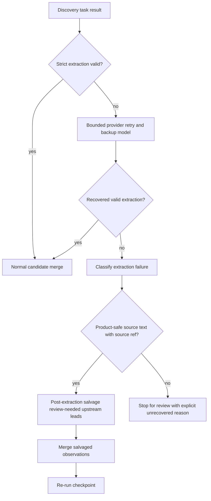

# Radar Search Pipeline TO BE 0.7.6.4.18.1.2

Status: TO BE

Slice: `0.7.6.4.18.1.2: Live extraction robustness and post-extraction salvage`

Pipeline: `candidate-discovery`

Source of truth for current AS IS: `docs/radar/RADAR_SEARCH_PIPELINE_AS_IS.md`

Generated PDF: `docs/radar/to-be/RADAR_SEARCH_PIPELINE_TO_BE_0.7.6.4.18.1.2.pdf`

## 1. Decision Context

After the recall-first upstream admission slice, deterministic and recorded
tests prove that candidate discovery can retain source-backed upstream leads
without signal evidence. A bounded Docker/API benchmark smoke exposed an earlier
live-provider blocker: OpenRouter can return schema-invalid extraction content
while its product-safe source annotations already contain useful candidate
evidence. The run then stops before expansion and benchmark target-funnel
diagnostics.

This slice merges the older `0.7.6.3.6.6` backlog item into the current
candidate-discovery corrective track. It does not implement signal-monitoring
runtime.

## 2. Intended Behavior

Candidate discovery keeps strict extraction validation and bounded retry/backup
attempts. If those attempts still leave the extraction contract invalid, the
pipeline performs one deterministic post-extraction salvage pass before terminal
checkpoint stop.

Salvage may use only product-safe source diagnostics:

- normalized `RadarSourceEvidence` title, snippet, URL, and source ref;
- retrieved or analyzed source title/snippet/URL metadata;
- source lifecycle diagnostics that already exclude prompts, secrets, headers,
  tokens, hidden reasoning, and raw private provider payloads.

If source diagnostics contain an explicit source-backed legal/company lead,
candidate discovery materializes a review-needed upstream observation and
re-runs the checkpoint. If no safe source-backed lead exists, the run remains
stopped for review with an explicit unrecovered reason.

## 3. Changed Flow

## 4. Roles Changed

`ExtractionFailureClassifier` owns provider-neutral failure categories:
`schema_invalid_empty`, `schema_invalid_with_sources`, `unlinked_source_refs`,
`backup_schema_invalid`, `retry_budget_exhausted`, and
`unrecoverable_no_source_text`.

`PostExtractionSalvageService` owns deterministic salvage from product-safe
source diagnostics. It does not call providers and does not accept downstream
product candidates.

Checkpoint recovery invokes salvage only at the bounded extraction-recovery
limit. It records the result and re-checkpoints recovered state.

## 5. Diagnostic Surface

Execution metadata adds:

- `post_extraction_salvage_records`;
- `post_extraction_salvage_count`;
- `post_extraction_salvage_outcome`;
- `post_extraction_salvage_unrecovered_reason`.

Existing extraction validation issues, repair records, model attempts, retry
records, and budget decisions remain visible. A recovered run reports
`extraction_contract_state=post_extraction_salvage_recovered`.

## 6. Semantics And Boundaries

Salvaged candidates are upstream review leads:

- `upstream_discovery_outcome=review_needed_upstream_lead`;
- `product_acceptance_status=review_required`;
- no signal search provider calls;
- no `not_observed` projection;
- no product acceptance without strict qualification evidence.

No source ref or no product-safe source text means no candidate is created.
This is not a hidden broad fallback.

## 7. Test Plan

Fast tests must prove:

- empty schema-invalid output still stops without hidden fallback;
- source-backed schema-invalid output creates review-needed upstream leads;
- unlinked refs and retry/backup exhaustion are separately classified;
- checkpoint recovery continues after salvage instead of terminal
  `schema_failed`;
- benchmark smoke can reach expansion and target-funnel diagnostics before a
  longer live benchmark is attempted.

## 8. Out Of Scope

- No signal-monitoring live runtime/API work.
- No quality claim from one live run.
- No SIBUR-specific production hardcode outside benchmark fixtures.
- No broad prompt redesign unless a focused test requires a minimal repair
  prompt change.
