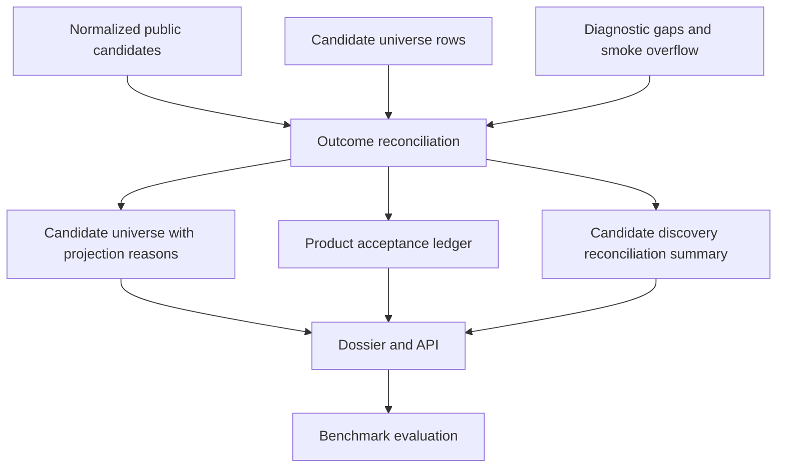

# Radar Search Pipeline TO BE 0.7.6.4.18.1.3

Status: TO BE

Slice: `0.7.6.4.18.1.3: Candidate discovery outcome reconciliation and public result repair`

Pipeline: `candidate-discovery`

Source of truth for current AS IS: `docs/radar/RADAR_SEARCH_PIPELINE_AS_IS.md`

Generated PDF: `docs/radar/to-be/RADAR_SEARCH_PIPELINE_TO_BE_0.7.6.4.18.1.3.pdf`

## 1. Decision Context

After the signal-monitoring split, recall-first upstream admission, and
post-extraction salvage work, candidate discovery can retain more upstream
leads than it promotes into the short public candidate list. The live SIBUR
benchmark smoke showed the next failure mode: the run had many upstream leads
and benchmark target matches, but the visible result collapsed into a few rows
with no clear explanation of where the other leads went or why
`product_candidate_count` stayed zero.

This slice makes the result surface auditable. It does not broaden product
acceptance, tune providers, or implement signal-monitoring runtime.

## 2. Intended Behavior

Candidate discovery must produce one reconciled accounting layer:

- public candidate rows;
- candidate-universe-only upstream leads;
- diagnostic gaps, including smoke cap overflow;
- rejected or not-promoted entities;
- product acceptance statuses and reasons;
- public projection statuses and reasons.

Every retained upstream lead must have:

- `upstream_discovery_outcome`;
- `product_acceptance_status`;
- `product_acceptance_reason`;
- `public_result_status`;
- `public_projection_reason`.

`score.tier` remains a compatibility/display field. New backend and evaluation
logic must use explicit upstream/product/public fields.

## 3. Changed Flow

## 4. Acceptance Logic

The run is not acceptable merely because it completed. The candidate-discovery
DoD is:

- `unexplained_drop_count == 0`;
- every universe-only or gap entity has a non-empty projection reason;
- `product_candidate_count == 0` is acceptable only when
  `product_candidate_zero_explained == true` and every ledger row has a product
  acceptance reason;
- if `product_candidate_count > 0`, `product_candidate_zero_explained` must be
  `false` so the report does not imply a zero-product run;
- benchmark targets cannot remain `present_not_projected` when product-safe
  source diagnostics provide source-backed names;
- API `/candidates`, dossier, and evaluation report expose the reconciliation
  summary and product acceptance ledger.

## 5. Out Of Scope

- no signal-monitoring live runtime;
- no lowering of downstream product precision;
- no SIBUR-specific production hardcode outside benchmark fixtures/hints;
- no provider prompt or model tuning;
- no expansion-budget redesign.

## 6. Validation

Fast validation must cover:

- finalization smoke-cap overflow produces ledger rows with reasons;
- API candidates and dossier expose upstream/product/public fields;
- evaluation report includes reconciliation metrics and fails visibly on
  `present_not_projected`;
- architecture tests keep new reconciliation logic out of large modules.

Docker/API benchmark smoke is the final gate: after rebuild, the SIBUR
`benchmark_smoke` run must satisfy the DoD above before the slice is closed.
