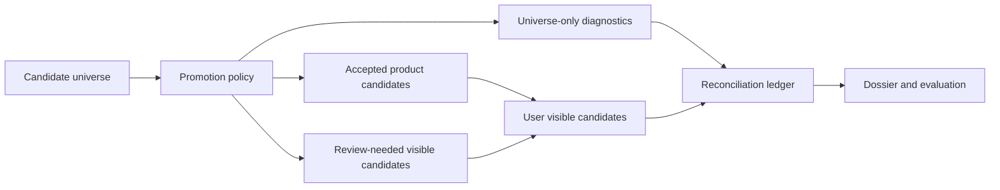

# Radar Candidate Discovery TO BE 0.7.6.4.18.1.4

## 1. Slice And Decision Context

Slice `0.7.6.4.18.1.4` corrects the candidate-discovery result surface after
the recovery and reconciliation repairs. The current pipeline can retain broad
upstream legal targets, but the user-facing candidate list is still too narrow:
the benchmark smoke can match eight legal baseline targets while only three
rows are visible as public/product candidates.

The deliberate decision is to split the visible candidate surface from strict
product acceptance:

- accepted product candidates are strict account candidates;
- review-needed candidates are user-visible legal leads that need human or
  downstream acceptance work;
- universe-only diagnostics remain available for non-account entities, noisy
  rows, gaps, and traceable explanations.

Signal monitoring remains out of scope. Candidate discovery still ends with a
handoff snapshot and must not create searched-negative signal observations.

## 2. AS IS Problem Statement

Implemented behavior after `0.7.6.4.18.1.3`:

- upstream leads no longer disappear without a reconciliation reason;
- dossier and evaluation expose `candidate_discovery_reconciliation` and
  `product_acceptance_ledger`;
- the SIBUR benchmark smoke can report high strict recall over
  `candidate_universe`;
- public candidate rows still represent only the strict accepted subset.

This leaves a product gap: users see three public/product candidates, while
five additional source-backed legal baseline targets are buried in diagnostic
surfaces. The result is technically explainable but still product-poor.

## 3. Intended Pipeline Behavior

Candidate discovery now produces three explicit surfaces:

1. `candidate_universe`: broad upstream truth, including legal entities,
   sites, branches, ambiguous rows, gaps, and diagnostics.
2. `user_visible_candidates`: the user-facing candidate surface. It contains:
   accepted product candidates and review-needed legal candidates.
3. strict product candidates: the accepted subset used for product precision.

Public candidate rows must carry a surface status:

- `accepted_product_candidate`;
- `review_needed_candidate`;
- `universe_only_diagnostic`;
- `not_promoted`.

Review-needed legal candidates are visible, but they do not inflate precision
and do not become accepted product candidates.

## 4. Roles Changed

| Role | New responsibility | Still does not own |
|---|---|---|
| Candidate projection/finalization | Build user-visible accepted and review-needed candidate rows from source-backed legal universe entries. | Provider calls, signal monitoring, or product precision rules outside candidate discovery. |
| Outcome reconciliation | Count accepted, review-needed, visible, universe-only, and not-promoted rows consistently. | Retrieval, extraction, or benchmark scoring. |
| API/dossier mappers | Expose the same user-visible candidate rows and candidate universe with surface status. | Mutating run behavior. |
| Evaluation | Report visible legal baseline coverage separately from strict product precision. | Provider calls or hiding quality failures. |
| Search expansion/target funnel | Give protected targets such as Poliom a specific bounded reason when they are generated but not selected. | Unbounded retry or hardcoded production selection. |

## 5. Context Passed Between Roles

Finalization passes product-safe fields only:

- candidate name, entity type, source refs, benchmark id, aliases;
- upstream discovery outcome and confidence;
- product acceptance status and reason;
- public projection status and reason;
- candidate surface status and reason;
- target-funnel path reason for protected benchmark targets.

Raw prompts, hidden reasoning, credentials, headers, and raw provider dumps are
not allowed in the visible surface or evaluation report.

## 6. Source, Budget, And Checkpoint Semantics

The slice does not add broad fallback or unbounded budget.

Source-backed legal entities may become review-needed visible candidates when:

- they are legal entities;
- they have source refs or structured registry identity;
- they match protected benchmark legal targets or satisfy deterministic
  source-backed admission rules.

Budget and checkpoint semantics remain bounded. A generated-but-not-selected
protected target must receive a specific bounded reason such as selection cap,
reserve cap, admission cap, or execution cap. Generic disappearance is not
allowed.

## 7. Dossier, Trace, And Evaluation Visibility

The dossier and candidates endpoint expose:

- `candidate_surface_status`;
- accepted vs review-needed candidate counts;
- visible legal baseline count where evaluation context exists;
- strict product candidate count;
- product acceptance reason;
- surface promotion reason.

The evaluation report exposes:

- `legal_baseline_visible_count`;
- `accepted_product_candidate_count`;
- `review_needed_candidate_count`;
- `visible_candidate_count`;
- strict `product_candidate_count`;
- unchanged `strict_recall`, `review_recall`, `precision`;
- target-funnel reasons for all baseline targets.

## 8. Changed Flow

## 9. Test Plan

Fast tests must prove:

- source-backed legal universe entries can become review-needed visible rows;
- accepted and review-needed candidates are counted separately;
- review-needed visible candidates do not count as accepted product candidates;
- the SIBUR-style fixture reaches at least eight visible legal baseline targets
  and at least three accepted product candidates;
- protected targets cannot regress to `present_not_projected`;
- `not_observed` is not created in handoff mode.

Final gate:

1. rebuild Docker with `docker compose up -d --build`;
2. run SIBUR `benchmark_smoke`;
3. evaluate the run through API;
4. close the slice only when the DoD metrics pass.

## 10. Acceptance Criteria

- `legal_baseline_visible_count >= 8`;
- `accepted_product_candidate_count >= 3`;
- `review_needed_candidate_count >= 5`, or every missing legal target has a
  specific target-funnel and ledger reason;
- `unexplained_drop_count == 0`;
- `present_not_projected_count == 0`;
- Poliom is visible/projected or has a specific bounded selection/cap reason;
- handoff signal rows remain not-searched/pending/limited.

## 11. Explicit Out Of Scope

- no signal-monitoring live runtime;
- no quality claim from one live run;
- no SIBUR-specific production hardcode outside benchmark fixtures/hints;
- no unbounded budget increase;
- no lowering strict product precision.

## 12. Open Questions

- Whether review-needed legal candidates should appear in the same UI table as
  accepted candidates or in a separate grouped section is a frontend question
  for a later UI slice. The backend contract must expose both either way.
