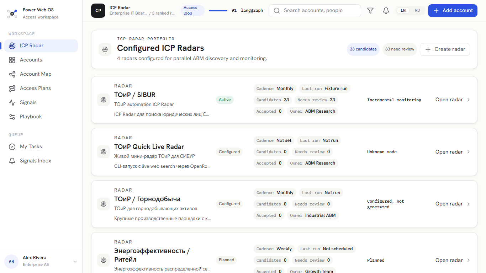
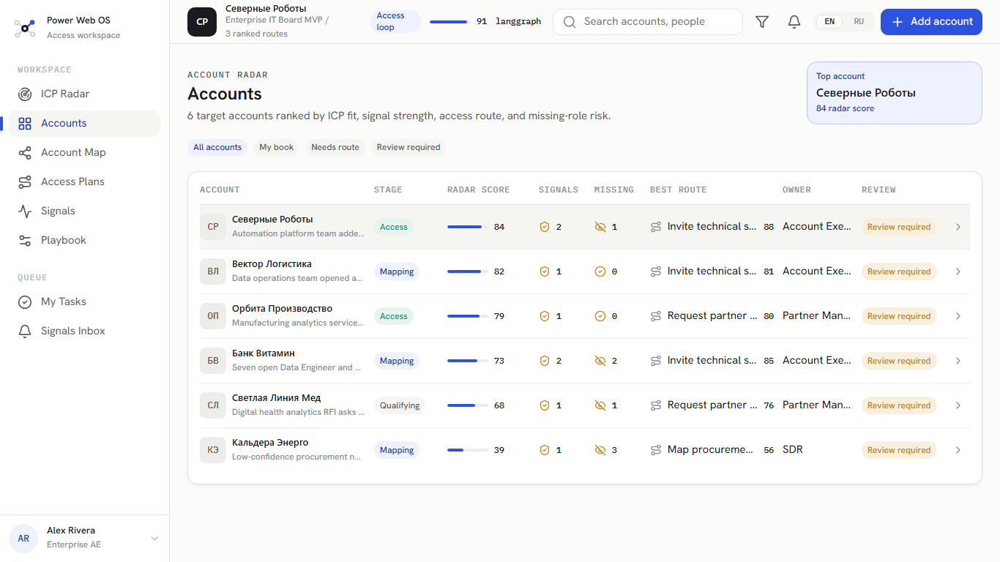
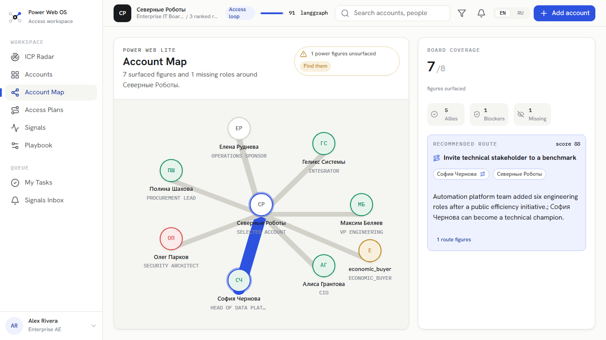
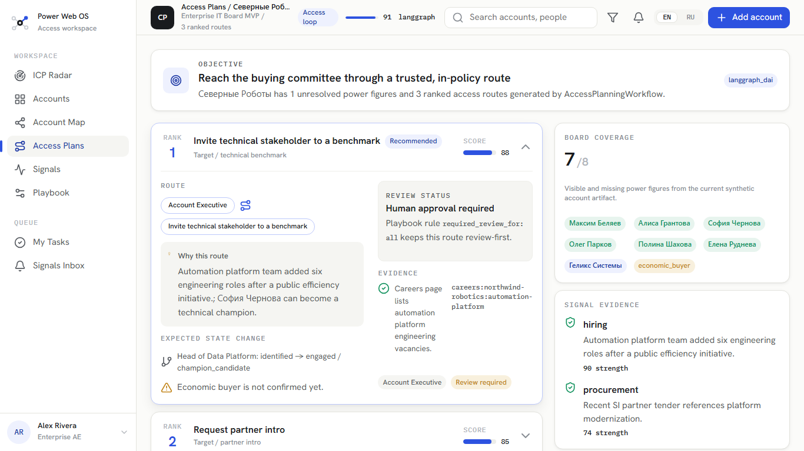
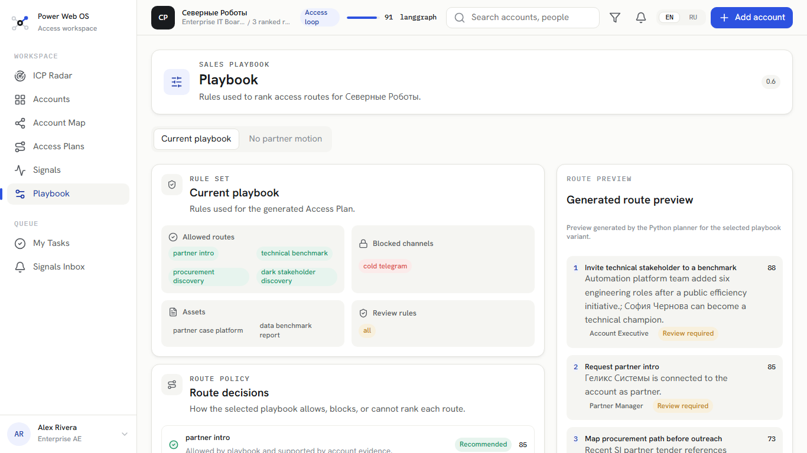

# User Guide

## What Power Web OS Does

Power Web OS helps a sales or ABM team answer five questions:

1. Which accounts match a specific ICP profile now?
2. Why is this account relevant now?
3. Who influences the buying decision?
4. Which access routes are allowed by our playbook?
5. What next move should a human review and execute?

The upstream module is called `ICP Radar`. An ICP Radar is configured for a product and market profile, such as ТОиР automation for large Russian petrochemical and industrial companies. It discovers candidate accounts, monitors evidence-backed signals, scores them transparently, and sends only accepted accounts into Power Web work.

## Current Demo

The current demo starts with an `ICP Radar` catalog. The catalog contains one active ТОиР/SIBUR-style radar imported from an XLSX fixture plus two configured examples without generated shortlists yet. It also keeps a six-account accepted portfolio with Russian-language company and person names for the downstream Power Web and Access Plan loop.

`ICP Radar` ranks legal entities from the imported workbook while the radar configuration itself is expressed as fit, intent, and tier logic. Historical workbook candidate rows still show imported fit/intent/trigger/total columns for compatibility, but radar Settings no longer treat trigger or total as user-configured concepts. The accepted portfolio is ranked by Account Radar using deterministic ICP fit, signal strength, best Access Plan route score, and missing-role penalty.

The default top-ranked accepted account, `Северные Роботы`, has the richest current Power Web example: eight board figures across technical, procurement, security, operations, partner, and missing economic-buyer roles. Use it to inspect how a more enterprise-like influence map fits inside the `Account Map` screen.

Run:

```bash
python demo/run_demo.py generate-icp-radar
python demo/run_demo.py generate-icp-radar-catalog
python demo/run_demo.py generate-account-radar
npm --prefix ./frontend run dev
```

Optional live mini radar through CLI/export fallback:

```bash
python -m power_web_os.demo run-live-mini-icp-radar --dry-run-plan
python -m power_web_os.demo run-live-mini-icp-radar --live
```

The live command requires local OpenRouter credentials in `.env`. The preferred
interactive path is the backend API: start Redis, the Celery worker, and
`power-web-os-api`, then open `РўРћРёР  Quick Live Radar` and click `Run radar`.
If the backend is unavailable, the screen stays in demo fallback mode and can
still show `frontend/public/demo/live_mini_icp_radar_run.json` when that file
exists. No fake candidates are created.

Open the Vite URL printed by the frontend command. The demo opens in a bounded Power Web OS workspace shell with `ICP Radar` active. It shows:

- ICP Radar catalog with multiple configured radars;
- experimental `РўРћРёР  Quick Live Radar`, which can start a backend live run and still falls back to real provider-backed findings from `frontend/public/demo/live_mini_icp_radar_run.json`;
- selected-radar `Found accounts` and editable local-demo `Settings` modes;

- sidebar navigation for `ICP Radar`, `Accounts`, `Account Map`, `Access Plans`, `Signals`, and `Playbook`;
- profile and navigation frame that stays visible while workspace content scrolls inside the app;
- `EN` / `RU` language switcher in the top bar, with the choice saved locally in the browser;
- ICP Radar ranking from the ТОиР workbook fixture;
- imported fit, intent, trigger, total score, tier, evidence refs, and selected-candidate C1-C20 criteria breakdown;
- a disabled `Take into work` affordance reserved for the planned handoff slice;
- Account Radar ranking across six target accounts;
- radar score, stage, signal count, missing roles, best route, owner, and review status;
- account context, route count, workflow runtime, and ICP fit for the selected account in the top bar;
- planned placeholder states for product areas that are not implemented yet;
- click-through from an account row to that account's `Access Plans` screen;
- a working `Account Map` screen for the currently selected account;
- a working `Playbook` screen for the currently selected account;
- Power Web Lite board coverage with visible figures, missing roles, and total known/missing perimeter;
- highlighted recommended access route path through a surfaced person, partner, or missing role;
- selected board-node inspector with stance, state, route membership, and influence score;
- current playbook rules: allowed routes, blocked channels, available assets, review rules, route decisions, and generated route preview;
- a read-only `No partner motion` what-if variant generated by the Python planner, with partner intro and partner-case assets disabled;
- board coverage with visible and missing power figures;
- signal evidence with confidence and source refs;
- top Access Plan routes;
- route rationale, risk, owner, evidence refs, and expected state change;
- human review status from the playbook.

The language switcher localizes UI chrome plus visible deterministic demo data such as stages, owners, route titles, route rationale, risks, expected state changes, signal kinds, signal summaries, evidence summaries, and missing-role labels. Company names, person names, technical runtime names, and source refs remain artifact data.

`Account Map` uses the same selected account as `Accounts` and `Access Plans`. Clicking an account row still opens `Access Plans`; using the sidebar `Account Map` item opens the Power Web Lite board for that selected account. Missing figures are shown as unsurfaced nodes, and the cobalt highlight marks only the active recommended route.

`Playbook` also uses the same selected account. Open it from the sidebar to see why the planner allowed, blocked, or could not rank each route under the current playbook. The segmented control switches between the generated current playbook analysis and the deterministic `No partner motion` variant. The frontend does not recalculate planner logic; both route previews are pre-generated in the Access Plan artifact.

## Product Walkthrough

### ICP Radar catalog and shortlist

Live Radar now shows two separate pipeline controls. `Candidate discovery`
answers "who should we monitor" and uses the existing backend run API to create
a candidate-discovery run. `Signal monitoring` answers "what changed recently"
for already known candidates. In the current UI it is a recorded/no-network
preview only: the report can be inspected, but the production `Check signals`
action is disabled until the signal-monitoring backend API is implemented.

The `ICP Radar` screen now starts with a list-first catalog of configured radars. Each row represents a configured ICP Radar with aligned columns for status, owner, cadence, last run, run mode, candidate count, needs-review count, and accepted count. Use `Create radar` to add a browser-local demo radar, or open `ТОиР / SIBUR` to inspect the active fixture-backed radar. Its `Found accounts` tab contains the current ranked table, and its `Settings` tab edits the radar definition by block: radar header, global search base, account qualification rules, monitoring, intent signals, scoring model, and validation.

Settings are intentionally business-facing:

- IDs and signal codes are generated by the system. They can be shown compactly for custom formulas, but they are not edited by hand.
- Radar name, description, active/inactive status, read-only owner, duplicate, delete, and reset actions live in the selected radar header. Header actions stay in the top-right action row; status and owner stay with the description on the left. The monitoring run mode is shown only in the Monitoring block, not repeated in the header.
- Account qualification criteria are flat natural-language rules with `AND` / `OR`, optional `NOT`, required/recommended level, global-base usage, optional local sources, cross-validation, and HITL additional-source switches.
- The selected radar header owns radar name, description, active status, duplicate/delete/reset actions, and the header edit action. There is no separate global Settings action panel.
- The global search base is shown as bounded keyword/exclusion lists plus a numbered source table. Long references stay inside their table cells.
- Account qualification criteria and intent signals are shown as aligned tables with operator/rule/source/check columns so the list can be scanned before editing.
- Intent signals use the same simplified source/rule model as qualification criteria. A global `0 / 1 / 2` scoring rubric is kept in its own compact block, and individual signals can override it only when needed.
- Monitoring uses constrained controls: cadence, run mode, deduplication policy, and number/unit fields for lookback and stale windows.
- Scoring uses only `Fit / Соответствие`, `Intent / Интент`, and `Tier / Уровень`. Presets cover arithmetic mean, weighted average, maximum signal, capped sum, and custom formula.
- Custom formula mode is the only place where generated rule IDs and signal codes matter.

The catalog also includes `РўРћРёР  Quick Live Radar`. This is the first live experimental radar. In API mode, use `Run radar` to create a queued backend run, watch `queued/running/completed/failed` status, and load candidates after output exists. In fallback mode, its `Found accounts` tab can still show the exported `live_mini_icp_radar_run.json` artifact. After a successful run, the radar is reviewed through the same canonical table-first flow as `РўРћРёР  / SIBUR`: candidates stay in the same sticky-column shortlist, row click opens the same four-block preview, and `Open details` opens the same tabbed in-shell detail view. Runtime/provider metadata is available in the candidate `Journal` tab, not on the main shortlist. Live findings always require human review and do not flow into `Accounts` automatically.

Use `Inspect run` / `Диагностика запуска` when you need to understand the run
itself, especially if it failed or returned no candidates. The diagnostics view
shows run context, output state, coverage warnings, candidate-universe lifecycle,
source lifecycle, product-safe journal/dossier sections, and trace availability
without requiring a selected candidate. The `Trace` tab is for developer/admin
inspection: it groups sanitized technical records by phase and keeps raw JSON
collapsed by default.

Start with `ICP Radar`. This is the upstream ABM radar view: it ranks candidate legal entities before they are accepted into Power Web work. The main surface is a wide table: the company column stays fixed while score, tier, evidence, and criteria-related columns can scroll horizontally inside the table. Click a candidate row to open a bounded inline preview with the main signal, short recommendation, top evidence refs, and top criteria. Open the candidate detail view when you need the full C1-C20 signal breakdown, source refs, and local signal validation controls. Take-into-work is still a planned follow-up slice.



### Accounts portfolio

Open `Accounts` to see the accepted account portfolio. This is no longer raw ICP discovery; these accounts are already ready for downstream Power Web work. The table compares radar score, signal count, missing roles, best route, owner, and review status. Clicking a row keeps that account selected and opens its `Access Plans` view.



### Power Web board

Open `Account Map` to inspect the selected account's Power Web Lite board. Visible figures, missing roles, stance, and route membership are shown as a compact influence map. The cobalt route path highlights the currently recommended access route; missing figures remain visible as unsurfaced nodes rather than disappearing from the strategy.



### Access Plan

Open `Access Plans` to review the ranked next moves. Each route includes rationale, evidence, risk, expected state change, owner, score, and human-review status. The screen is intentionally review-first: it explains the recommendation but does not execute outreach or CRM changes.



### Playbook analysis

Open `Playbook` to see how the customer's rules shape the plan. The screen shows allowed routes, blocked channels, available assets, review rules, policy decisions, and route preview. The `No partner motion` variant is generated by the Python planner and lets the user compare what changes when partner intro motions are disabled.



## ICP Radar Table Workflow

The current ICP Radar UI is table-first:

- The workspace opens with a list-first radar catalog; select a radar row to enter its `Found accounts` and `Settings` tabs.
- `Settings` is edited by block. The radar header owns name/description/status editing and lifecycle actions; each content block has its own `Edit`, `Save`, and `Discard`, and saved edits are stored only in browser local demo state and labelled as `Local draft`.
- Switches are used for active/inactive and boolean source policies. Disabled switches are informational and should not mutate local demo state.
- You can create a radar, edit an existing radar, save a draft, discard unsaved changes, duplicate a radar, reset one radar back to the generated artifact, or reset all demo changes.
- The generated `/demo/icp_radar.json` and `/demo/icp_radars.json` artifacts remain read-only. Editing settings does not run live search, rescore candidates, or recalculate the fixture shortlist yet.
- Qualification rules define which legal entities should enter the radar. Intent signals define why a qualified account is interesting now. These are separate settings blocks and both are edited as natural-language rules rather than technical `field/operator/value` triples.
- Sources are structured entities with type, label, reference, and trust policy: trusted, cross-check, or HITL required. The shared source base is a numbered bounded table.
- Intent signals have detection rules and a separate global fixed `0/1/2` scoring rubric block. Fit and intent scoring use presets; tier thresholds classify the result.
- The active `ТОиР / SIBUR` shortlist opens as a broad ranked account table.
- The live `РўРћРёР  Quick Live Radar` uses the same broad table, inline preview, and tabbed detail view. Only the data source differs: it shows what the OpenRouter-backed backend workflow found in the persisted run output or exported live artifact fallback.
- The first account/company column stays fixed while the user scrolls horizontally across score, evidence, and criteria columns.
- Clicking a candidate expands a compact preview directly under that row.
- Every ICP Radar preview uses the same four blocks: summary, tier explanation, qualification, and signals. Qualification and signal blocks are capped at five rows each; sources and runtime metadata stay out of preview.
- The inline preview is anchored to the visible workspace rather than to the horizontally scrolled table columns. It uses a responsive layout, has one bounded scroll area for the whole preview, and shows only the top evidence refs and top criteria.
- The preview action sits below the context blocks so laptop screens keep the content readable without a separate left rail.
- Score and tier values stay in the table row; the expanded row strengthens those existing values instead of repeating them in the preview.
- Full candidate work opens in a separate candidate detail view with breadcrumbs back to `ICP Radar`.
- The detail view keeps a compact candidate header sticky and uses tabs: overview, qualification, signals, sources, and journal.
- The qualification tab is a review table, not a raw Q1/Q2 list. Each collapsed row stays compact: rule, operator, final assessment, source count, cross-validation, and local review decision. Expand a row to see evidence cards: source ref, source origin, trust/check policy, fact, short source excerpt or fallback, and why the fact matches the rule.
- Requirement fit ties the rule setting to the evidence found: required or recommended, evidence strength, cross-validation status, final conclusion, confidence, and the recommended human action. Rejecting or correcting a qualification decision requires a comment; approving can use the default local review comment.
- The signals tab follows the same review pattern, but evaluates intent score instead of fit. Each expanded signal starts with score evaluation: scale, scoring rule, found fact, original score, effective score, confidence, cross-validation, and recommended action.
- Signal evidence cards keep the source and evidence together: source ref/title, origin, trust/check policy, fact, source excerpt or fallback, why it is a signal, and why the score applies. Reject, stale, and correction decisions require a comment; confirm can use the default local review comment.
- Runtime/provider/model/query/source-count fields for live runs are shown in the `Journal` tab together with structured trace and review flags.
- The C1-C20 breakdown is now a signal validation table sourced from the same `intent_signals` dictionary used in radar Settings.
- Use filters to focus on all, needs review, confirmed, corrected, rejected, or stale signals, and sort by score, validation status, or confidence.
- Click a signal row to inspect rationale, source refs, facts, original score, effective score, and validation state.
- You can confirm a signal, reject it, mark it stale, or correct its score with confidence, selected evidence refs, corrected summary, and a mandatory comment for negative/corrective actions.
- Confirmed and unreviewed signals keep their original score. Corrected signals use the adjusted score. Rejected and stale signals stay visible in the evidence trail but contribute `0` to the effective score.
- Fixture validation decisions are saved in browser-local demo state under `power-web-os-icp-radar-signal-validation`. They update the visible fixture shortlist score and ranking, but they do not mutate generated JSON artifacts. API-backed live run decisions persist through backend review endpoints.
- Numeric C1-C20 scores come from the XLSX fixture. Criterion-level facts are a curated synthetic demo annotation layer, clearly labelled as `synthetic_demo_annotation`; they demonstrate the product mechanic that future production extraction should replace.
- Criteria without curated facts are still explicit: nonzero scores are marked as inferred from the XLSX score, and zero scores are marked as not observed.
- Use `Reset local validation` in candidate detail to remove local validation decisions for the selected candidate.

The generated JSON artifact is also available at:

- `demo/output/access_plan.json`
- `demo/output/icp_radar.json`
- `demo/output/icp_radars.json`
- `demo/output/account_radar.json`
- `frontend/public/demo/access_plan.json`
- `frontend/public/demo/icp_radar.json`
- `frontend/public/demo/icp_radars.json`
- `frontend/public/demo/account_radar.json`
- `frontend/public/demo/access_plans/{account_id}.json`

## Current Limitations

- ICP Radar settings can be edited as local browser demo drafts. Production persistence, run scheduling, live source setup, and shortlist recalculation are not implemented yet.
- ICP Radar fixture signal and qualification validation is still browser-local in the UI.
  API-backed live run review decisions are saved through backend review endpoints.
- `Take into work` does not create accepted accounts yet.
- No live CRM integration yet.
- No live source connectors yet.
- No hosted production API server yet.
- No downstream feedback loop yet.

## ICP Radar Flow

The first ICP Radar demo uses a ТОиР automation profile based on the SIBUR-style spreadsheet analysis. It separates two jobs:

- account discovery: find and qualify legal entities inside a holding, using stable attributes such as revenue, asset type, site, INN, and whether decisions are made independently;
- signal monitoring: repeatedly collect current signals such as tenders, ТОиР/EAM mentions, predictive diagnostics, modernization, incidents, hiring, and import-substitution activity.

The radar itself is inspectable and locally editable as a configured object. The current catalog has multiple radars, and each selected radar has a `Settings` tab showing metadata, shared search base, account qualification rules, intent signals, fit/intent/tier scoring model, validator findings, run cadence, and whether the run is full or incremental. Saved changes are stored in browser `localStorage` and can be reset from the catalog; they do not modify generated demo artifacts.

Each found signal should have evidence and a validation state. A user should be able to confirm, correct, reject, or mark a signal as stale. The final ICP score should update from validated signals and show the breakdown by fit, intent, tier classification, evidence, and manual validation decisions.
