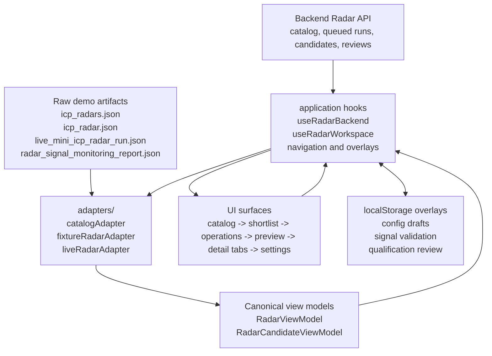

# ICP Radar Frontend Feature

This feature owns the ICP Radar workspace: radar catalog, selected radar
shortlist, candidate preview, candidate detail review, local demo overlays, and
radar settings.

The route-level screen in `frontend/src/screens/ICPRadarScreen.tsx` is only a
compatibility wrapper. New radar behavior belongs here.

## Ownership Map

```text
ICPRadarScreen.tsx      Feature coordinator: loading/error state and current surface assembly.
adapters/               Raw artifacts -> canonical radar and candidate view models.
application/            Navigation, backend mode, browser-local fallback overlays, settings drafts, review mutations.
domain/                 Pure score, status, validation, qualification, and metadata helpers.
components/             Presentation-only catalog/header components.
fixture*                Fixture-backed shortlist, preview, and detail surfaces.
liveOperations          Live Radar runs/checks/diagnostics tab for backend-connected radars.
live*                   Live-run shortlist, operations, diagnostics, preview, and detail surfaces through the same UX contract.
settings*               Block-editable radar configuration surfaces.
styles/                 Feature CSS split by UI surface.
```

## Data Flow



Generated artifacts are read-only. The backend API is preferred for live Radar
catalog, candidate-discovery runs, candidates, and review decisions when
available. Browser-local overlays can change fixture/offline demo state, but
they must never mutate generated JSON.

Backend-connected Radar runs are artifact-backed by `radar_id`, not by a
single special demo radar. Any backend radar with a completed latest run can
open the live shortlist, diagnostics, dossier, and candidate detail surfaces.
Catalog counts for those radars are derived from the run candidates endpoint so
the card total, accepted/product count, and review-needed count match the rows
the user opens.

Backend catalog loading is intentionally two-step. The lightweight
`/api/radars` response owns catalog visibility first; heavy detail, dossier,
trace, and candidate artifact hydration happen after that and must not hide a
radar that the backend already returned. While the catalog request is pending,
the screen stays in a loading/API state. Demo fallback is allowed only after an
explicit API failure and must be visibly labeled as fallback.

Benchmark radars returned by the backend are protected from silent browser-local
delete overrides. If local demo state attempted to hide one, the catalog keeps
the backend radar visible and marks it so the user can reset demo changes.

Signal Monitoring uses its dedicated backend endpoints in API mode. Its
application controller owns signal history, preflight, queueing, polling,
report loading and source-run synchronization. Selecting a historical signal
run automatically selects its `source_run_id`; candidate and signal reports are
never rendered as an unrelated pair.

`frontend/public/demo/radar_signal_monitoring_report.json` remains only as an
explicitly labelled offline/demo fallback. It must not replace an empty backend
signal history while API mode is active.

## How To Add A New Radar Type

1. Add or extend the raw artifact type only if the provider truly needs a new
   contract.
2. Add an adapter under `adapters/` that maps the raw artifact into
   `RadarViewModel` and `RadarCandidateViewModel`.
3. Register the artifact/catalog selection at the application boundary, not in a
   presentation component.
4. Reuse the canonical table -> preview -> detail-tabs flow. Do not create a new
   visual paradigm, side panel, or provider-specific shortlist column set.
5. Put run-level runtime/provider metadata into the `Runs` operations tab and
   run diagnostics, and
   candidate-specific evidence/runtime context into the candidate `Journal` tab.
   Do not put either above the shortlist table.
6. Map technical trace records through `liveTraceModel.ts` before rendering:
   grouping, status, filtering, and safety cleanup are view-model concerns, not
   ad hoc JSX logic.
7. Map qualification rows into the shared review contract before rendering:
   source refs, source origin, trust/check policy, evidence, requirement fit,
   optional excerpt, and local approve/reject/correct decisions are domain
   view-model concerns, not ad hoc JSX fields. Expanded qualification rows use
   evidence cards; the full source inventory belongs in the `Sources` tab.
8. Map live signal rows into score-evaluation plus evidence-card view models
   before rendering. Expanded signal rows must show score evaluation, source
   linked evidence cards, and local signal review; do not render provider output
   as a raw summary plus source list.
9. Add focused tests for the adapter and architecture boundary before changing
   UI behavior.

## Where Code Should Not Go

- No `window.localStorage` in presentation components.
- No `fetch` or `RadarApiClient` in presentation components.
- No API DTO passthrough into JSX; normalize API responses in `adapters/`.
- No provider-specific branching in the route wrapper or feature coordinator.
- No scoring, validation, or artifact normalization inside JSX-heavy modules.
- No ICP Radar selectors in global `frontend/src/styles.css`.
- No new radar-specific shortlist UX unless the canonical UX ADR changes first.

## Change Checklist

- Adapter or model change: run `python -m pytest tests/test_frontend_architecture_contract.py`.
- Frontend TypeScript change: run `npm --prefix ./frontend run build`.
- Any visible UI/layout change: run `npm --prefix ./frontend run visual:smoke`.
- Backend catalog visibility/stability change: run
  `npm --prefix ./frontend run radar:benchmark-ui-dod` against the Docker
  frontend on `http://127.0.0.1:5173`; it performs ten clean browser-context
  checks and fails if `Benchmark / SIBUR holding contour` is missing, hidden by
  fallback/local overrides, or its UI counts diverge from the backend candidates
  endpoint. Set `POWER_WEB_OS_RADAR_UI_DOD_START_VITE=1` only for a manual local
  Vite run with matching backend CORS origins.
- Candidate/signal pipeline wiring change: run
  `npm --prefix ./frontend run radar:pipeline-split-ui-dod` against Docker. It
  validates separate histories and budgets, source-run synchronization, direct
  URL inspection, missing-run errors, EN/RU layout and persisted reports.
- Settings/local overlay change: run `npm --prefix ./frontend run settings:toggle-smoke`.
- Public behavior or architecture change: update developer docs, architecture docs, ADRs, and `ROADMAP.md`.
