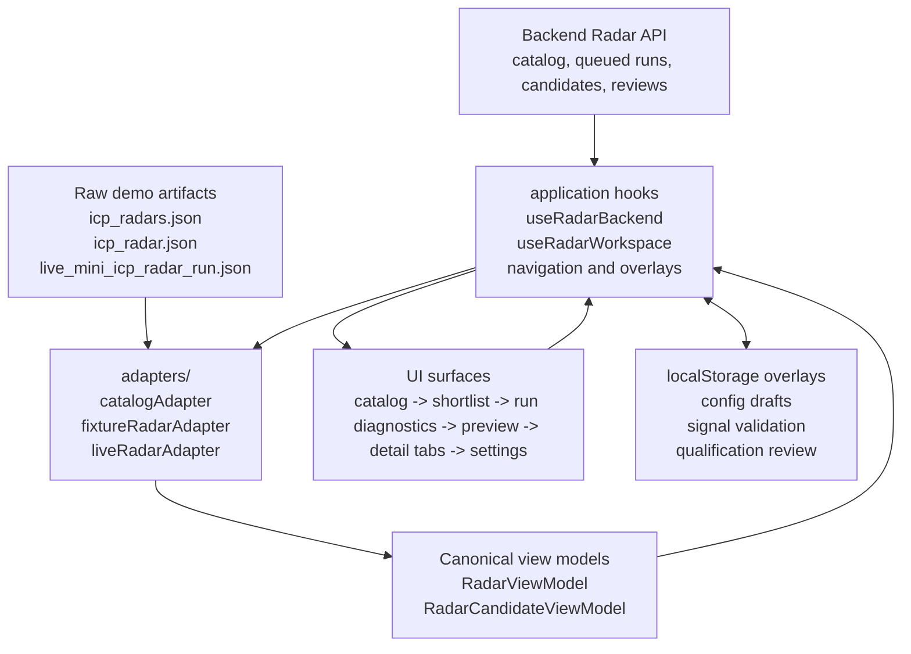

# ICP Radar Frontend Feature

This feature owns the ICP Radar workspace: radar catalog, selected radar
shortlist, candidate preview, candidate detail review, local demo overlays, and
radar settings.

The route-level screen in `frontend/src/screens/ICPRadarScreen.tsx` is only a
compatibility wrapper. New radar behavior belongs here.

## Ownership Map

```text
ICPRadarScreen.tsx      Feature coordinator: loading/error state and current surface assembly.
adapters/               Raw artifacts -> canonical radar and candidate view models.
application/            Navigation, backend mode, browser-local fallback overlays, settings drafts, review mutations.
domain/                 Pure score, status, validation, qualification, and metadata helpers.
components/             Presentation-only catalog/header components.
fixture*                Fixture-backed shortlist, preview, and detail surfaces.
live*                   Live-run shortlist, diagnostics, preview, and detail surfaces through the same UX contract.
settings*               Block-editable radar configuration surfaces.
styles/                 Feature CSS split by UI surface.
```

## Data Flow



Generated artifacts are read-only. The backend API is preferred for live Radar
catalog, run, candidates, and review decisions when available. Browser-local
overlays can change fixture/offline demo state, but they must never mutate
generated JSON.

## How To Add A New Radar Type

1. Add or extend the raw artifact type only if the provider truly needs a new
   contract.
2. Add an adapter under `adapters/` that maps the raw artifact into
   `RadarViewModel` and `RadarCandidateViewModel`.
3. Register the artifact/catalog selection at the application boundary, not in a
   presentation component.
4. Reuse the canonical table -> preview -> detail-tabs flow. Do not create a new
   visual paradigm, side panel, or provider-specific shortlist column set.
5. Put run-level runtime/provider metadata into run diagnostics, and
   candidate-specific evidence/runtime context into the candidate `Journal` tab.
   Do not put either above the shortlist table.
6. Map technical trace records through `liveTraceModel.ts` before rendering:
   grouping, status, filtering, and safety cleanup are view-model concerns, not
   ad hoc JSX logic.
7. Map qualification rows into the shared review contract before rendering:
   source refs, source origin, trust/check policy, evidence, requirement fit,
   optional excerpt, and local approve/reject/correct decisions are domain
   view-model concerns, not ad hoc JSX fields. Expanded qualification rows use
   evidence cards; the full source inventory belongs in the `Sources` tab.
8. Map live signal rows into score-evaluation plus evidence-card view models
   before rendering. Expanded signal rows must show score evaluation, source
   linked evidence cards, and local signal review; do not render provider output
   as a raw summary plus source list.
9. Add focused tests for the adapter and architecture boundary before changing
   UI behavior.

## Where Code Should Not Go

- No `window.localStorage` in presentation components.
- No `fetch` or `RadarApiClient` in presentation components.
- No API DTO passthrough into JSX; normalize API responses in `adapters/`.
- No provider-specific branching in the route wrapper or feature coordinator.
- No scoring, validation, or artifact normalization inside JSX-heavy modules.
- No ICP Radar selectors in global `frontend/src/styles.css`.
- No new radar-specific shortlist UX unless the canonical UX ADR changes first.

## Change Checklist

- Adapter or model change: run `python -m pytest tests/test_frontend_architecture_contract.py`.
- Frontend TypeScript change: run `npm --prefix ./frontend run build`.
- Any visible UI/layout change: run `npm --prefix ./frontend run visual:smoke`.
- Settings/local overlay change: run `npm --prefix ./frontend run settings:toggle-smoke`.
- Public behavior or architecture change: update developer docs, architecture docs, ADRs, and `ROADMAP.md`.
